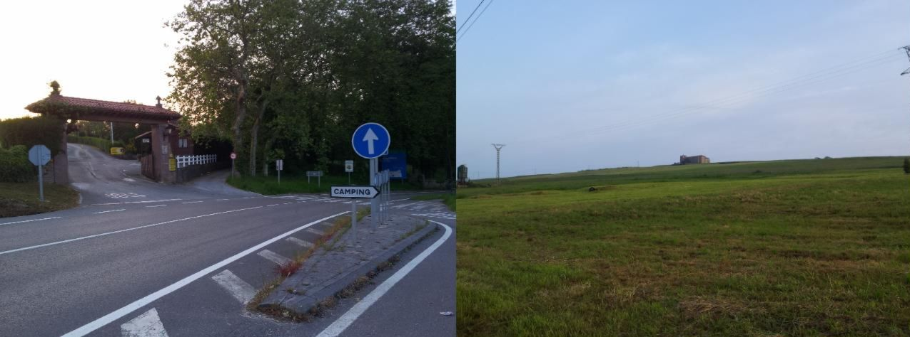
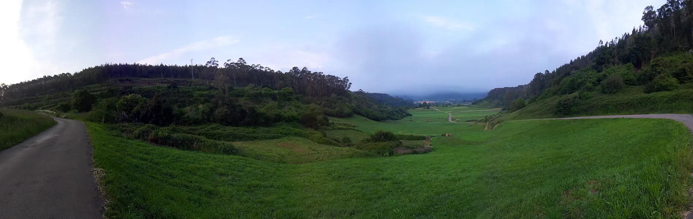
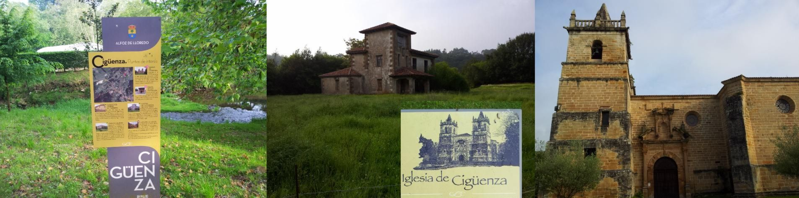
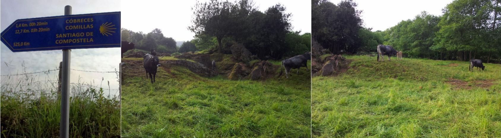
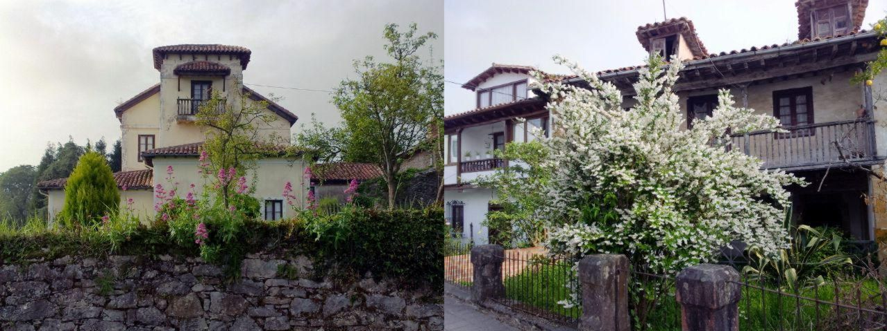
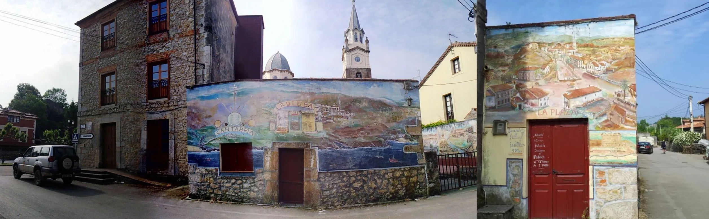
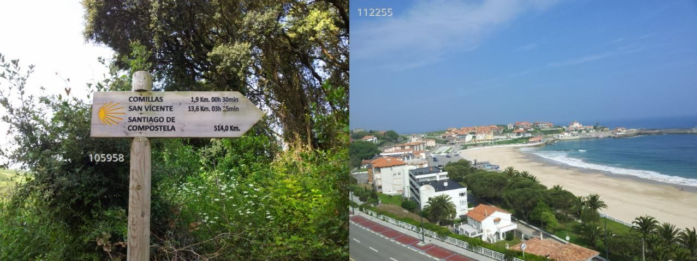
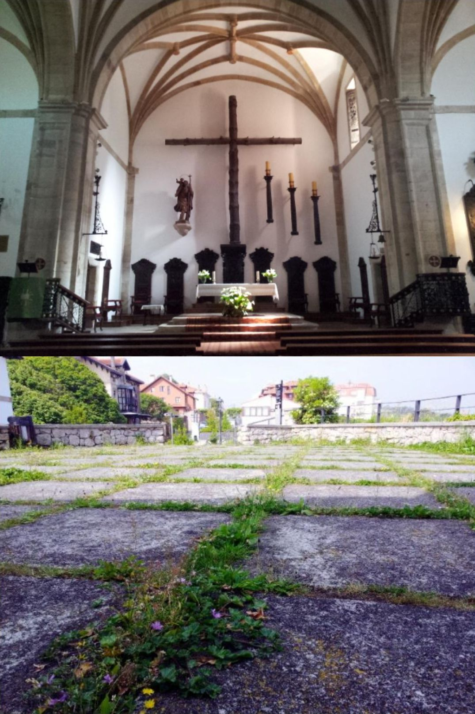
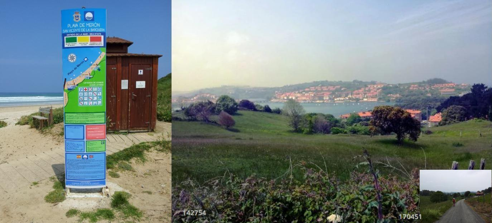

## Camino del Norte  2018

### Etappe-15: Santillana del Mar  →  Serdio ( 22,2 + 19  km )
23  Mai 2018

🇩🇪 Als ich am frühen Morgen in Santillana del Mar aufbrach, fiel mir der Campingplatz auf. Kaum hatte ich ihn erblickt, dachte ich: „Warum habe ich nicht dort gebucht? Das wäre gemütlicher gewesen als die Pension.“ 

..., ... .   

Irgendwann siegt einfach die Erschöpfung, und der Handyakku ist so leer, dass man nichts mehr festhalten kann. Doch manche Augenblicke davor brennen sich aufgrund der späteren Ereignisse so tief ins Gedächtnis ein, dass man sie nie wieder vergisst. So bleiben einem die Uhrzeit, die Müdigkeit, die Ankunft, der Anruf und das Abendessen für immer präsent. Das alles nur, weil ein Pilger völlig erschöpft und sehr spät in der Herberge von Serdio ankam, als es schon keine freien Betten mehr gab. Das Obergeschoss war komplett belegt, sodass ein anderer Pilger und ich uns unten einrichteten. In diesem Moment sagte der erschöpfte Pilger: „Ich bleibe hier, ich gehe nicht mehr weiter.“ Da ich zu den Letzten gehörte, die eingecheckt hatten, gab mir die Herbergsleiterin noch mit auf den Weg: „Falls noch jemand kommt, rufen Sie mich bitte an. Dann komme ich zurück, um die Person zu registrieren.“

Sowohl dieser Pilger als auch ich sprachen nur mäßig Englisch – gerade gut genug, um uns zu verständigen. Seinem Akzent nach zu urteilen, stammte er wohl aus dem Baltikum oder vielleicht aus Russland. Ich hatte ihn schon am späten Nachmittag beobachtet, wie er auf einer Bank saß, geistesabwesend auf den See blickte und ganz in Gedanken versunken war. Seinem Tonfall und seiner gedrückten Stimmung nach zu urteilen – sowohl am Vorabend als auch am nächsten Morgen –, war die Last, die er mit sich herumtrug, weit schwerer als nur das Gewicht seines Rucksacks.

---

🇪🇸  Al salir temprano por la mañana de Santillana del Mar, me llamó la atención el camping. En cuanto lo vi, pensé: «¿Por qué no habré reservado allí? Habría sido más cómodo que la pensión». 

...., ... . 

Llega un momento en que el cansancio te supera y la batería del móvil está tan baja que ya no te permite registrar nada. Sin embargo, hay ciertos instantes previos que, por lo que ocurre después, se te quedan grabados en la memoria para siempre; es así como recuerdas  la hora, el cansancio, la llegada, la llamada y la cena. Y todo porque un peregrino llegó exhausto y muy tarde al albergue de Serdio cuando ya no quedaban camas libres; la planta de arriba estaba llena, por lo que otro peregrino y yo nos acomodamos abajo. Fue entonces cuando aquel hombre dijo: «Me quedo aquí, no voy a continuar la caminata». Como yo había sido de los últimos en llegar, la hospitalera me dijo: «Si viene alguien más, por favor llámeme; volveré para registrarlo».

Tanto él como ich hablábamos un inglés precario, pero suficiente para entendernos. Por su acento, yo diría que era de los países bálticos o incluso de Rusia. Ya lo había visto a última hora de la tarde, sentado en un banco, con la mirada perdida en el lago y sumido en sus pensamientos. A juzgar por su tono de voz y su estado de ánimo, tanto la noche anterior como a la mañana siguiente, la carga que llevaba consigo era mucho más que el simple peso de su mochila.

---

🇺🇸 As I set off from Santillana del Mar early in the morning, the campsite caught my eye. The moment I saw it, I thought, "Why didn't I book a spot there? It would have been much nicer than the guesthouse."

..., ... . 

Eventually, exhaustion takes over, and your phone battery gets so low that you can't record anything anymore. Yet, there are certain moments leading up to it that stick in your mind forever because of what happens next; that is how we remember the  time, the fatigue, the arrival, the phone call, and the dinner. It all happened because a pilgrim arrived at the Serdio albergue incredibly tired and very late, at a point when there were no free beds left. The upper floor was completely full, so another pilgrim and I set ourselves up downstairs. That was when the weary pilgrim said, "I’m staying here; I’m not going any further." Since I was one of the last to arrive, the hospitalera told me, "If anyone else shows up, please call me, and I’ll come back to register them."

Both that pilgrim and I spoke broken English, but it was just enough to understand each other. Judging by his accent, I would guess he was from the Baltic states or perhaps Russia. I had already noticed him later in the afternoon, sitting on a bench, staring blankly at the lake and deeply lost in thought. From his tone and demeanor—both the previous evening and the following morning—it was clear that the burden he was carrying was far heavier than just the weight of his backpack.

---

🇵🇹 Ao partir de Santillana del Mar de manhã cedo, o parque de campismo chamou-me a atenção. Assim que o vi, pensei: "Por que não reservei ali? Teria sido mais agradável do que a pensão." 

..., ... . 

Chega um momento em que o cansaço vence e a bateria do telemóvel fica tão fraca que já não se consegue registar nada. No entanto, há certos momentos anteriores que, devido aos acontecimentos seguintes, ficam gravados na memória e nunca mais se esquecem; é por isso que guardamos a hora , o cansaço, a chegada, a chamada e o jantar na lembrança. E tudo porque um peregrino chegou exausto e muito tarde ao albergue de Serdio, quando já não havia camas livres; o andar de cima estava lotado, por isso eu e outro peregrino acomodámo-nos no rés do chão. Foi então que ele disse: "Eu fico aqui, não vou continuar a caminhada." Como eu tinha sido um dos últimos a chegar, a hospitaleira disse-me: "Se aparecer mais alguém, por favor ligue-me; eu volto para o registar."

Tanto eu como esse peregrino falávamos um inglês fraco, mas o suficiente para nos entendermos. Pelo sotaque, eu diria que ele era dos países bálticos ou talvez da Rússia. Já o tinha visto ao final da tarde, sentado num banco, a olhar para o mar e completamente absorto nos seus pensamentos. A julgar pelo seu tom de voz e pelo seu estado de espírito — tanto na noite anterior como na manhã seguinte —, o fardo que ele carregava era muito mais do que o simples peso da sua mochila.

Serdio, Kantabrien

Albergue de Peregrinos

- Städtische Herberge von Serdio
- - Stand: September 2026: Vorübergehend geschlossen
- Albergue Municipal de Serdio
- - Situação em setembro de 2026: temporariamente encerrado
- - Información de septiembre de 2026: Cerrado temporalmente
- Serdio Municipal Hostel
- - As of September 2026: Temporarily closed

---

  

🇬🇧
🇪🇸
🇵🇹
🇩🇪

---

**↪** [Etappe-16_Serdio_Poo-de-Llanes](Etappe-16_Serdio_Poo-de-Llanes.md)

 🔁 [Camino-del-Norte_Etapas](Camino-del-Norte_Etapas.md)
 

 ...→