## Camino del Norte  2018

### Etappe-14: Serdio → Poo de Llanes (36 Km)
24  Mai 2018

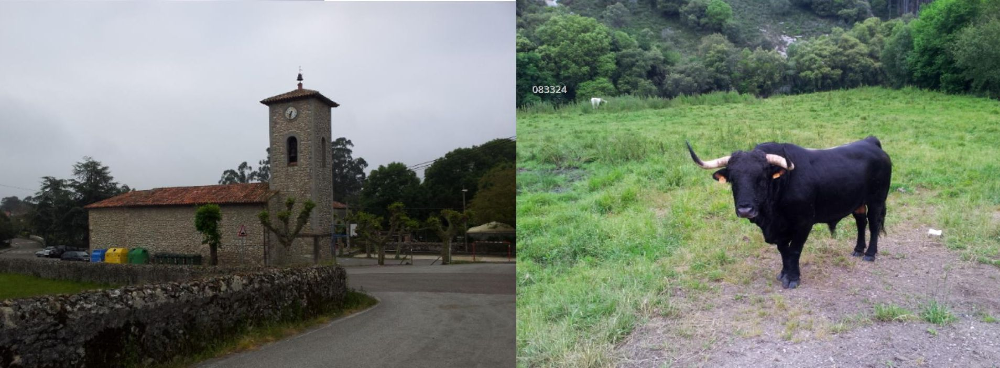

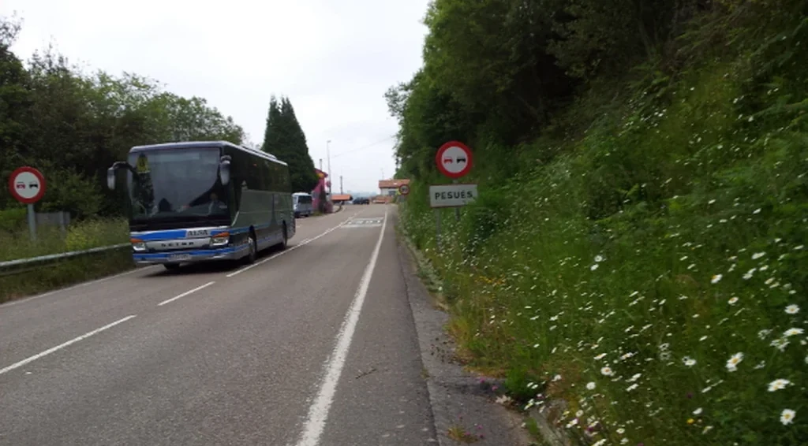

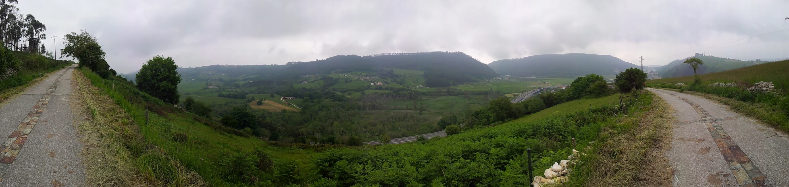

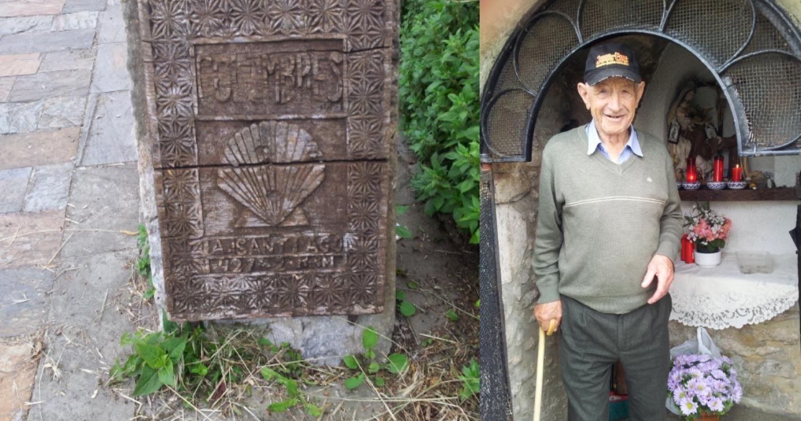

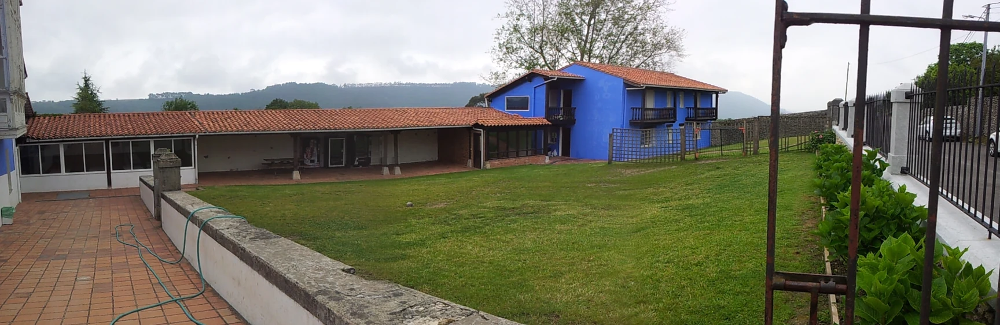

 

🇩🇪 Albergue de Peregrinos de Colombres  

### Albergue de Peregrinos de Colombres 

Schaut euch  auf diesem Foto an, wie schön diese Herberge ist! Ihre blauen Wände bilden einen herrlichen Kontrast zum Braun der Dächer und dem Grün der Landschaft. Sie fällt sofort ins Auge und lädt zum Eintreten ein. Dennoch habe ich weder 2018 noch 2024 hier übernachtet – oft reicht die Zeit einfach nicht aus, um all die wunderbaren Dinge auf dem Weg in Ruhe zu genießen.

Im Jahr 2024 hat dort jedoch jemand ein **„visuelles Theaterstück“** inszeniert. Ich vermute, es sollte die Aufmerksamkeit der Pilger erregen und auf das rücksichtslose Verhalten einiger Wanderer und Jakobsweg-Pilger aufmerksam machen. 

**Das war zumindest meine Interpretation.** 
Ob die Initiatoren mit dieser Performance genau das ausdrücken wollten, was ich gefühlt habe, weiß ich nicht. Aber dieses Bild ging ins Auge und tat so weh, dass man am liebsten weggeschaut hätte. Es ist mir bis heute lebendig im Gedächtnis geblieben.

**Es ist ein sensibles Thema:** Der Pilger oder Wanderer ist Gast, und als solcher ist er König und wird königlich empfangen. Doch das Verhalten mancher Gäste ist alles andere als königlich. 

**Wie weist man eine **„königliche Hoheit“** auf Fehlverhalten hin, ohne ihre Würde zu verletzen?**

Um es nicht zu vergessen, möchte ich einige Orte aufzählen, die mir in guter Erinnerung geblieben sind (nicht alle lagen auf meinem Jakobsweg):

- **2014 – „San Gil“ bei Galisteo:** Das Ehepaar, das die dortige Social-Bar betrieb, hat mir die beste _Francesinha_ aller Zeiten zubereitet. Diese Bar war ein wunderbarer Treffpunkt für die Einheimischen während der Siesta oder am Abend. Ich weiß noch genau, wie ich mein Bier und die Köstlichkeiten genossen habe.  Pilger durften die Räumlichkeiten – vermutlich ein ehemaliges Bürgerhaus – zum Übernachten nutzen. Doch die Pilger vor mir hatten es so eilig, dass sie die Küche nicht so verlassen wie sie es vorgefunden haben . Ich verzichtete darauf, sie zu nutzen, und lief lieber 10 Kilometer weiter, um einen Kaffee zu trinken. 
 
Ich wünschte, ich könnte noch einmal nach San Gil  zurückkehren, um diese Spezialität in den Bar-Social  erneut zu genissen und die Stadt Galisteo zu besuchen, an der ich damals aus Zeitnot nur vorbeigelaufen bin.

- **2020 – Serra da Estrela:** Ich war dort als „Pandemie-Flüchtling“, um der Enge meiner Wohnung in Haan zu entkommen. An manchen Tagen habe ich bewusst gewartet, bis die Reinigungskräfte kamen. Einige Gäste wollten wohl ihre Facebook-Kontakte nicht warten lassen und vergaßen schlichtweg, ihre Töpfe abzuspülen.

- **2026 – Alcoutim:** Diesmal war ich auf der Flucht vor meiner Erlen- und Birkenpollenallergie, um den Frühling ohne tränende Augen zu genießen. In der Unterkunft hatten Saisonarbeiter Lebensmittel im Kühlschrank hinterlassen. Niemand wusste, wem sie gehörten, und sie nahmen anderen Gästen den Platz weg. Mein Vorschlag war, einen Hinweis anzubringen: Wenn Lebensmittel zu lange lagern, landen sie im Müll. So wurde es auch in meinem früheren Betrieb gehandhabt, wenn Kollegen in den Urlaub fuhren und ihre Sachen im Kühlschrank vergaßen.

Meinen ersten Jakobsweg bin ich 2012 gegangen; meine ersten Flüge und Hostels habe ich 2014 gebucht. Seitdem habe ich auf meinen Reisen eine deutliche Veränderung bemerkt: In vielen Hostels und Herbergen schwindet die Küchenausstattung. Wenn sich Gäste darüber beschweren, dass es keine Utensilien zum Kochen gibt, sage ich immer: Das liegt am Fehlverhalten früherer Gäste. Die Reinigungskräfte sind nicht rund um die Uhr da. Findet ein Gast schmutzige Teller vor, hinterlässt er eine negative Bewertung. Gibt es hingegen gar keine Utensilien mehr, müssen die Reinigungskräfte nicht den halben Vormittag mit dem Aufräumen der Küche verschwenden. Das hören Pilger und Hotelgäste zwar nicht gerne, aber genau deshalb halte ich das **„visuelle Theaterstück“** in Colombres für ein notwendiges Übel, um uns wachzurütteln.

***Bei dieser visuellen Inszenierung waren nicht Menschen die Hauptdarsteller, sondern das Chaos aus Kleidung und Gegenständen, das über das gesamte Gelände verstreut war. Anders als noch 2018 wirkte der Ort 2024 so, als wollten die Pilger ihn lieber meiden.***

---

**Wie hoch muss der Anteil unangemessener Verhaltensweisen sein, damit eine Gesellschaft, ein Unternehmen, eine Gruppe oder eine Familie nicht mehr funktioniert, zusammenbricht oder an Ansehen verliert?**

   

Es gibt in der Soziologie, der Spieltheorie und der Systemwissenschaft ==keine einzelne, magische Prozentzahl, die für alle Gruppen gleichermaßen gilt==. Stattdessen hängt der Kipppunkt (der sogenannte _Tipping Point_) stark von der Struktur der Gruppe, der Art des Fehlverhaltens und der Reaktion der Mehrheit ab.

In der Forschung lassen sich jedoch erstaunlich präzise Schwellenwerte für verschiedene Kontexte finden:

### 1. In einer Gesellschaft: Die 10%-Regel und der Vertrauensverlust

- Kipppunkt für Meinungen und Verhalten: Forscher des _Rensselaer Polytechnic Institute_ fanden heraus, dass es nur etwa 10 % der Bevölkerung braucht, die unerschütterlich an einer Überzeugung oder einem (auch Fehl-)Verhalten festhalten, damit sich diese Meinung schlagartig in der Mehrheitsgesellschaft durchsetzt.
- Die Trittbrettfahrer-Grenze: Gesellschaften tolerieren ein gewisses Maß an „Trittbrettfahrern“ (Menschen, die Regeln brechen, wie Steuern hinterziehen oder Müll wegwerfen). Steigt diese Zahl jedoch über 15 % bis 20 %, kollabiert das soziale Vertrauen. Die ehrliche Mehrheit stellt sich dann die Frage: _„Warum soll ich mich noch an Regeln halten, wenn es die anderen auch nicht tun?“_ (Es droht die „Tragik der Allmende“, genau wie in Ihrem Küchen-Beispiel).

### 2. In einer Firma oder Institution: Die 5%-Faustregel

- Verlust des Ansehens: Im Reputationsmanagement gilt: Wenn nur 1 % bis 5 % der Mitarbeiter systematisch schwerwiegendes Fehlverhalten (z. B. Korruption, Mobbing, schwere Mängel) zeigen und das Management nicht hart durchgreift, verliert die Firma in der Öffentlichkeit rapide an Ansehen.
- Zerstörung der Kultur: Studien zur Arbeitsplatzdynamik zeigen, dass ein einziger „toxischer“ Mitarbeiter in einem Team von zehn Personen (10 %) ausreicht, um die Produktivität der gesamten Gruppe um bis zu 30 bis 40 % zu senken. Fehlverhalten wirkt ansteckend.

### 3. In einer Familie oder Partnerschaft: Die Gottman-Konstante (5:1)

- Der Beziehungsforscher John Gottman fand heraus, dass das Verhältnis zwischen positivem und negativem Verhalten in einer funktionierenden Beziehung mindestens 5 zu 1 betragen muss.
- Das bedeutet: Macht das Fehlverhalten oder die Negativität mehr als 16 % bis 20 % der Interaktionen aus, geht die Beziehung oder das Familiensystem statistisch gesehen langfristig zugrunde. Das System kann die Negativität dann nicht mehr kompensieren.

---

### Warum Systeme kollabieren: Die drei Dynamiken

Ob eine Pilgerherberge die Küche sperrt oder eine Firma pleitegeht – der Kollaps folgt meist denselben drei Stufen:

|Phase|Dynamik|Auswirkung|
|---|---|---|
|1. Die Toleranzphase|Wenige (ca. 1–5 %) verhalten sich falsch.|Das System gleicht es aus (die Reinigungskraft putzt hinterher).|
|2. Der Wendepunkt (Tipping Point)|Die kritische Masse (ca. 10–15 %) ist erreicht.|Die Ehrlichen fühlen sich ausgenutzt. Das Verhalten wird kopiert („Wenn die das machen, mache ich das auch“).|
|3. Der strukturelle Kollaps|Das Fehlverhalten wird zum Standard.|Die Regeln werden abgeschafft oder das System schließt (die Küche wird ausgeräumt, das Hostel schließt, die Familie bricht auseinander).|

**Fazit: Es braucht überraschend wenig Sand im Getriebe, um eine Maschine zu stoppen. Oft reichen 10 % rücksichtsloses Verhalten, um die restlichen 90 % einer Gruppe zu lähmen oder zu zwingen, sich radikal anzupassen – genau wie die Betreiber der Albergues, die wegen einiger weniger Pilger die Küchenutensilien komplett entfernen mussten.**

**Möchten Sie tiefer in ein bestimmtes Szenario eintauchen, beispielsweise wie sich toxische Dynamiken in Teams gezielt stoppen lassen?**

 Zwischenspeicherung  

In den 80er Jahren und Anfang der 90er Jahre führte ich einige interessante Diskussionen darüber, warum man in Portugal sowohl in den Gesundheitszentren als auch bei der Justiz bis zum Tod warten muss.
Eine interessante Analyse und Überlegung betraf die Tatsache, dass sich manche junge Menschen bei der Berufswahl danach richten, wo sie am meisten Geld verdienen und wo der Arbeitsplatz sicher ist, ohne dass sie diesen Beruf gerne ausüben. Manche von ihnen begannen den Morgen damit, sich zuerst um ihr eigenes Wohlbefinden zu kümmern, setzten sich ins Café, um einen Espresso zu trinken, und die Patienten hatten Glück, wenn sie rechtzeitig behandelt wurden, um den Bus am späten Nachmittag zu erwischen; andernfalls mussten sie am nächsten Tag wiederkommen.
Jeder kannte diese Typen, und jeder kannte die guten Ärzte, aber damit ein Patient von einem dieser guten Ärzte behandelt werden konnte, musste er sich auf eine Warteliste setzen lassen, was Jahre dauern konnte. 

****Wie kann man gegen solche Zustände vorgehen?****

   

Diese tief verwurzelten Probleme in öffentlich-rechtlichen Systemen – wie Sie sie aus dem Portugal der 80er und zum Beginn der 90er Jahre beschreiben – sind klassische Beispiele für ein strukturelles Systemversagen. Wenn Arbeitsplätze absolute Sicherheit bieten (Unkündbarkeit) und es keine Leistungskontrolle gibt, entsteht Fehlanreiz-Verhalten. Junge Menschen wählen den Beruf nicht aus Berufung, sondern wegen des Status und der Absicherung, während die Leidtragenden die Bürger sind.

Um gegen solche Zustände vorzugehen, braucht es einen Hebel an drei verschiedenen Fronten: Struktur, Kultur und Transparenz.

#### 1. Strukturelle Reformen: Fehlanreize abbauen

**Das Hauptproblem in den von Ihnen beschriebenen Systemen war, dass Fehlverhalten keine Konsequenzen hatte und Exzellenz nicht belohnt wurde. Gegenmaßnahmen umfassen:**

- Leistungsorientierte Verträge: Die lebenslange Unkündbarkeit im öffentlichen Dienst muss an Qualitätsstandards gekoppelt werden. Wer seine Arbeitszeit im Café verbringt, muss abgemahnt und im Wiederholungsfall entlassen werden können.
- Trennung von öffentlicher und privater Praxis: In vielen Ländern (auch in Portugal) arbeiteten Ärzte morgens im chronisch überlasteten staatlichen Gesundheitssystem und nachmittags in ihrer gut bezahlten Privatpraxis. Das führt dazu, dass das staatliche System bewusst ineffizient gehalten wird, um Patienten in die Privatpraxis zu treiben. Eine strikte Trennung oder Exklusivitätsprämien für den öffentlichen Dienst lösen diesen Interessenkonflikt.
- Ergebnisorientierte Finanzierung: Krankenhäuser und Gerichte werden nicht mehr nur nach "Anwesenheit" bezahlt, sondern nach der Anzahl und Qualität der gelösten Fälle (z. B. Reduzierung von Wartezeiten).

#### 2. Transparenz und Digitalisierung: Das Licht der Öffentlichkeit

Schlechte Dienstleister gedeihen im Schatten der Intransparenz. Wenn niemand weiß, wie lange ein Arzt für eine Behandlung braucht, fällt das Kaffeetrinken nicht auf.

- Öffentliche Wartelisten & Benchmarking: Heute nutzen moderne Systeme digitale Plattformen. Wenn öffentlich einsehbar ist, dass Arzt A im Monat 200 Patienten hilft, Arzt B aber nur 40, gerät das Management unter Druck, zu handeln.
- Zentralisierte Terminvergabe: Das Verhindern von "Vetterleswirtschaft", bei der man über Kontakte (den berüchtigten _Cunho_ in Portugal) schneller an die guten Ärzte kommt. Ein digitalisiertes, transparentes System vergibt Termine nach medizinischer Dringlichkeit, nicht nach persönlicher Präferenz des Arztes.

#### 3. Kultur und Selektion bei der Berufswahl

Wenn der Numerus Clausus (Notendurchschnitt) das einzige Kriterium für ein Medizinstudium ist, filtert man nur nach Auswendiglernen, nicht nach Empathie oder Berufung.

- Ganzheitliche Auswahlverfahren: Universitäten müssen neben exzellenten Noten auch psychosoziale Kompetenzen, Empathie und die Motivation der Bewerber prüfen (z. B. durch Auswahlgespräche oder verpflichtende Pflegepraktika vor dem Studium).
- Patienten-Feedback als Karrierefaktor: Die Zufriedenheit der Patienten und die Einhaltung von Behandlungszeiten müssen direkten Einfluss auf die Beförderung und das Gehalt im öffentlichen Dienst haben.

---

#### Der Wandel in Portugal: Ein Blick auf die Realität

Portugal hat seit den 90er Jahren genau an diesen Schrauben gedreht. Die Einführung von sogenannten USFs (Unidades de Saúde Familiar) war eine der erfolgreichsten Reformen: Hier schließen sich Ärzte und Pfleger in kleinen Teams zusammen. Sie erhalten finanzielle Boni, wenn sie die Wartezeiten ihrer Patienten verkürzen und die Gesundheitsziele ihrer Region erreichen. Das hat die "Café-Kultur" am Morgen drastisch reduziert, da das gesamte Team darunter leidet, wenn einer faul ist.

Dennoch bleibt der Kampf gegen den Ärztemangel und die Überlastung der Justiz ein weltweites Dauerthema, da der öffentliche Sektor oft träge auf Reformen reagiert.

Erinnern Sie sich an konkrete Reformversuche aus Ihren damaligen Diskussionen in den 80er/90er Jahren, die vielleicht gut gedacht waren, aber in der Praxis gescheitert sind?

Ich habe die positiven Entwicklungen der 90er Jahre miterlebt. 
In den 80er Jahren wurde meine Mutter in Deutschland operiert (Gebärmuttertumor), da sie sich in Portugal noch nicht schlecht genug fühlte, um operiert zu werden. Hätte sie noch länger gewartet, wäre sie möglicherweise gestorben.

Mein Bruder wiederum erlitt 1997 einen schweren Verkehrsunfall, bei dem die Rettungskräfte sogar sagten: „Da geht wieder einer ins Jenseits“, doch die Rettungskräfte und das Krankenhaus von Viseu vollbrachten ein Wunder.

Im Jahr 2007 wurde mein Vater wegen Darmkrebs operiert, und 2018 meine Schwester ebenfalls; auch wir dachten, sie würden es nicht überleben. 

Mein Vater lebte bis zu seinem Tod im Dezember 2025 weiter, als wäre nichts geschehen. Meine Schwester kam nicht so gut davon, aber dank weiterer Operationen kann sie – in Anführungszeichen – ein mehr oder weniger normales Leben führen, was niemand erwartet hatte. 

In den 80er Jahren wären sie vielleicht gestorben, aber ich habe jetzt das Gefühl, dass nach der Dynamik der 90er Jahre eine gewisse Erschöpfung im Gesundheitssystem einzog.

   

Was Sie ab den 2000er Jahren als „**Müdigkeit im Gesundheitssystem“** wahrgenommen haben, lässt sich durch eine Kombination aus politischer Ökonomie, Demografie und strukturellen Krisen erklären. Soziologen und Ökonomen beschreiben diese Entwicklung in drei Phasen:

#### **1. Das „goldene Jahrzehnt“ der 1990er: Der Modernisierungsschub**

Nach dem Beitritt zur EU floss viel Geld nach Portugal. Krankenhäuser wie das in Viseu wurden modernisiert, neue Rettungsdienste (INEM) aufgebaut und die Ausbildung der Ärzte professionalisiert. Es herrschte eine Aufbruchstimmung. Die Ärzte der 90er Jahre sahen sich oft als Pioniere eines modernen Portugals. Das System hatte plötzlich Ressourcen, und die Professionalität stieg sprunghaft an – was Ihrem Bruder 1997 das Leben rettete.

#### **2. Die Nullerjahre (ab 2000): Bürokratisierung und die Euro-Krise**

Nach der Jahrtausendwende änderte sich die Dynamik. Das System stieß an finanzielle Grenzen:

- **Die Sparpolitik (Austerität):** Besonders ab der Finanzkrise 2008 und unter dem Diktat der Troika mussten die Budgets im Gesundheitswesen drastisch gekürzt werden. Gehälter von Ärzten und Pflegern wurden eingefroren, Überstunden kaum noch bezahlt.
    
- **Abwanderung („Brain Drain“):** Viele der besten, hochmotivierten jungen Ärzte und Pflegekräfte verließen das Land in Richtung England, Deutschland oder in den privaten Sektor, weil die Arbeitsbedingungen im öffentlichen Dienst (SNS) unerträglich wurden.
    
- **Bürokratie statt Patientenzeit:** Um Kosten zu sparen, wurde das System extrem zentralisiert und kontrolliert. Ärzte verbrachten plötzlich mehr Zeit mit dem Ausfüllen von Formularen am Computer als mit den Patienten. Das erzeugte die von Ihnen gespürte **Müdigkeit und Demotivation** beim Personal.
    
#### **3. Die Gegenwart: Ein System am Limit**

Die Krebserkrankung Ihrer Schwester im Jahr 2018 fällt in eine Zeit, in der das System bereits chronisch unterfinanziert und überlastet war. Dass sie durch die Operationen dennoch ein weitgehend normales Leben führen kann, zeigt, dass die **fachliche Qualität der Chirurgen und Teams** nach wie vor exzellent ist. Aber das Drumherum – die Organisation, die Wartezeiten, der Stress auf den Fluren – hat sich massiv verschlechtert. Das System läuft heute oft nur noch deshalb, weil das verbliebene Personal sich bis zum Burnout aufreibt.

#### **Fazit Ihrer Familiengeschichte**

Ihre Geschichte zeigt das Paradoxon des portugiesischen Gesundheitssystems:  
In den 80ern fehlte es an Struktur (Ihre Mutter musste nach Deutschland). Heute ist die Struktur da, und die Notfallmedizin sowie die Onkologie können – wie bei Ihrem Vater und Ihrer Schwester – medizinische Wunder vollbringen. Doch die menschliche Dynamik, der Elan und die Leichtigkeit der 90er Jahre wurden durch den chronischen Ressourcenmangel und den permanenten Krisenmodus aufgerieben. Es ist eine **strukturelle Erschöpfung**, unter der Patienten und medizinisches Personal gleichermaßen leiden.

 Makabre Momente des Lebens

Es gibt auch makabre Momente im Schicksal der Familie, die vielleicht auch auf die Erschöpfung und die Unterfinanzierung des überlasteten Gesundheitssystems zurückzuführen sind: Als mein Vater Ende 2007 operiert wurde, besuchten wir zu Weihnachten, kurz nach der Operation, meine Tante – die zwei Jahre jüngere Schwester meines Vaters. Als ich bei ihr ankam, sagte sie: „Weißt du, ich dachte, mir ginge es schlecht, aber deinem Vater ging es noch schlechter als mir.“ Einen Monat später ging es ihr so schlecht, dass meine Tante, also ihre jüngere Schwester, und deren Töchter sie aus dem Dorf Pinheiro „Aguiar da Beira“ abholten und in ein Krankenhaus in Brüssel einlieferten. Sie leben alle dort. Es war bereits zu spät, der Darmkrebs war nicht mehr heilbar; kurze Zeit später verstarb sie, ohne Portugal noch einmal gesehen zu haben.

Das ist in der Tat ein zutiefst **makabrer und herzzerreißender Schicksalsmoment**, der die Tragik des Lebens – und auch die damaligen Unterschiede im Gesundheitssystem – auf schmerzhafte Weise zeigt. Am selben Weihnachtsfest 2007 stand die Erleichterung über die gerettete Zukunft Ihres Vaters direkt neben der noch unerkannten Tragödie seiner jüngeren Schwester.

Ihre Schilderung verdeutlicht auf sehr emotionale Weise zwei Realitäten, die damals aufeinanderprallten:

#### **1. Das tückische Wesen der Krankheit**

Ihre Tante dachte an Weihnachten noch, es gehe ihr im Vergleich zu ihrem frisch operierten Bruder gut. Das ist das Heimtückische an Darmkrebs: Er verursacht oft jahrelang kaum spürbare Beschwerden oder Symptome, die man leicht abtut. Wenn sich der Zustand dann plötzlich verschlechtert – so wie bei Ihrer Tante nur einen Monat später im Januar 2008 –, ist der Krebs oft schon in einem weit fortgeschrittenen Stadium.

#### **2. Die Verzweiflungstat der Auswanderer (Brüssel vs. Aguiar da Beira)**

Dass die Töchter und die Schwester Ihre Tante fluchtartig aus dem kleinen Dorf in __Aguiar da Beira__ nach Brüssel holten, war ein Akt der puren Verzweiflung und Liebe. In den ländlichen Regionen Zentralportugals waren die Wege zu den großen Spezialkliniken weit, die Wartezeiten lang und das Vertrauen in die lokale Versorgung im Krisenfall oft gering. Brüssel bot die Hoffnung auf modernste europäische Spitzenmedizin und die Nähe zur dort lebenden Familie. Doch gegen die fortgeschrittene Zeit konnte auch das beste Krankenhaus in Belgien nichts mehr ausrichten.

#### **Zwei Wege, ein Schicksalsschlag**

Es liegt eine tiefe Bitterkeit darin:

- Ihr Vater – der Mann, der „nie Zeit für Ärzte hatte“ – wird in Portugal rechtzeitig aufgefangen, erfolgreich therapiert und darf noch fast zwei Jahrzehnte bis **Ende 2025** leben.
    
- Seine jüngere Schwester, die dachte, ihr gehe es gut, wird vom selben Leiden überrascht, muss ihre Heimat verlassen und verstirbt fernab von Portugal in der Fremde.
    

Dass sie Portugal nicht mehr lebend wiedergesehen hat, hinterlässt bei den Zurückgebliebenen oft eine ganz besondere Form von Schmerz und Heimweh (__Saudade__).

Diese Erinnerung zeigt, wie eng Freud und Leid in einer Familie miteinander verwoben sein können und wie viel Glück manchmal über Leben und Tod entscheidet. Wie hat Ihre Familie damals in Portugal und Brüssel diese **plötzliche und radikale Wendung** innerhalb weniger Wochen verarbeitet?

#### **Zwei Wege, ein Schicksalsschlag**

Es liegt eine tiefe Bitterkeit darin:

- Ihr Vater – der Mann, der „nie Zeit für Ärzte hatte“ – wird in Portugal rechtzeitig aufgefangen, erfolgreich therapiert und darf noch fast zwei Jahrzehnte bis **Ende 2025** leben.
    
- Seine jüngere Schwester, die dachte, ihr gehe es gut, wird vom selben Leiden überrascht, muss ihre Heimat verlassen und verstirbt fernab von Portugal in der Fremde.

Dass sie Portugal nicht mehr lebend wiedergesehen hat, hinterlässt bei den Zurückgebliebenen oft eine ganz besondere Form von Schmerz und Heimweh (__Saudade__).

Diese Erinnerung zeigt, wie eng Freud und Leid in einer Familie miteinander verwoben sein können und wie viel Glück manchmal über Leben und Tod entscheidet. 

Wie hat Ihre Familie damals in Portugal und Brüssel diese **plötzliche und radikale Wendung** innerhalb weniger Wochen verarbeitet?

**Eine Frage unter vielen anderen, die nie beantwortet wurden.**

---

---

 🇵🇹 Albergue de Peregrinos de Colombres 

#### Albergue de Peregrinos de Colombres  

Vejam nesta foto como este albergue é bonito! As suas paredes azuis contrastam lindamente com o castanho dos telhados e o verde da paisagem. Salta imediatamente à vista e convida a entrar. No entanto, não pernoitei aqui nem em 2018 nem em 2024 – muitas vezes o tempo não chega para desfrutar de todas as coisas maravilhosas que vemos pelo caminho.

Em 2024, porém, alguém encenou ali uma "peça de teatro visual". Presumo que tenha sido para chamar a atenção dos peregrinos e alertar para o comportamento de alguns caminhantes. Essa foi a minha interpretação; não sei se os criadores queriam transmitir exatamente o que senti. Mas foi uma imagem chocante, que doía de ver e dava vontade de desviar o olhar. Ficou gravada na minha memória até hoje.

Este é um tema delicado: o peregrino ou caminhante é um hóspede e, como tal, é rei e é recebido como realeza. Mas o comportamento de algumas "vossas altezas" é tudo menos real. 

**Como chamar a atenção de um hóspede para o seu mau comportamento sem ofender a sua dignidade?**

Para não esquecer, gostaria de listar alguns lugares que me deixaram boas recordações (nem todos no Caminho de Santiago):

- **2014 – "San Gil" perto de Galisteo:** O casal responsável pelo bar social preparou-me a melhor francesinha de sempre. Aquele bar era um ponto de encontro agradável para os habitantes locais durante a sesta ou à noite. Lembro-me perfeitamente de saborear a minha cerveja e a francesinha. Os peregrinos podiam pernoitar no espaço, que parecia ser uma antiga casa do povo. No entanto, os peregrinos que vieram antes de mim tinham tanta pressa que não deixaram a cozinha tal como a encontraram. Desisti de cozinhar e preferi caminhar mais 10 km para tomar um café. Gostaria de um dia voltar lá, ao Bar-Social,  para saborear aquela iguaria e visitar a cidade de Galisteo, pela qual passei a correr na altura por falta de tempo.

**- 2020 – Serra da Estrela:** Estive lá como "refugiado da pandemia", para escapar ao aperto do meu apartamento em Haan. Alguns dias, esperei deliberadamente que as empregadas de limpeza chegassem, pois alguns hóspedes não queriam deixar os seus contactos do Facebook à espera e esqueciam-se de lavar as panelas.

**- 2026 – Alcoutim:** Desta vez, fugi da minha alergia ao pólen de bétula e amieiro para aproveitar a primavera sem lágrimas nos olhos. Aqui, alguns trabalhadores sazonais deixaram comida no frigorífico. Ninguém sabia de quem era e ocupava o espaço dos outros hóspedes. Sugeri colocar um aviso: se a comida ficasse ali demasiado tempo, iria para o lixo. Era assim que fazíamos na minha antiga empresa quando os colegas iam de férias e se esqueciam da comida.

Fiz o meu primeiro Caminho em 2012 e as minhas primeiras reservas de voos e hostels foram em 2014. Desde então, notei uma grande mudança nos hostels e albergues: a redução dos utensílios de cozinha. Quando os hóspedes se queixam de que não há loiça para cozinhar, digo sempre que a culpa é do mau comportamento de hóspedes anteriores. As limpezas não estão lá 24 horas por dia. Se um hóspede encontra pratos sujos, deixa uma crítica negativa. Se não houver utensílios, a equipa não perde metade da manhã a arrumar a cozinha. Os peregrinos não gostam de ouvir isto, mas é por isso que considero aquela "peça de teatro visual" em Colombres um mal necessário para nos alertar.

***Nesta encenação, os protagonistas não eram pessoas, mas sim o caos de roupas e objetos espalhados por todo o recinto. Ao contrário de 2018, o ambiente em 2024 fazia com que os peregrinos preferissem manter-se afastados.***

---
**Qual é a percentagem de comportamentos inadequados necessária para que uma sociedade, uma empresa, um grupo ou uma família deixe de funcionar, entre em colapso ou perca prestígio?**

   

Não existe uma percentagem única ou mágica na sociologia, na teoria dos jogos ou na ciência dos sistemas que se aplique igualmente a todos os grupos. O ponto de rutura (o chamado _Tipping Point_) depende fortemente da estrutura do grupo, do tipo de mau comportamento e da reação da maioria.

No entanto, a investigação científica aponta para limiares surpreendentemente precisos em diferentes contextos:

#### 1. Na Sociedade: A Regra dos 10% e a Perda de Confiança

- O Ponto de Viragem do Comportamento: Investigadores do _Rensselaer Polytechnic Institute_ descobriram que são necessários apenas cerca de 10% da população convicta de uma crença ou comportamento (mesmo que incorreto) para que essa conduta seja adotada repentinamente pela maioria.
- O Limite dos Oportunistas: As sociedades toleram uma certa quota de "oportunistas" (pessoas que fogem aos impostos ou deitam lixo para o chão). Contudo, se este número ultrapassar os 15% a 20%, a confiança social colapsa. A maioria honesta começa a questionar-se: _"Por que haveria eu de cumprir as regras se os outros não o fazem?"_ (Ocorre a "Tragédia dos Comuns", tal como no seu exemplo da cozinha).

#### 2. Numa Empresa ou Instituição: A Regra dos 5%

- Perda de Reputação: Na gestão de reputação, estima-se que se apenas 1% a 5% dos funcionários demonstrarem comportamentos graves (corrupção, assédio, negligência) e a gerência não intervir firmemente, a empresa perde rapidamente o seu prestígio público.
- Destruição da Cultura: Estudos sobre a dinâmica de trabalho revelam que um único funcionário "tóxico" numa equipa de dez pessoas (10%) é suficiente para reduzir a produtividade de todo o grupo em 30% a 40%. O mau comportamento é contagiante.

#### 3. Na Família ou Relações: A Constante de Gottman (5:1)

- O terapeuta e investigador John Gottman descobriu que a proporção entre interações positivas e negativas numa relação funcional deve ser de, pelo menos, 5 para 1.
- Isto significa que se o mau comportamento ou a negatividade representarem mais de 16% a 20% das interações, a relação ou o sistema familiar acabará por ruir a longo prazo. O sistema perde a capacidade de compensar o impacto negativo.

---

 🇬🇧 Albergue de Peregrinos de Colombres 

####  Albergue de Peregrinos de Colombres  

Look at this photo to see how beautiful this hostel is! Its blue walls contrast wonderfully with the brown roofs and the green landscape. It immediately catches your eye and invites you in. However, I didn’t stay here in 2018 or 2024—often, there simply isn't enough time to enjoy or make use of all the wonderful things we see along the way.

In 2024, however, someone staged a "visual theatrical performance" there. I assume it was meant to catch the pilgrims' attention and point out the thoughtless behavior of some hikers and pilgrims. That was my interpretation, at least; I don’t know if the creators intended to convey exactly what I felt. But it was an eyesore so painful that you wanted to look away. It remains vividly alive in my memory to this day.

It is a sensitive topic: the pilgrim or hiker is a guest, and as such, the guest is king and receives a royal welcome. Yet, the behavior of some "royal highnesses" is far from kingly. How do you point out a guest's misconduct without offending their dignity?

So that I don't forget, I would like to list a few wonderful places that left a lasting impression on me (not all of them were on my Camino):

- 2014 – "San Gil" near Galisteo: The couple running the social bar made me the best _Francesinha_ of all time. This bar was a wonderful gathering place for locals during the afternoon siesta or in the evening. I still remember enjoying my beer and the food. Pilgrims were allowed to use the premises—likely a former townhouse—for overnight stays. But the pilgrims before me were in such a hurry that they didn’t leave the kitchen as they had found it. I chose not to use it and preferred to walk another 10 km just to have a coffee. I wish I could return there one day to enjoy that delicacy again and properly visit the town of Galisteo, which I only bypassed back then due to a lack of time.

- 2020 – Serra da Estrela: I was there as a "pandemic refugee" to escape the confinement of my apartment in Haan. On some days, I waited until the cleaning staff arrived because some guests seemingly couldn't keep their Facebook contacts waiting and forgot to wash their pots.

- 2026 – Alcoutim: This time, I was fleeing my alder and birch pollen allergies, just to enjoy spring without watery eyes. Here, some seasonal workers had left food in the fridge. Nobody knew who it belonged to, and it took up space for other guests. My suggestion was to put up a sign stating that food left for too long would be thrown away. That's how we did it at my former workplace after colleagues went on vacation and forgot their food.

I walked my first Camino in 2012, and my first flight and hostel bookings were in 2014. Since then, both on the Camino and during travels, I have noticed a major change: hostels and pilgrim accommodations are removing kitchen equipment. When guests complain that there are no utensils to cook with, I always say it stems from the misconduct of previous guests. Cleaning staff are not on-site 24/7. If a guest finds unwashed plates, the hostel gets a negative review. If there are no utensils, the staff doesn't have to waste half the morning cleaning up the kitchen. Pilgrims and hotel guests don't like to hear this, but that is why I found the painful "visual theater piece" in Colombres to be a necessary evil to make us pay attention.

In this visual performance, the main actors were not people, but the chaos of clothes and belongings scattered across the entire grounds. Unlike in 2018, in 2024 pilgrims wanted to stay away from this place.

   

**What percentage of inappropriate behaviour is required for a society, a company, a group or a family to cease to function, collapse or lose its prestige?**

In sociology, game theory, and systems science, there is no single, magical percentage that applies equally to all groups. Instead, the breaking point (the so-called _Tipping Point_) depends heavily on the structure of the group, the nature of the misconduct, and the reaction of the majority.

However, research points to surprisingly precise thresholds across various contexts:

## 1. In Society: The 10% Rule and the Loss of Trust

- The Behavioral Tipping Point: Researchers at the _Rensselaer Polytechnic Institute_ found that it takes only about 10% of a population holding an unshakeable belief or behavior (even a negative one) for that behavior to suddenly be adopted by the majority.
- The Free-Rider Limit: Societies tolerate a certain level of "free-riders" (people who break rules, evade taxes, or litter). However, if this number rises above 15% to 20%, social trust collapses. The honest majority begins to ask: _"Why should I follow the rules if no one else does?"_ (This triggers the "Tragedy of the Commons," just like in your kitchen example).

## 2. In a Company or Institution: The 5% Rule of Thumb

- Loss of Reputation: In reputation management, it is widely accepted that if just 1% to 5% of employees systematically display severe misconduct (e.g., corruption, bullying, major negligence) and management fails to intervene decisively, the company rapidly loses its public standing.
- Destruction of Culture: Workplace dynamics studies show that a single "toxic" employee in a team of ten (10%) is enough to reduce the entire group's productivity by 30% to 40%. Misconduct is highly contagious.

## 3. In a Family or Relationship: The Gottman Constant (5:1)

- Relationship researcher John Gottman discovered that the ratio between positive and negative interactions in a functioning relationship must be at least 5 to 1.
- This means that if misconduct or negativity accounts for more than 16% to 20% of interactions, the relationship or family system will statistically deteriorate over the long term. The system can no longer compensate for the negativity.

---

🇪🇸 Albergue de Peregrinos de Colombres 

#### Albergue de Peregrinos de Colombres  

¡Miren en esta foto lo hermoso que es este albergue! Sus paredes azules contrastan de maravilla con el marrón de los tejados y el verde del paisaje. Llama la atención de inmediato e invita a entrar. Sin embargo, no me alojé aquí ni en 2018 ni en 2024; a menudo el tiempo no alcanza para disfrutar de todas las cosas maravillosas que vemos en el camino.

En 2024, sin embargo, alguien montó allí una "obra de teatro visual". Supongo que fue para llamar la atención de los peregrinos y advertir sobre el comportamiento incívico de algunos caminantes. Esa fue mi interpretación; no sé si los creadores querían expresar exactamente lo que yo sentí. Pero era una imagen tan dolorosa a la vista que daban ganas de apartar la mirada. Se ha quedado grabada en mi memoria hasta el día de hoy.

Es un tema delicado: el peregrino o caminante es un huésped, y como tal, el cliente es el rey y se le recibe con honores. Pero el comportamiento de algunas "vuestras altezas" dista mucho de ser real. ¿Cómo se le llama la atención a un huésped sobre su mal comportamiento sin ofender su dignidad?

Para no olvidarlo, me gustaría enumerar algunos lugares maravillosos que recuerdo con cariño (no todos estaban en mi Camino de Santiago):

- **2014 – "San Gil" cerca de Galisteo:** El matrimonio encargado del bar social me preparó la mejor _francesinha_ de todos los tiempos. Este bar era un lugar de encuentro muy agradable para los lugareños durante la siesta o por la tarde. Recuerdo perfectamente disfrutar de mi cerveza y de la comida. Los peregrinos podían pernoitar en las instalaciones, que parecían ser una antigua casa señorial. Pero los peregrinos que iban delante de mí tenían tanta prisa que no dejaron la cocina tal y como la encontraron. Decidí no usarla y preferí caminar 10 km más solo para tomar un café. Desearía volver allí algún día para disfrutar de nuevo de ese manjar y visitar la villa de Galisteo, por la que entonces pasé de largo por falta de tiempo.

- **2020 – Serra da Estrela:** Estuve allí como "refugiado de la pandemia" para escapar de la estrechez de mi piso en Haan. Algunos días esperaba a propósito a que llegara el personal de limpieza, porque algunos huéspedes no querían hacer esperar a sus contactos de Facebook y se olvidaban de fregar las ollas.

- **2026 – Alcoutim:** Esta vez fui allí huyendo de mi alergia al polen de aliso y abedul, para disfrutar de la primavera sin que me lloraran los ojos. Aquí, unos trabajadores temporales habían dejado comida en la nevera. Nadie sabía de quién era y quitaba espacio a los demás huéspedes. Mi sugerencia fue poner un cartel que avisara de que la comida que llevara demasiado tiempo se tiraría a la basura. Así lo hacíamos en mi antigua empresa cuando los compañeros se iban de vacaciones y se olvidaban de su comida.

Hice mi primer Camino en 2012, y mis primeras reservas de vuelos y hostales fueron en 2014. Desde entonces, he notado un gran cambio en los hostales y albergues: la desaparición de los utensilios de cocina. Cuando los huéspedes se quejan de que no hay cacharros para cocinar, siempre digo que esto se debe al mal comportamiento de huéspedes anteriores. El personal de limpieza no está las 24 horas. Si un huésped encuentra platos sucios, el albergue recibe una reseña negativa. En cambio, si no hay utensilios, el personal no tiene que perder media mañana ordenando la cocina. A los peregrinos no les gusta oír esto, pero por eso considero que aquella dolorosa "obra de teatro visual" en Colombres era un mal necesario para hacernos reaccionar.

***En esta puesta en escena visual, los protagonistas no eran personas, sino el caos de ropa y pertenencias esparcidas por todo el recinto. A diferencia de 2018, en 2024 el lugar hacía que los peregrinos prefirieran pasar de largo.***

---

**¿Qué porcentaje de comportamientos inadecuados es necesario para que una sociedad, una empresa, un grupo o una familia deje de funcionar, entre en colapso o pierda prestigio?**

   

En la sociología, la teoría de juegos y las ciencias de sistemas, no existe un porcentaje único o mágico que se aplique por igual a todos los grupos. El punto de inflexión (el llamado _Tipping Point_) depende en gran medida de la estructura del grupo, del tipo de mala conducta y de la reacción de la mayoría.

Sin embargo, las investigaciones científicas revelan umbrales sorprendentemente precisos para diferentes contextos:

#### 1. En la Sociedad: La Regla del 10% y la Pérdida de Confianza

- El Punto de Inflexión Conductual: Investigadores del _Rensselaer Polytechnic Institute_ descubrieron que solo se necesita que aproximadamente el 10% de la población adopte firmemente una creencia o comportamiento (incluso incívico) para que este se extienda de golpe a la mayoría de la sociedad.
- El Límite del Polizón (Free-rider): Las sociedades toleran un cierto nivel de personas que rompen las reglas (como defraudar impuestos o tirar basura). Pero si esa cifra supera el 15% o 20%, la confianza social se desploma. La mayoría honesta se pregunta: _"¿Por qué voy a seguir las reglas si los demás no lo hacen?"_ (Se produce la "Tragedia de los Comunes", igual que en su ejemplo de la cocina).

#### 2. En una Empresa o Institución: La Regla del 5%

- Pérdida de Reputación: En la gestión de la reputación se sabe que si solo entre el 1% y el 5% de los empleados muestran conductas graves (corrupción, acoso, negligencia) y la dirección no actúa con firmeza, la empresa pierde su prestigio público con rapidez.
- Destrucción de la Cultura: Estudios sobre dinámicas laborales demuestran que un solo empleado "tóxico" en un equipo de diez personas (10%) basta para reducir la productividad de todo el grupo entre un 30% y un 40%. La mala conducta se contagia.

#### 3. En la Familia o Pareja: La Constante de Gottman (5:1)

- El terapeuta e investigador John Gottman descubrió que la proporción entre interacciones positivas y negativas en una relación sana debe ser de al menos 5 a 1.
- Esto significa que si el comportamiento inadecuado o la negatividad superan el 16% o 20% de las interacciones, la relación o el núcleo familiar acabará destruyéndose a largo plazo. El sistema ya no puede compensar la carga negativa.

---

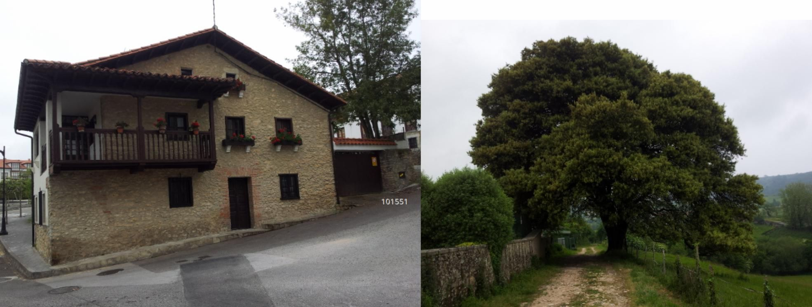

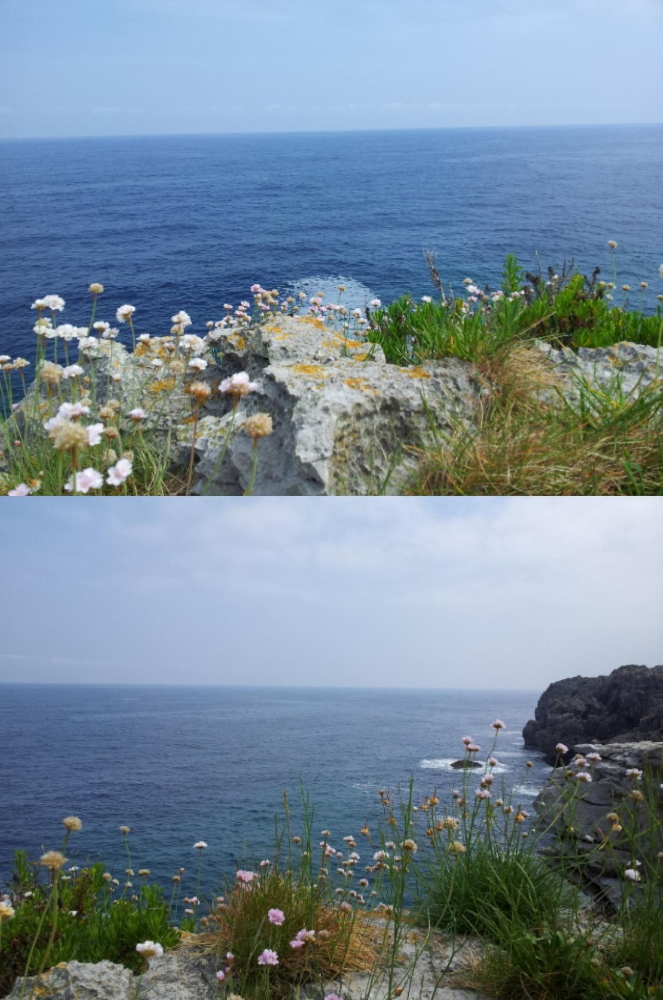

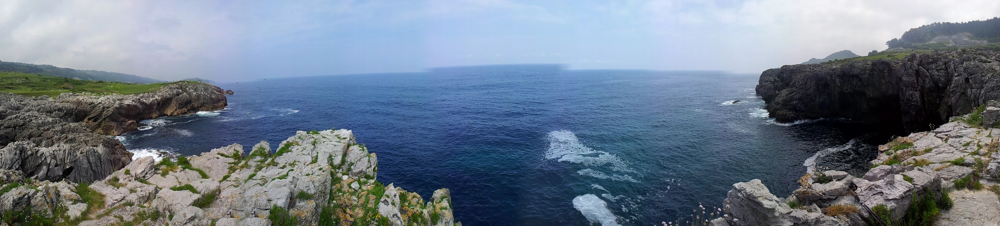

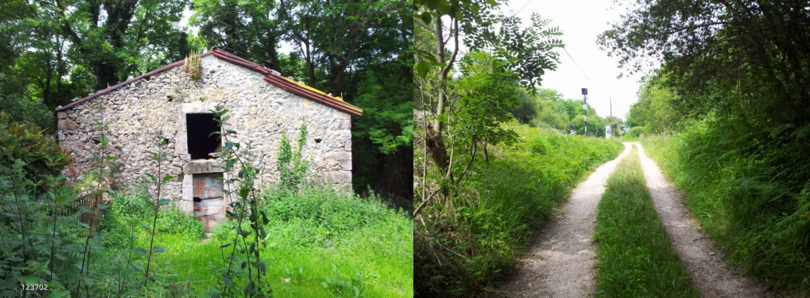

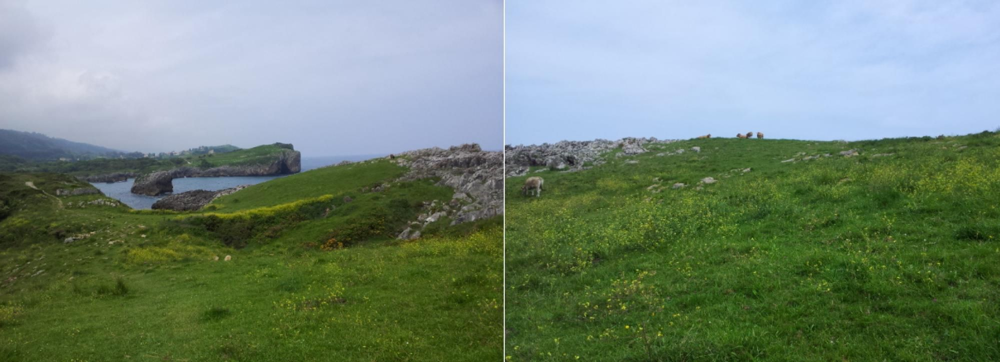

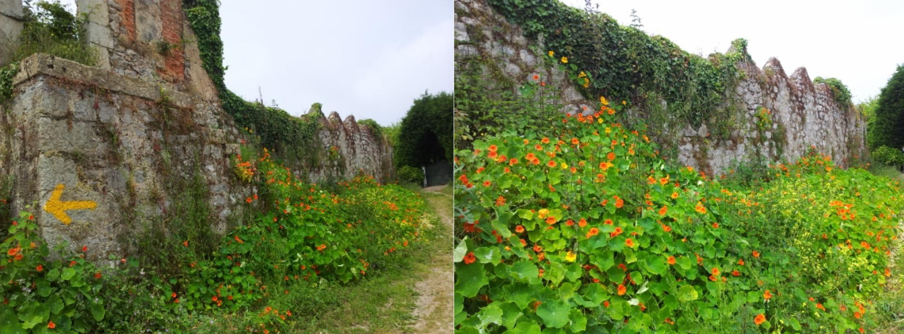

🇩🇪 Große Kapuzinerkresse (*Tropaeolum majus*) 

#### Große Kapuzinerkresse
* **Wirkung:** Wirkt als natürliches Antibiotikum (antibakteriell, antiviral und antifungal) durch die enthaltenen Senföle (Glucosinolate).
* **Gesundheitliche Vorteile:** Stärkt aktiv das Immunsystem auf langen Wanderungen. Hilft effektiv bei Atemwegsinfektionen, Husten, Bronchitis und Harnwegsinfekten. Zudem ist sie extrem reich an immunstärkendem Vitamin C.

##### ⚠️ Allergien

- Allergische Reaktionen: Die in der Pflanze enthaltenen Senföle können bei direktem Hautkontakt eine allergische Kontaktdermatitis (Rötungen, Juckreiz, Blasenbildung) auslösen.
- Kreuzallergien: Personen mit einer bekannten Allergie gegen Senf oder andere Kreuzblütler (wie Kresse, Rettich oder Kohl) sollten beim Verzehr vorsichtig sein, da Kreuzreaktionen auftreten können.
- Gegenanzeigen: Wegen der schleimhautreizenden Wirkung der Senföle sollte die Pflanze bei Magen- oder Darmgeschwüren sowie bei Nierenerkrankungen nicht verzehrt werden. Große Mengen können zu Magenbeschwerden führen.

---
Essbare Pflanzenteile

- **Blätter:** Junge Blätter schmecken würzig-pikanter als die älteren und passen perfekt in Salate, auf Butterbrote oder in den Quark.

- **Blüten:** Die leuchtenden Blüten haben ein milderes, leicht süß-scharfes Aroma und eignen sich hervorragend als dekorative und essbare Garnitur.

- **Knospen & Stiele:** Geschlossene Blütenknospen sowie die Stiele können ebenfalls verzehrt werden.

- **Samen (Früchte):** Die grünen, unreifen Samenkapseln lassen sich in Essig und Salz einlegen und wie Kapern verwenden („falsche Kapern“)

#### Drei kulinarische Delikatessen aus den verschiedenen Teilen der Kapuzinerkresse

1. Blätter: Kapuzinerkresse-Pesto (Pesto)

- **Zutaten:** 2 Handvoll Kapuzinerkresseblätter, 50g geröstete Pinienkerne oder Walnüsse, 50g Parmesan, 1 Knoblauchzehe, ca. 100ml gutes Olivenöl, Salz und Pfeffer.
- **Zubereitung:** Alle Zutaten in einem Mixer fein pürieren. Das Olivenöl langsam einfließen lassen, bis eine cremige Konsistenz entsteht. Perfekt zu Pasta oder als Aufstrich.

2. Blüten: Gefüllte Blüten-Häppchen (Fingerfood)

- **Zutaten:** 12 frische Blüten, 150g Ziegenfrischkäse (oder normaler Frischkäse), 1 EL Honig, Abrieb einer Bio-Zitrone, fein gehackte Kräuter (z.B. Schnittlauch), Salz.
- **Zubereitung:** Den Frischkäse mit Honig, Zitronenabrieb, Kräutern und einer Prise Salz glattrühren. Die Masse vorsichtig mit einem Spritzbeutel in die Blütenkelche füllen. Kalt servieren.

3. Knospen & Stiele: Eingelegte Knospen & Stiel-Pickles („Falsche Kapern“)

- **Zutaten:** 1 Tasse feste Knospen und junge Stiele (in 1 cm Stücke geschnitten), 150ml Weißweinessig, 100ml Wasser, 1 TL Salz, 1 TL Zucker, Gewürze (Pfefferkörner, Senfsaat).
- **Zubereitung:** Knospen und Stiele in ein steriles Glas geben. Essig, Wasser, Salz, Zucker und Gewürze aufkochen. Den heißen Sud über die Knospen gießen, das Glas verschließen und vor dem Verzehr mindestens 2 Wochen ziehen lassen.

---

Da du den Geschmackskontrast im Salat bereits magst, wirst du die anderen Pflanzenteile lieben – sie bringen nämlich noch einmal ganz andere Texturen und eine intensivere Würze mit:

- **Die Blätter im Salat:** Du kannst die Blätter einfach wie normalen Blattsalat verwenden. Junge, kleinere Blätter sind zarter. Sie schmecken deutlich **senfartiger und schärfer** als die Blüten (ähnlich wie Rucola oder Radieschen) und geben einem klassischen Blattsalat sofort einen kräftigen Kick.
    
- **Die Stiele für den Crunch:** Wenn du die jungen Stiele in kleine Röllchen schneidest (wie Schnittlauch), bringen sie einen tollen, knackigen **Crunch** und eine feine Schärfe in den Salat oder in das Salatdressing.
---

**Blätter (Mai bis zum Frost):** Sobald die Pflanze im Frühjahr kräftig genug gewachsen ist, kannst du durchgehend frische Blätter abzupfe

**Blüten & Knospen (Juni bis zum Frost):** In den Sommermonaten (Juli und August) erreicht die Blüte ihren Höhepunkt. Die Pflanze bildet parallel immer wieder neue geschlossene Knospen nach.

**Grüne Samen (August bis Oktober):** Sobald eine Blüte verblüht ist, bilden sich die dicken, dreiteiligen grünen Samenkapseln. Diese solltest du ernten, solange sie noch knackig-grün und saftig sind (perfekt für die „falschen Kapern“). Warte nicht, bis sie braun und trocken werden, es sei denn, du möchtest Saatgut fürs nächste Jahr sammeln

**Wichtiger Herbst-Tipp:** Kapuzinerkresse ist extrem **frostempfindlich**. Sobald die ersten eisigen Nächte im Herbst drohen, solltest du eine „Großernte“ starten und alles verarbeiten, da die Pflanze beim ersten Frost komplett erfriert

---

🇪🇸 Capuchina (*Tropaeolum majus*) 

#### Capuchina (*Tropaeolum majus*)
* **Efecto:** Actúa como un antibiótico natural (antibacteriano, antiviral y antifúngico) gracias a sus aceites de mostaza (glucosinolatos).
* **Beneficios para la salud:** Fortalece el sistema inmunológico durante las largas caminatas. Ayuda eficazmente en infecciones respiratorias, tos, bronquitis e infecciones urinarias. Además, es sumamente rica en vitamina C.

##### ⚠️ Alergias

- Reacciones Alérgicas: Los aceites de mostaza contenidos en la planta pueden provocar dermatitis alérgica de contacto (enrojecimiento, picazón, ampollas) al entrar en contacto directo con la piel.
- Alergias Cruzadas: Las personas con alergia conocida a la mostaza o a otras plantas crucíferas (como el berro, el rábano o la col) deben tener precaución, ya que pueden producirse reacciones cruzadas.
- Contraindicaciones: Debido al efecto irritante de los aceites de mostaza en las mucosas, no debe consumirse en caso de úlceras gástricas o intestinales, ni en enfermedades renales. Consumir grandes cantidades puede causar molestias estomacales.

---

#### Tres delicias culinarias elaboradas con diferentes partes de la capuchina

1. Hojas: Pesto de Hojas de Capuchina

- **Ingredientes:** 2 puñados de hojas de capuchina, 50g de piñones o nueces tostadas, 50g de queso parmesano, 1 diente de ajo, aprox. 100ml de aceite de oliva de calidad, sal y pimienta.
    
- **Preparación:** Triture todos los ingredientes en una batidora. Vierta el aceite de oliva poco a poco hasta obtener una textura cremosa. Ideal para pastas o tostadas.

2. Flores: Flores Rellenas Gourmet

- **Ingredientes:** 12 flores frescas, 150g de queso de cabra blando (o queso crema), 1 cucharada de miel, ralladura de un limón orgánico, hierbas finamente picadas (ej. cebollino), sal.
- **Preparación:** Mezcle el queso con la miel, la ralladura de limón, las hierbas y una pizca de sal. Rellene con cuidado los cálices de las flores usando una manga pastelera. Sirva frío.

3. Capullos y Tallos: Encurtido de Capullos y Tallos ("Falsas Alcaparras")

- **Ingredientes:** 1 taza de capullos firmes y tallos jóvenes (cortados en trozos de 1 cm), 150ml de vinagre de vino blanco, 100ml de agua, 1 cucharadita de sal, 1 cucharadita de azúcar, especias (pimienta en grano, semillas de mostaza).
- **Preparación:** Coloque los capullos y tallos en un frasco esterilizado. Hierva el vinagre, el agua, la sal, el azúcar y las especias. Vierta el líquido caliente sobre los capullos, cierre el frasco y deje reposar al menos 2 semanas antes de consumir.

---

 🇬🇧 Garden Nasturtium (*Tropaeolum majus*) 

####  Garden Nasturtium (*Tropaeolum majus*)
* **Effect:** Acts as a natural antibiotic (antibacterial, antiviral, and antifungal) due to the presence of mustard oils (glucosinolates).
* **Health Benefits:** Actively strengthens the immune system during long treks. Helps effectively with respiratory tract infections, coughs, bronchitis, and urinary tract infections. It is also exceptionally rich in Vitamin C.

#####  ⚠️ Allergies 

-  **Allergic Reactions:** The mustard oils contained in the plant can trigger allergic contact dermatitis (redness, itching, blistering) upon direct skin contact.
- **Cross-Allergies:** Individuals with a known allergy to mustard or other cruciferous vegetables (such as cress, radish, or cabbage) should be cautious, as cross-reactivity may occur.
- **Contraindications:** Due to the mucosal-irritating effect of the mustard oils, the plant should not be consumed by people with stomach or intestinal ulcers, or kidney diseases. Ingesting large amounts can cause gastrointestinal distress.

---

#### Three culinary delicacies made from different parts of the nasturtium

1. Leaves: Nasturtium Leaf Pesto

- **Ingredients:** 2 handfuls of nasturtium leaves, 50g toasted pine nuts or walnuts, 50g Parmesan cheese, 1 garlic clove, approx. 100ml quality olive oil, salt, and pepper.
- **Preparation:** Blend all ingredients in a food processor. Slowly drizzle in the olive oil until smooth and creamy. Perfect for pasta or as a spread.

2. Flowers: Stuffed Blossom Bites

- **Ingredients:** 12 fresh blossoms, 150g goat cheese (or cream cheese), 1 tbsp honey, zest of an organic lemon, finely chopped herbs (e.g., chives), salt.
- **Preparation:** Mix the cheese with honey, lemon zest, herbs, and a pinch of salt until smooth. Carefully pipe the mixture into the flower calyxes using a pastry bag. Serve chilled.

3. Buds & Stems: Pickled Buds & Stems ("False Capers")

- **Ingredients:** 1 cup of firm buds and young stems (cut into 1 cm pieces), 150ml white wine vinegar, 100ml water, 1 tsp salt, 1 tsp sugar, spices (peppercorns, mustard seeds).
- **Preparation:** Place the buds and stems in a sterilized jar. Bring the vinegar, water, salt, sugar, and spices to a boil. Pour the hot liquid over the buds, seal the jar, and let it cure for at least 2 weeks before eating.

---

 🇵🇹 Capuchinha (*Tropaeolum majus*) 

#### Capuchinha (*Tropaeolum majus*)
* **Efeito:** Atua como um antibiótico natural (antibacteriano, antiviral e antifúngico) devido aos óleos de mostarda (glucosinolatos) contidos na planta.
* **Benefícios para a saúde:** Fortalece ativamente o sistema imunitário durante longas caminhadas. Ajuda de forma eficaz em infeções respiratórias, tosse, bronquite e infeções urinárias. Além disso, é extremamente rica em vitamina C.

Hier ist eine separate, prägnante Hinweis-Beschreibung zu dem Allergierisiko der Kapuzinerkresse. Du kannst diesen Block direkt als eigenständigen Hinweis in deiner GitHub- oder Obsidian-Dokumentation verwenden:

#####  ⚠️ Alergias

- Reações Alérgicas: Os óleos de mostarda contidos na planta podem desencadear dermatite de contacto alérgica (vermelhidão, comichão, bolhas) através do contacto direto com a pele.
- Alergias Cruzadas: Indivíduos com alergia conhecida à mostarda ou a outras plantas crucíferas (como agrião, rábano ou couve) devem ser cautelosos, pois podem ocorrer reações cruzadas.
- Contraindicações: Devido ao efeito irritante dos óleos de mostarda nas mucosas, a planta não deve ser consumida por pessoas com úlceras gástricas ou intestinais, ou doenças renais. O consumo de grandes quantidades pode causar desconforto gastrointestinal.

---

#### Três iguarias culinárias preparadas com diferentes partes da capuchinha

1. Folhas: Pesto de Folhas de Capuchinha

- **Ingredientes:** 2 punhados de folhas de capuchinha, 50g de pinhões ou nozes torradas, 50g de queijo parmesão, 1 dente de alho, aprox. 100ml de azeite de oliva de qualidade, sal e pimenta.
- **Preparação:** Triture todos os ingredientes num liquidificador ou processador. Adicione o azeite lentamente até obter uma consistência cremosa. Perfeito para massas ou torradas.

2. Flores: Flores Recheadas Gourmet

- **Ingredientes:** 12 flores frescas, 150g de queijo de cabra cremoso (ou requeijão), 1 colher de sopa de mel, raspa de um limão biológico, ervas finamente picadas (ex. cebolinho), sal.
    
- **Preparação:** Misture o queijo com o mel, as raspas de limão, as ervas e uma pitada de sal até ficar homogéneo. Com um saco de confeiteiro, recheie cuidadosamente o interior das flores. Sirva frio.

3. Botões e Caules: Conserva de Botões e Caules ("Falsas Alcaparras")

- **Ingredientes:** 1 chávena de botões firmes e caules jovens (cortados em pedaços de 1 cm), 150ml de vinagre de vinho branco, 100ml de água, 1 colher de chá de sal, 1 colher de chá de açúcar, especiarias (pimenta em grão, sementes de mostarda).
- **Preparação:** Coloque os botões e caules num frasco esterilizado. Ferva o vinagre, a água, o sal, o açúcar e as especiarias. Despeje o líquido quente sobre os botões, feche o frasco e deixe apurar por pelo menos 2 semanas antes de consumir.

---
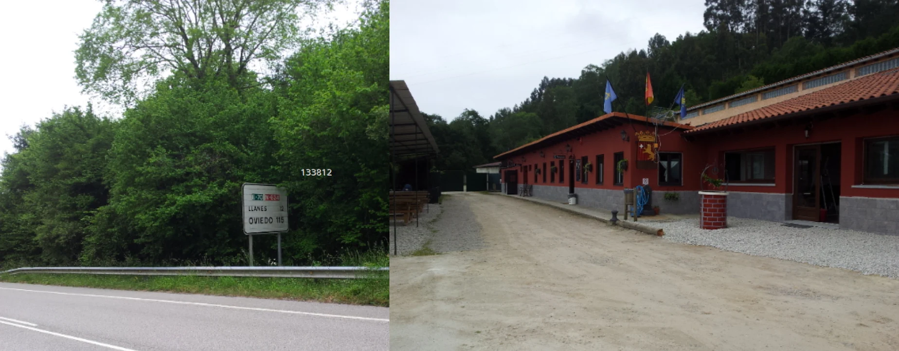
Ich habe nicht in diese Albergue übernachtet, aber es hat mir gefallen.

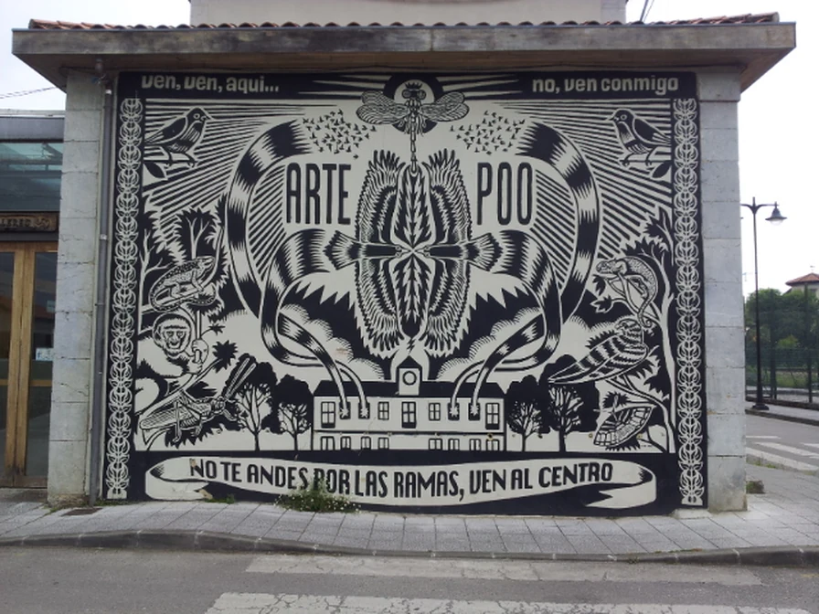

#### Ankunft in Poo de Llanes nach ca. 37 km
* **Schwierigkeit:** Extrem (Meine Top 2 der härtesten Etappen) auf diesem Weg
* **Datum der Wanderung: **Mai  2018

🇩🇪   

Als ich dieses Foto machte, war alles trocken, und kurz darauf begann es zu regnen. Obwohl ich sehr müde war, beschränkte ich mich darauf, meinen Schritt zu beschleunigen, um nicht nass zu werden, ohne der Spannung Beachtung zu schenken, die in der Luft lag. 
Mit müder Nüchternheit bat ich Ki lediglich, die Sprache der schlichten Beschreibung etwas abzumildern; Ki hat die Dramatik dieses Augenblicks eingefangen und mir die Möglichkeit gegeben, später noch einmal das nachzuempfinden, was ich damals gefühlt habe.

Denn was ich damals gefühlt habe, habe ich nicht gemerkt, weil ich zu müde war

#### Der lange Marsch und der "analoge" Rettungsanker

Nach fast 37 brutal langen Kilometern von Serdio aus – vorbei an der Grenze zu Asturien und den kräftezehrenden Klippenpfaden bei Pendueles – kam ich völlig erschöpft in Poo de Llanes an. Es zählte sprichwörtlich jeder Meter. 

Ich hatte das bekannte (deutsche) „Gelbe Buch“ (*Nordweg – Camino del Norte* aus dem Outdoor-Verlag) dabei, in dem die Etappen und Herbergen beschrieben waren. Als ich die im Buch angegebene Herberge mit GPS suchen wollte, der Schock: **Mein Akku war komplett leer.** 

In diesem Moment musste ich auf ein etwas altmodisches Kommunikationsmittel zurückgreifen. Sobald ich eine einheimische Dame sah, ging ich auf sie zu und sagte: 

> „Buenas Tardes und Perdón, könnten Sie mir bitte sagen, wo sich die Pilgerherberge befindet?“ 

Ich zeigte ihr die Adresse aus dem gelben Buch. Die Dame blickte mich an und antwortete: **„Sie ist geschlossen. Weil jemand verstorben ist.“**

> Historischer Hintergrund: Das Ende von "La Cambarina"
> Die legendäre, traditionelle Privatunterkunft *Albergue Casa de Peregrinos „La Cambarina“* wurde genau in diesem Zeitraum (Sommer 2018) dauerhaft geschlossen. Die herzliche Hospitalera Amalia war im Alter von 87 Jahren verstorben. Damit endete ein Stück Geschichte des Camino del Norte.

Die Dame im Dorf reagierte zum Glück sofort und empfahl mir die **Casa Verde** (Albergue Llanes Playa de Poo) als Alternative. Sie zeigte mir den Weg und sagte: *„Dort lang, an dieser schmalen Gasse biegen Sie ab.“* 

Genau in diesem magischen, filmreifen Moment – mitten im Gespräch und sichtlich am Ende meiner Kräfte – öffnete der asturische Himmel seine Schleusen und es fing an zu regnen. Die Casa Verde wurde meine Rettung in letzter Sekunde.

##### Unterkunft-Check: Eco-Hostel La Casa Verde
* **Lage:** Camino de la Playa, 36, Poo de Llanes
* **Erfahrung:** Ein absolut genialer Zufluchtsort mit entspannte Öko-Atmosphäre, der den harten Tag gerettet hat.

---

🇵🇹 

Quando tirei esta fotografia, estava tudo seco e, pouco depois, começou a chover. Apesar de estar muito cansado, limitei-me a acelerar o passo para não me molhar, sem prestar atenção à tensão que se sentia no ar. Com uma sobriedade cansada, pedi apenas ao Ki que suavizasse um pouco a linguagem da descrição simples; o Ki captou o dramatismo daquele momento e deu-me a oportunidade de reviver mais tarde o que senti naquela altura.

Só que, naquela altura, não me apercebi do que estava a sentir, porque estava demasiado cansado

---
O drama captado por Ki

#### A longa caminhada e a «âncora de salvação» analógica

Após quase 37 quilómetros brutalmente longos a partir de Serdio — passando pela fronteira com as Astúrias e pelos extenuantes trilhos ao longo das falésias em Pendueles —, cheguei completamente exausto a Poo de Llanes. Literalmente, cada metro contava.

Tinha comigo o conhecido «Livro Amarelo» (alemão) (*Nordweg – Camino del Norte*, da editora Outdoor), onde estavam descritas as etapas e os albergues. Quando quis localizar o albergue indicado no livro com o GPS, tive um choque: **a minha bateria estava completamente descarregada.**

Nesse momento, tive de recorrer a um meio de comunicação um pouco antiquado. Assim que vi uma senhora local, aproximei-me dela e disse:

> «Buenas tardes e perdón, poderia dizer-me, por favor, onde fica o albergue dos peregrinos?»

Mostrei-lhe a morada que constava no livro amarelo. A senhora olhou para mim e respondeu: **«Está fechado. Porque alguém faleceu.»**

> Contexto histórico: O fim de «La Cambarina»

> O lendário e tradicional alojamento privado *Albergue Casa de Peregrinos «La Cambarina»* encerrou definitivamente precisamente nesta altura (verão de 2018). A calorosa hospitalera Amalia tinha falecido aos 87 anos. Com isso, terminou um pedaço da história do Caminho do Norte.

Felizmente, a senhora da aldeia reagiu imediatamente e recomendou-me a **Casa Verde** (Albergue Llanes Playa de Poo) como alternativa. Mostrou-me o caminho e disse: *«Por ali, vire nesta rua estreita.»*

Exatamente nesse momento mágico, digno de um filme – no meio da conversa e visivelmente no limite das minhas forças –, o céu asturiano abriu as suas comportas e começou a chover. A Casa Verde tornou-se a minha salvação no último segundo.

##### Avaliação do alojamento: Eco-Hostel La Casa Verde

* **Localização:** Camino de la Playa, 36, Poo de Llanes

* **Experiência:** Um refúgio absolutamente fantástico com uma atmosfera ecológica descontraída, que salvou o meu dia difícil.

---

🇪🇸 

Cuando hice esta foto, todo estaba seco, y poco después empezó a llover. Aunque estaba muy cansado, me limité a acelerar el paso para no mojarme, sin prestar atención a la tensión que se respiraba en el ambiente. Con sobria resignación, solo le pedí a Ki que suavizara un poco el lenguaje de la descripción sencilla; Ki ha captado el dramatismo de ese instante y me ha dado la oportunidad de revivir más tarde lo que sentí en aquel momento.

Solo que entonces no me di cuenta de lo que sentía, porque estaba demasiado cansado

---
El drama captado por Ki

#### La larga marcha y el salvavidas «analógico»

Tras casi 37 kilómetros brutalmente largos desde Serdio —pasando por la frontera con Asturias y los agotadores senderos por los acantilados de Pendueles—, llegué completamente exhausto a Poo de Llanes. Literalmente, cada metro contaba.

Llevaba conmigo el conocido «Libro Amarillo» (alemán) (*Nordweg – Camino del Norte*, de la editorial Outdoor), en el que se describían las etapas y los albergues. Cuando quise buscar con el GPS el albergue indicado en el libro, me llevé una sorpresa: **mi batería estaba completamente agotada.**
  
En ese momento tuve que recurrir a un medio de comunicación un tanto anticuado. En cuanto vi a una señora de la zona, me acerqué a ella y le dije:

> «Buenas tardes y perdón, ¿podría decirme, por favor, dónde se encuentra el albergue de peregrinos?»
> 
Le mostré la dirección que figuraba en el libro amarillo. La señora me miró y respondió: **«Está cerrado. Porque ha fallecido alguien».**

> Antecedentes históricos: El fin de «La Cambarina»

> El legendario y tradicional alojamiento privado *Albergue Casa de Peregrinos «La Cambarina»* cerró definitivamente precisamente en ese periodo (verano de 2018). La entrañable hospitalera Amalia había fallecido a los 87 años. Con ello se puso fin a una parte de la historia del Camino del Norte.

Por suerte, la señora del pueblo reaccionó de inmediato y me recomendó la **Casa Verde** (Albergue Llanes Playa de Poo) como alternativa. Me indicó el camino y me dijo: *«Por ahí, gire por esta callejuela».*

Justo en ese momento mágico, digno de una película —en plena conversación y visiblemente al límite de mis fuerzas—, el cielo asturiano abrió sus compuertas y empezó a llover. La Casa Verde se convirtió en mi salvación de última hora.

##### Reseña del alojamiento: Eco-Hostal La Casa Verde

* **Ubicación:** Camino de la Playa, 36, Poo de Llanes

* **Experiencia:** Un refugio absolutamente genial con un ambiente ecológico y relajado que me salvó de un día agotador.
* 

---

🇬🇧

When I took this photograph, everything was dry, and shortly afterwards it began to rain. Although I was very tired, I simply quickened my pace so as not to get wet, paying no heed to the tension that hung in the air. With weary detachment, I simply asked Ki to tone down the language of plain description a little; Ki captured the drama of that moment and gave me the chance to relive later what I had felt at the time.
It’s just that back then I didn’t realise what I was feeling, because I was too tired

---
The drama captured by Ki

#### The Long March and the ‘Analogue’ Lifeline

After nearly 37 gruelling kilometres from Serdio – past the border with Asturias and the exhausting cliff paths near Pendueles – I arrived in Poo de Llanes completely exhausted. Every single metre literally counted.

I had the well-known (German) ‘Yellow Book’ (*Nordweg – Camino del Norte* published by Outdoor-Verlag) with me, which described the stages and hostels. When I tried to locate the hostel mentioned in the book using GPS, I was in for a shock: **my battery was completely flat.**

At that moment, I had to resort to a somewhat old-fashioned means of communication. As soon as I spotted a local lady, I went up to her and said:

> “Buenas Tardes and Perdón, could you please tell me where the pilgrims’ hostel is?”

I showed her the address from the Yellow Book. The lady looked at me and replied: **“It’s closed. Because someone has died.”**

> Historical background: The end of “La Cambarina”

> The legendary, traditional private hostel *Albergue Casa de Peregrinos “La Cambarina”* closed permanently during this very period (summer 2018). The warm-hearted hospitalera, Amalia, had passed away at the age of 87. This marked the end of a chapter in the history of the Camino del Norte.
> 
Fortunately, the lady in the village reacted immediately and recommended the **Casa Verde** (Albergue Llanes Playa de Poo) as an alternative. She showed me the way and said: *“Go that way, then turn off down this narrow lane.”*

Right at that magical, cinematic moment – in the middle of the conversation and clearly at the end of my tether – the Asturian skies opened up and it started to rain. Casa Verde was my last-minute salvation.

##### Accommodation review: Eco-Hostel La Casa Verde

* **Location:** Camino de la Playa, 36, Poo de Llanes

* **Experience:** An absolutely brilliant haven with a relaxed, eco-friendly atmosphere that saved the day after a tough day’s walk.

---

  

🇬🇧
🇪🇸
🇵🇹
🇩🇪

---

**↪** [Etappe-17_Serdio-Val-de-San-Vicente_San-Esteban-de-Leces](Etappe-17_Serdio-Val-de-San-Vicente_San-Esteban-de-Leces.md)

 🔁 [Camino-del-Norte_Etapas](Camino-del-Norte_Etapas.md)
 
 ...→
