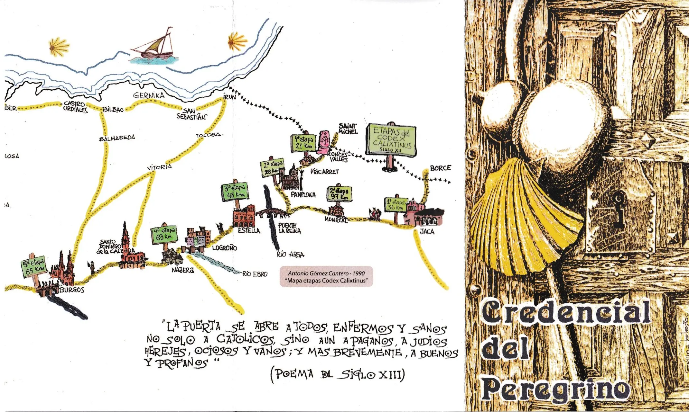
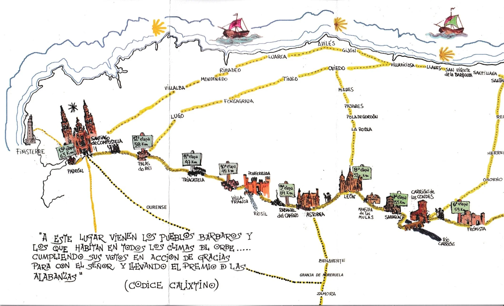
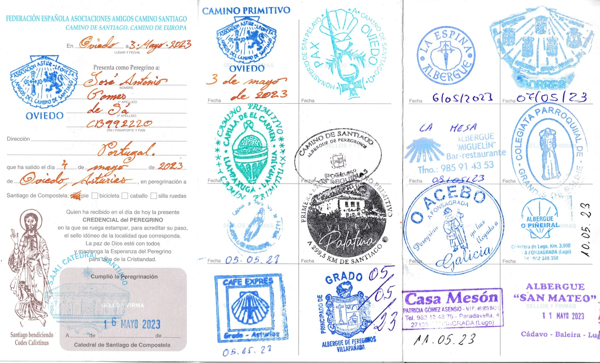
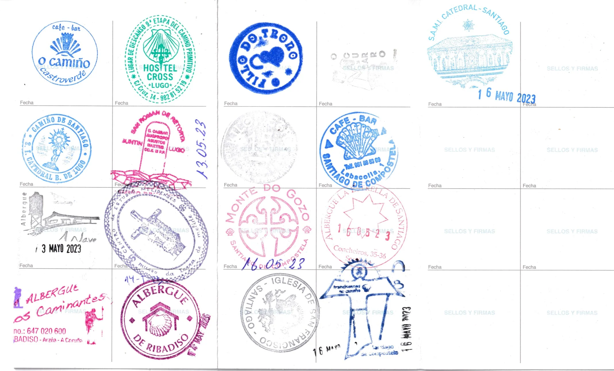
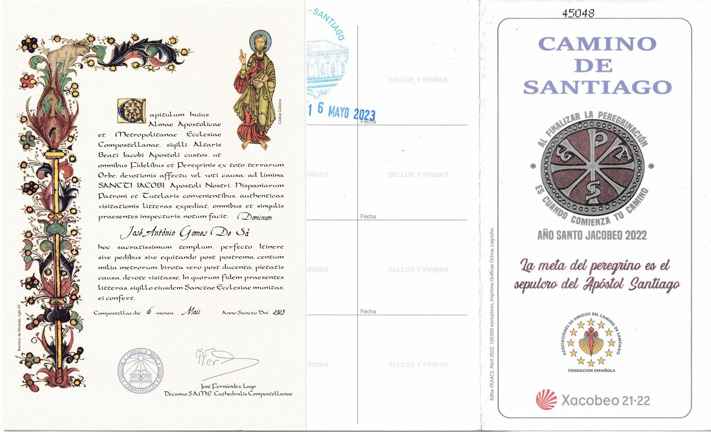
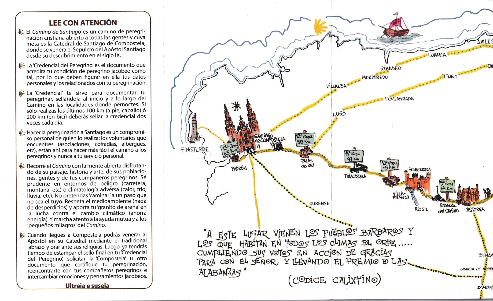

# Camino Primitivo 2023

## Credencial-del-Peregrino

 🇪🇸 *"La Puerta se abre a todos, Enfermos y Sanos, no solo a Católicos, sino aun a Paganos, A Judios Herejes, Ociosos y Vanos; y mas brevemente, a Buenos y Profanos"*
 – Poema de siglo XIII –

 🇬🇧 *‘The door is open to all, the sick and the healthy, not only to Catholics, but also to pagans, Jews, heretics, idlers and the vain; and, in short, to the good and the profane’*
 – 13th-century poem –

 🇵🇹 *«A porta abre-se a todos, doentes e saudáveis, não só aos católicos, mas também aos pagãos, aos judeus, aos hereges, aos ociosos e aos vaidosos; e, em suma, aos bons e aos profanos»*
 – Poema do século XIII –

🇩🇪 *„Die Tür steht allen offen, Kranken und Gesunden, nicht nur den Katholiken, sondern auch den Heiden, den Juden, den Ketzern, den Müßiggängern und den Eitlen; kurz gesagt, den Guten und den Gottlosen“*
 – Gedicht aus dem 13. Jahrhundert –

---
 

### Codice Calixtino

🇪🇸 *"A este Lugar vienen los Pueblos Barbaros y los que Habitan en todos los climas del Orbe .....* 
*cumpliendo sus Votos en Accion de Gracias para con el Señor y llevando el Premio  de las Alabanzas"*

🇩🇪 *„An diesen Ort kommen die barbarischen Völker und diejenigen, die in allen Klimazonen der Welt leben … 
um ihre Gelübde in Dankbarkeit gegenüber dem Herrn zu erfüllen und den Preis des Lobes darzubringen.“*

🇵🇹 «A este Lugar vêm os povos bárbaros e aqueles que habitam em todos os climas do mundo...
*cumprindo os seus votos de ação de graças para com o Senhor e trazendo o prémio  das louvores»*

🇬🇧 *“To this place come the barbarian peoples and those who live in every climate of the world …*
*to fulfil their vows in gratitude to the Lord and to offer the sacrifice of praise.”*

---

El camino marcado

---

 🔁  [El-Camino-Primitivo_Etappen](El-Camino-Primitivo_Etappen.md)
 
↪ [El-Camino-Primitivo](El-Camino-Primitivo.md)

 ...→
