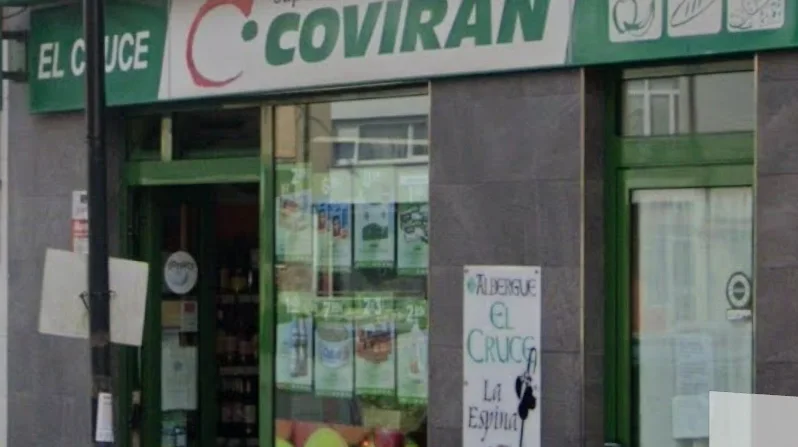

## Camino Primitivo 2023 

### Etappe-03: San Juan de Villapañada - La Espina (26,9 Km)
06 Mai 2023

Nachdem der Supermarkt offiziell geschlossen hatte, öffnete sie uns die Tür.
Das ist sehr praktisch, um uns mit Lebensmitteln für den Abend und den nächsten Tag einzudecken. Neben der Schlafecke sind es diese kleinen Details, die letztendlich darüber entscheiden, ob wir unser Ziel erreichen.

Albergue El Cruce, La Espina

---
### Es war zu langsam

🇩🇪  Es war zu langsam, 
Schritt für Schritt  folgt er uns hinterher und als wir vor den nähsten Anstieg eine kleine Verschnaufpause machten, ginge an uns vorbei und  war mal weg. 

In diese Albergue haben wir ein ehemaliger einundachtzigjähriger Lehrer aus Bayern getroffen, er war noch nicht bereit seine Wanderstiefel  an den Nagel zu hängen,  ohne die ursprüngliche Pilgerroute zurückgelegt zu haben.

---
🇵🇹   Era demasiado lento; 
passo a passo, ele seguia-nos e, quando fizemos uma pequena pausa para recuperar o fôlego antes da subida seguinte, passou por nós e desapareceu.

"Neste albergue conhecemos um antigo professor da Baviera de **oitenta e um anos**; ele ainda não estava pronto para **pendurar as botas** de caminhada sem ter percorrido o primeiro ou o caminho original."

---
🇪🇸  Iba demasiado lento; 
paso a paso nos seguía, y cuando nos detuvimos un momento para recuperar el aliento antes de la siguiente subida, nos adelantó y se alejó.

"En este albergue conocimos a un antiguo profesor de Baviera de **ochenta y un años**; aún no estaba dispuesto a **colgar las botas** de montaña sin haber recorrido el primer o el camino original."

---
🇬🇧  He was too slow; 
he followed us step by step, and when we stopped for a quick breather before the next climb, he walked past us and was gone in a flash.

"In this hostel, we met an **eighty-one-year-old** former teacher from Bavaria; he was not yet ready to **hang up his hiking boots** without having covered the first or the original path."

---

[Etapa-04_La-Espina_Borres](Etapa-04_La-Espina_Borres.md)

[El-Camino-Primitivo_Etappen](El-Camino-Primitivo_Etappen.md)