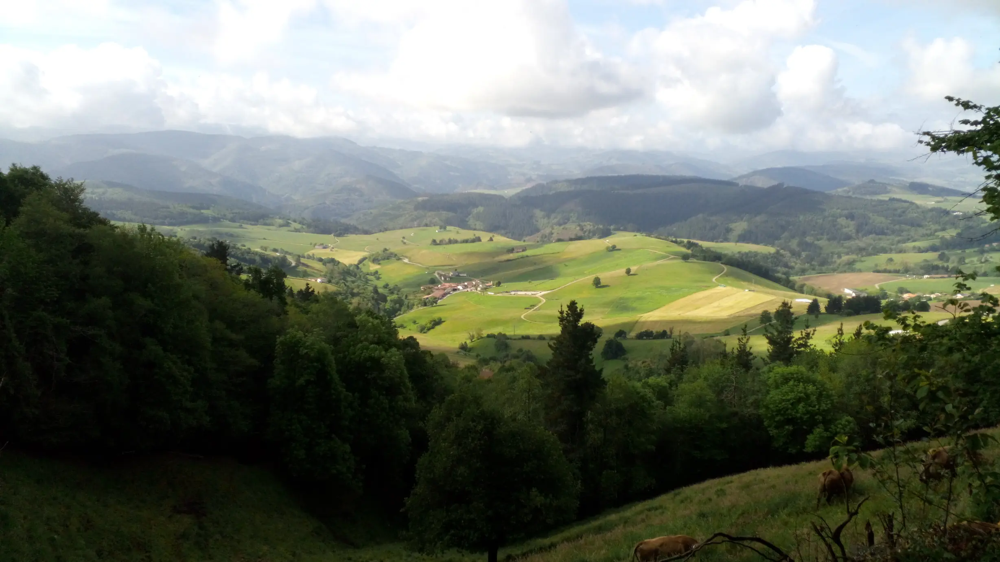

## Camino Primitivo 2023 

### Etappe-04: La Espina - Borres  (27,5 Km)
07 Mai 2023

 Voy a girar alí a la derecha /  Ich biege dort rechts ab / I'm turning right there /  Vou virar ali à direita

Googlemaps-Foto:  Albergue de Peregrinos de Santa Maria de Borres

🇪🇸 Yo giré a la derecha y seguí por el atajo, un camino cubierto de hierba húmeda que conduce a este albergue.

🇬🇧 I turned right and followed the shortcut, a path covered in damp grass leading to this hostel.

🇩🇪 Ich bog nach rechts ab und folgte der Abkürzung, einem mit feuchtem Gras bedeckten Weg, der zu dieser Herberge führt.

🇵🇹 Eu virei à direita e segui pelo atalho, um caminho coberto de erva húmida que conduz a este albergue.

---
#### 🇩🇪 Kurze Begegnung 

María aus Gran Canaria und ihre Begeisterung für Flüsse, da solche Landschaften in ihrer Heimat ungewöhnlich sind.
Die Route, die sie für den Jakobsweg geplant hatte, wurde an ihren Flug angepasst; deshalb setzte sie ihre Reise fort und trug die Flüsse auf ihrem Handy mit sich.
Nachdem Roze und ich uns darauf geeinigt hatten, am nächsten Tag gemeinsam die ersten Anstiege der Etappe zu bewältigen, folgte Roze María bis zur Herberge von Samblismo.
Wir trafen María auf dem Weg nicht wieder.
(Die Herberge von Samblismo wurde 2026 geschlossen.)

---

---

#### 🇪🇸 Un breve encuentro

María, de Gran Canaria, y su entusiasmo por los ríos, ya que en su tierra natal este tipo de paisajes no es habitual.
El itinerario que había planeado para el Camino de Santiago se adaptó a su vuelo; por eso, continuó su viaje llevando los ríos en su móvil.
Después de que Roze y yo quedáramos en superar juntas, al día siguiente, las primeras subidas de la etapa, Roze siguió a María hasta el albergue de Samblismo.
No volvimos a encontrarnos con María en el camino.
(El albergue de Samblismo cerrará en 2026.)

---
#### 🇬🇧 A brief encounter

María from Gran Canaria and her enthusiasm for rivers, as such landscapes are uncommon in her homeland.
The route she had planned for the Way of St James was adjusted to fit her flight; so she continued her journey, carrying the rivers with her on her mobile phone.
After Roze and I had agreed to tackle the first climbs of the stage together the following day, Roze accompanied María as far as the Samblismo hostel.
We didn’t meet María again along the way.
(The Samblismo hostel closed in 2026.)

---
#### 🇵🇹 Encontro breve

María, de Gran Canaria, e o seu entusiasmo pelos rios, uma vez que na sua terra natal este tipo de paisagens não é comum.
O itinerário que tinha planeado para o Caminho de Santiago foi adaptado ao seu voo; por isso, continuou a sua viagem levando os rios no seu telemóvel.
Depois de a Roze e eu termos combinado superar juntos, no dia seguinte, as primeiras subidas da etapa, a Roze seguiu a María até ao albergue de Samblismo.
Não voltámos a encontrar a María pelo caminho.
(O albergue de Samblismo fechou em 2026.)

---

 🇪🇸 En el albergue 

- Urs… de Suiza: 

- «¿Ella?» Tengo una foto de grupo con ella, pero siempre se me olvidan los nombres.
      ¿Y ella? También sale en la foto de grupo, ¿estuvo también en este albergue?
  .
- ¿Estarán los tres peregrinos españoles de camino para cumplir un voto o para mantenerse en forma física y mentalmente, con el fin de poder afrontar mejor los retos del día a día?
Aunque no podrían ser más diferentes en cuanto a edad y personalidad, siempre se han apoyado mutuamente en el «Caminho Primitivo».
.
- El joven peregrino alemán: no hablé con él, pero creo que vino a dar una vuelta después del colegio para decidir qué hacer a después.
.
- El , «peregrino de la vida» o «viajero del mundo», con un estilo de vida diferente y alternativo… ¿cómo se llamaba? Se había propuesto llevar un estilo de vida diferente.

---

 🇩🇪 In der Herberge 

- Urs … aus der Schweiz 
.
- „Sie?“ Ich habe ein Gruppen-Foto mit ihr, aber ich vergesse immer die Namen.
	  Und sie? Sie  ist auch auf den Gruppenfoto, war sie auch in diese Albergue? 
.
- Sind die drei spanischen Pilger vielleicht unterwegs, um ein Gelübde zu erfüllen oder um sich körperlich und geistig fit zu halten, damit sie die Herausforderungen des Alltags besser bewältigen können?
Obwohl sie sich in Bezug auf Alter und Persönlichkeit kaum unterschiedlicher sein könnten, haben sie sich auf dem „Caminho Primitivo“ stets gegenseitig unterstützt.
.
- Der junge Deutsche Pilger, mit ihm habe ich keine Kontakt gehabt, aber ich glaube er hat sich  nach der Schule die Beine vertreten um zu entscheiden wie es weiter geht. 
.
- Der  „Lebenspilger“ oder „Weltreisende“ mit einer anderen, alternativen Lebensweise – wie hieß er noch mal? Er hatte sich zum Ziel gesetzt, einen anderen Lebensstil zu führen.

---

 🇬🇧 At the hostel 

- Urs … from Switzerland – he enjoys hiking, but he loves cooking and eating even more.
.
- “Her?” I’ve got a group photo with her, but I always forget the names.
	And her? She’s in the group photo too – was she staying at this albergue as well?
.
- The three Spanish pilgrims, set off to fulfil a vow or to keep themselves physically and mentally fit, to better cope with the challenges of everyday life.
	– Although they couldn’t be more different in terms of age and personality, they always supported one another on the ‘Camin Primitivo’.
.
- The young German pilgrim: I didn’t speak to him, but I reckon he’d come for a wander after school to decide what to do next.
.
- The  ‘life pilgrim’ or ‘world traveller’ with a different, alternative way of life – what was his name again? He had set himself the goal of leading a different lifestyle.

---

 🇵🇹 No albergue 

- Urs… da Suíça.
.
- «Ela?» Tenho uma foto de grupo com ela, mas esqueço-me sempre dos nomes.
      E ela? Ela também está na foto de grupo, também esteve neste albergue?
.
- Será que os três peregrinos espanhóis estarão a caminho para cumprir um voto ou para se manterem em forma, tanto física como mentalmente, para que possam enfrentar melhor os desafios do dia a dia?
Embora não pudessem ser mais diferentes em termos de idade e personalidade, sempre se apoiaram mutuamente ao longo do «Caminho Primitivo».
.
- O jovem peregrino alemão: não tive contacto com ele, mas creio que veio dar uma volta depois da escola para decidir o que fazer a seguir.
.
- O «peregrino da vida» ou «viajante do mundo», com um modo de vida diferente e alternativo — como é que ele se chamava mesmo? Ele tinha-se proposto como objetivo levar um estilo de vida diferente.

---

---

🔁 [El-Camino-Primitivo_Etappen](El-Camino-Primitivo_Etappen.md)
 
↪ [Etapa-05_Borres_La-Mesa](Etapa-05_Borres_La-Mesa.md)

 ...→

