## Camino Primitivo 2023 

### Etappe-06: La Mesa - Grandas de Salime (16 Km)
09 Mai 2023 

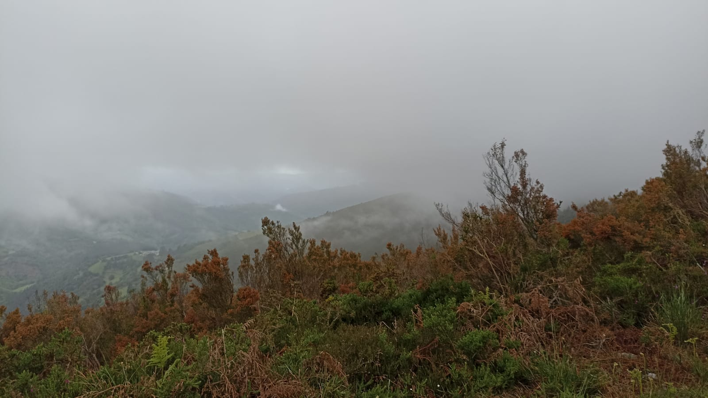

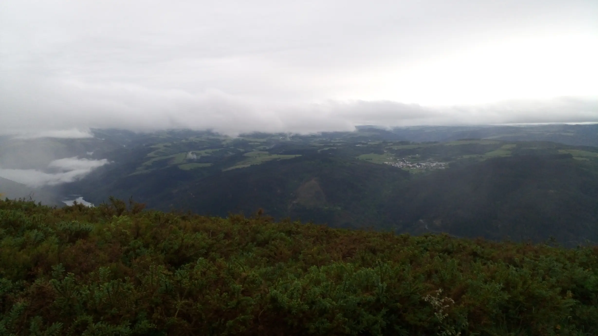

### Etapa trazada | traçada  / Planned stage  / Geplante Etappe

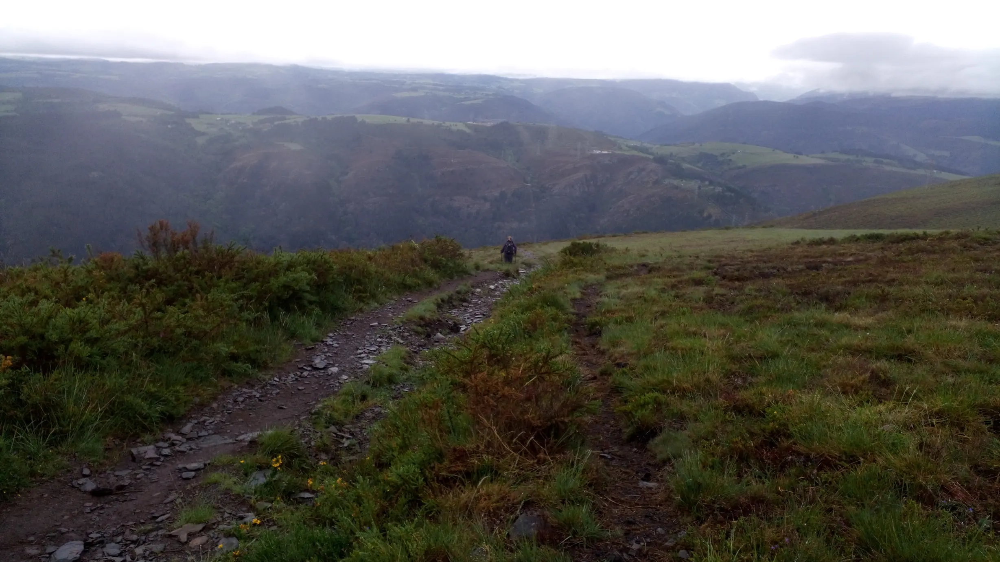

Sie kommt aus Madrid und hatte ebenfalls einen klaren Plan. Mit festen Schritten ging sie auf ihr Ziel zu.

Ich kenne Madrid nur als Durchreisender, und persönlich finde ich, dass Routen wie diese ein wunderbarer Spaziergang für alle sind, die den Stress Madrids ertragen müssen.

Unsere Tagesetappe war etwas kurzer, deswegen haben wir das langsamer angehen lassen.

---
Ela é de Madrid e também tinha um plano bem definido. Com passos firmes, avançou em direção ao seu objetivo. 

Conheço Madrid apenas de passagem e, pessoalmente, acho que percursos como este são um passeio maravilhoso para todos aqueles que têm de suportar o stress de Madrid.

A nossa etapa do dia foi um pouco mais curta, por isso fomos a um ritmo mais lento.

---
She’s from Madrid and had a clear plan too. She strode purposefully towards her destination. 

I’ve only ever been through Madrid in transit, and personally I think routes like this make for a lovely stroll for anyone who has to put up with the hustle and bustle of Madrid.

Our stage for the day was a bit shorter, so we took it a bit easier.

---

Es de Madrid y también tenía un plan claro. Avanzaba con paso firme hacia su objetivo. 

Solo conozco Madrid de paso y, personalmente, creo que recorridos como este son un paseo maravilloso para todos aquellos que tienen que soportar el estrés de Madrid.

Nuestra etapa de hoy era un poco más corta, así que nos lo tomamos con más calma.

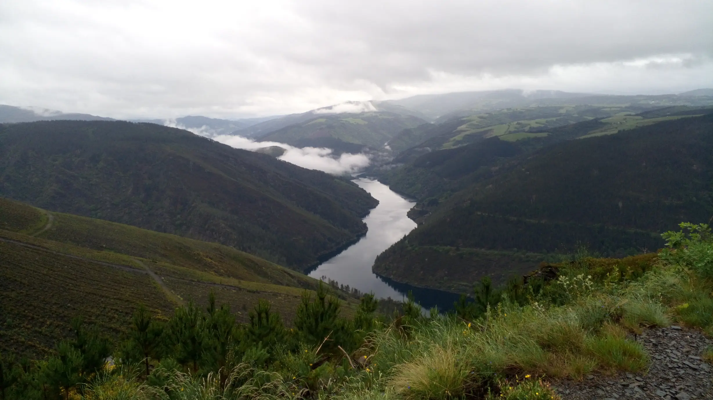

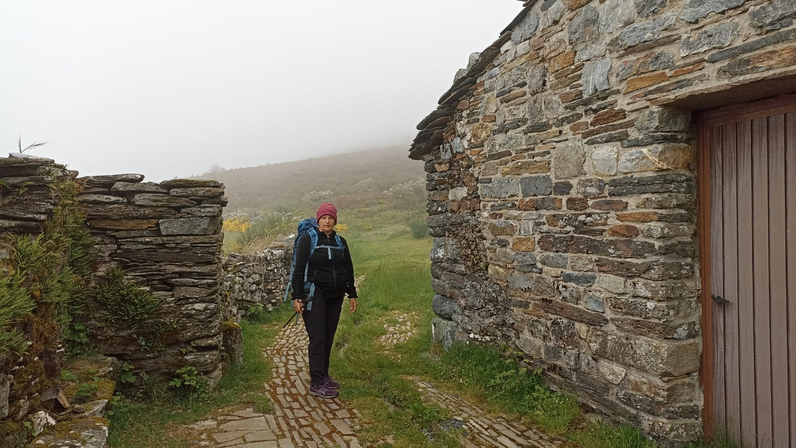

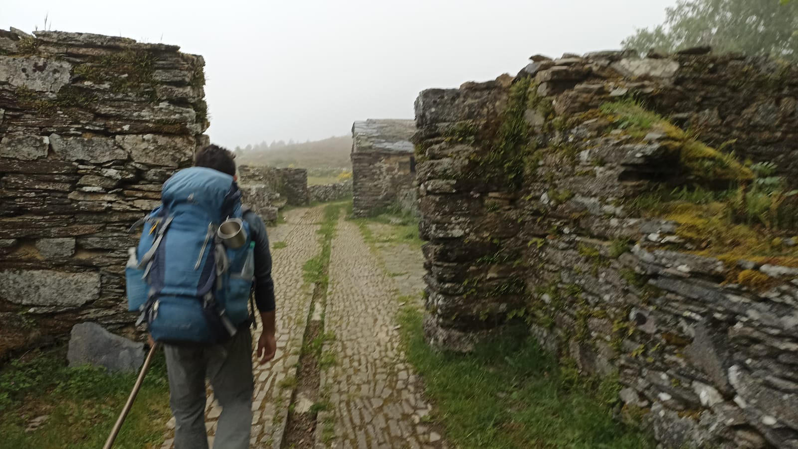

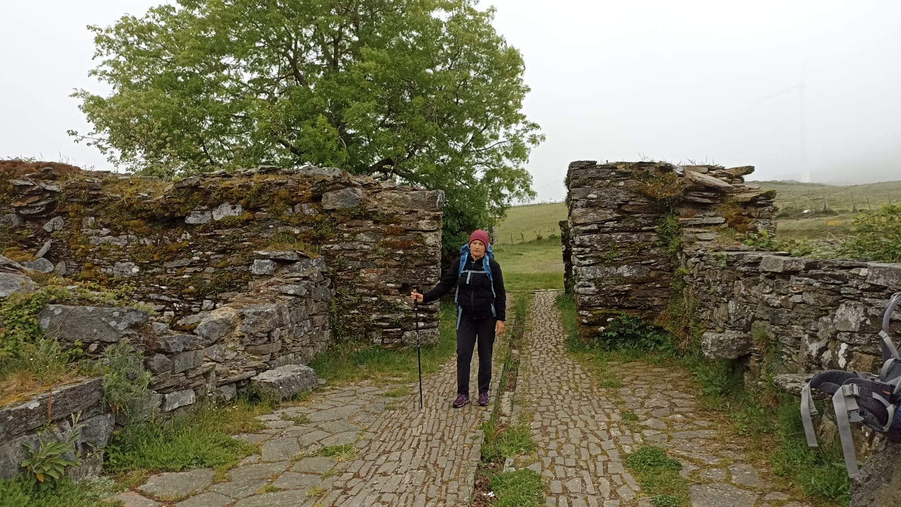

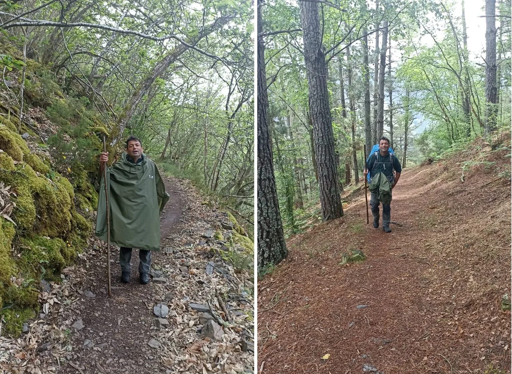

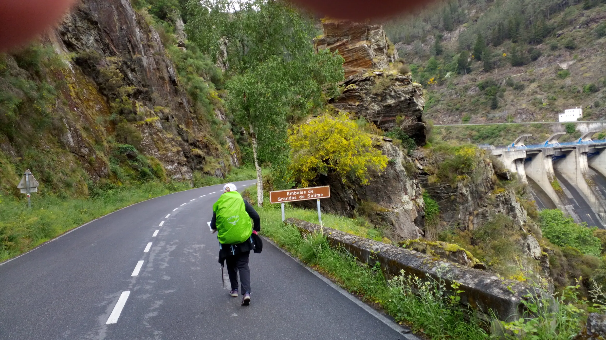

#### Ultramarinos Restrepo

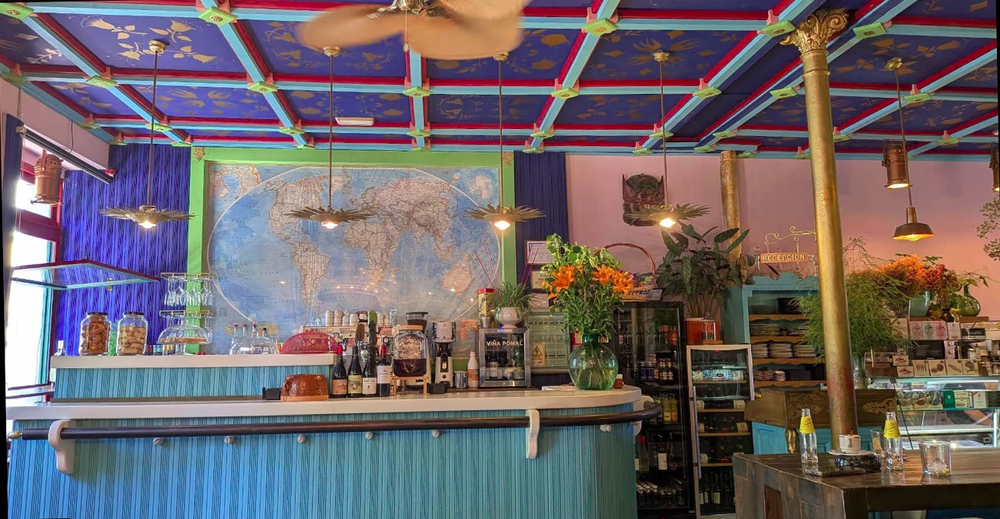

Ultramarinos Restrepo – Was für eine Überraschung.   Eine herrliche Atmosphäre, um einen Drink zu genießen und noch vieles mehr.

Ultramarinos Restrepo – ¡Menuda sorpresa!   Un ambiente maravilloso para disfrutar de una copa y mucho más.

Ultramarinos Restrepo – What a surprise!   A wonderful place to enjoy a drink and much more.

Ultramarinos Restrepo – Que surpresa!   Um ambiente maravilhoso para saborear uma bebida e muito mais.

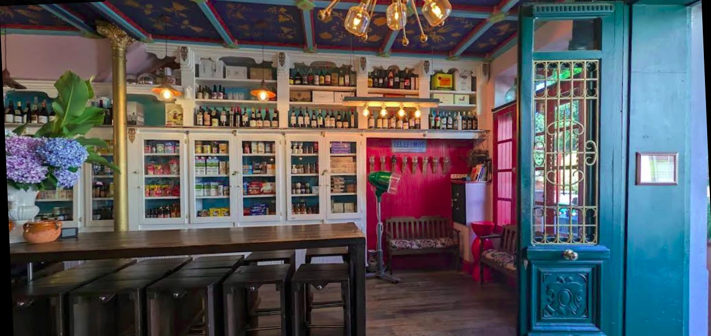

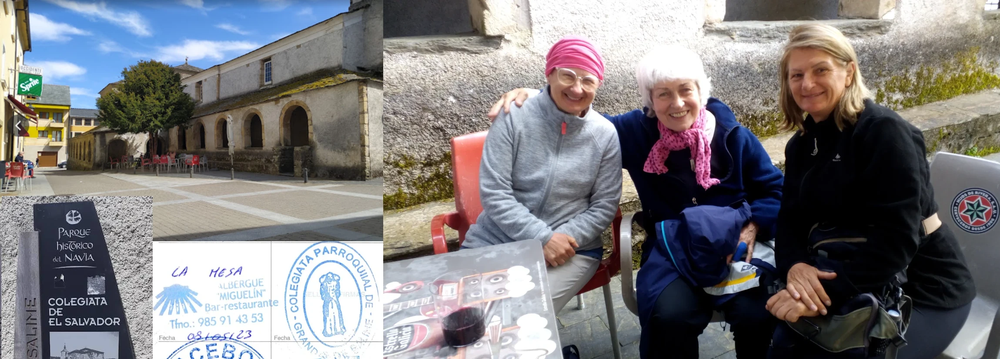

🇩🇪 Der „Caminho Primitivo“ ist nur etwas für junge Leute voller Energie. Die zwanzigjährigen Pilger liegen irgendwo in einem Lagerbett (Pritsche) und tanken neue Kräfte, um die nächste Etappe bewältigen zu können.

🇵🇹 O «Caminho Primitivo» é apenas para jovens cheios de energia. Os peregrinos de vinte anos estão deitados algures numa plataforma de dormitório a recuperar forças para conseguirem superar a próxima etapa. 

🇪🇸 El «Caminho Primitivo» es solo para gente joven llena de energía. Los peregrinos de veinte años descansan en alguna litera y recargan fuerzas para poder afrontar la siguiente etapa.

🇬🇧 The ‘Caminho Primitivo’ is only for young people brimming with energy. The twenty-year-old pilgrims are lying in bunk beds somewhere, recharging their batteries so they can tackle the next stage of the journey.

---
#### **Wo genau wurde dieses Foto aufgenommen?**

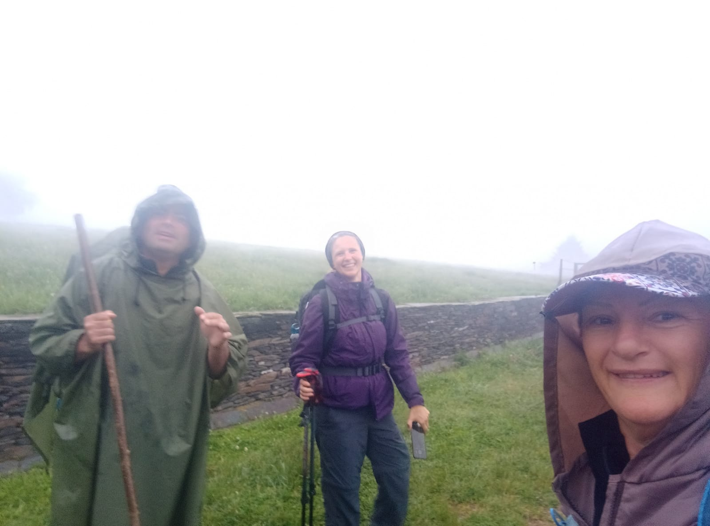

 🇩🇪 20230509_Danach_sanfter-Abstieg 

Ich habe die Fotos aus dem Ordner „.thumbnails“ wiederhergestellt und versucht, sie nach meinen Erinnerungen und den Stempeln auf den Ausweisen zu ordnen. Es kann sein, dass ich mich bei der Sortierung der Fotos um einen Tag geirrt habe.

Ich weiß nicht mehr, ob es 1 oder 2 km waren, aber nach dem Abstieg stand dort ein Steinmarker mit der Entfernung bis nach Santiago, wo wir ein Foto gemacht haben

---

🇪🇸 ¿Dónde se tomó exactamente esta foto?

20230509_Después_descenso-suave

He recuperado las fotos de la carpeta .thumbnails y he intentado ordenarlas según mis recuerdos y los sellos de las credenciales. Es posible que me haya equivocado de un día al ordenar las fotos.

Ya no recuerdo si eran 1 o 2 km, pero, tras el descenso, había allí un mojón de piedra con la distancia hasta Santiago, donde nos hicimos una foto.

---

 🇵🇹 Onde é que esta fotografia foi tirada, exatamente? 

20230509_Depois_descida suave

Recuperei as fotos da pasta «.thumbnails» e tentei organizá-las com base nas minhas memórias e nos carimbos nos documentos de identificação. É possível que me tenha enganado num dia ao organizar as fotos. 

Já não me lembro se eram 1 ou 2 km, mas, depois da descida, havia ali um marco de pedra com a distância até Santiago, onde tirámos uma fotografia

---

 🇬🇧 Where exactly was this photograph taken? 

20230509_Afterwards_a gentle descent

I have recovered the photos from the ‘.thumbnails’ folder and tried to organise them based on my memories and the stamps on the travel documents. It is possible that I got the date wrong by one day when sorting the photos. 

I can’t remember now whether it was 1 or 2 km, but after the descent there was a stone marker showing the distance to Santiago, where we took a photograph

---

 🔁 [El-Camino-Primitivo_Etappen](El-Camino-Primitivo_Etappen.md)
 
↪ [Etapa-07_Grandas-de-Salime_O-Pineiral](Etapa-07_Grandas-de-Salime_O-Pineiral.md) 

 ...→

