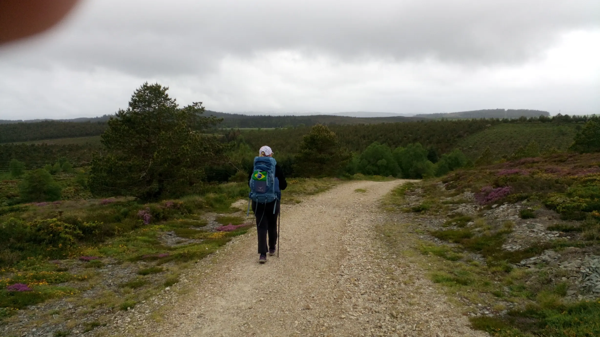
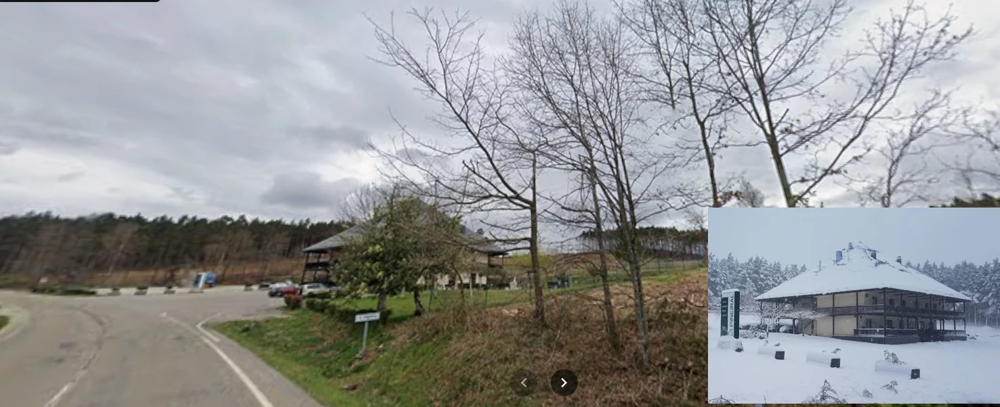

## Camino Primitivo 2023 

### Etappe-07: Grandas de Salime - Complejo "O Piñeiral" (29,1 Km)
10 Mai 2023

---

Googlemaps-Foto

El «Camino Primitivo» discurre detrás del complejo «O Piñeiral»; tuvimos que fijarnos muy bien para encontrar en mi pequeño móvil el atajo que atravesaba la hierba  hasta el alojamiento.

The ‘Camino Primitivo’ runs behind the ‘O Piñeiral’ complex; we had to look very carefully to find the shortcut through the grass to the accommodation on my small mobile phone.

O «Camino Primitivo» passa por trás do complexo «O Piñeiral»; tivemos de olhar com muita atenção para encontrar, no meu pequeno telemóvel, o atalho através da erva  que levava ao alojamento.

Der „Camino Primitivo“ verläuft hinter dem Komplex „O Piñeiral“; wir mussten sehr genau hinschauen, um auf meinem kleinen Handy die Abkürzung durch das Gras zur Unterkunft zu finden.

---
🔁 [El-Camino-Primitivo_Etappen](El-Camino-Primitivo_Etappen.md)
 
↪[Etapa-08_O-Pineiral_Cadavo](Etapa-08_O-Pineiral_Cadavo.md)

 ...→
