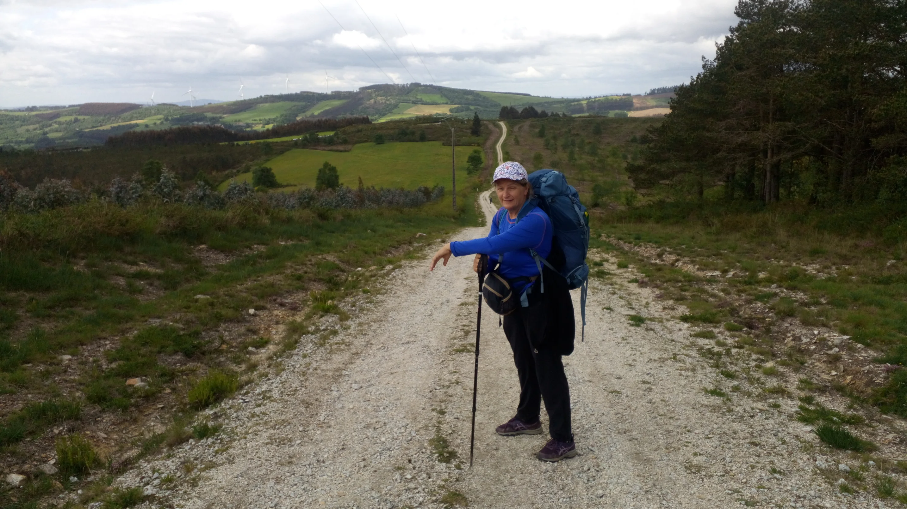
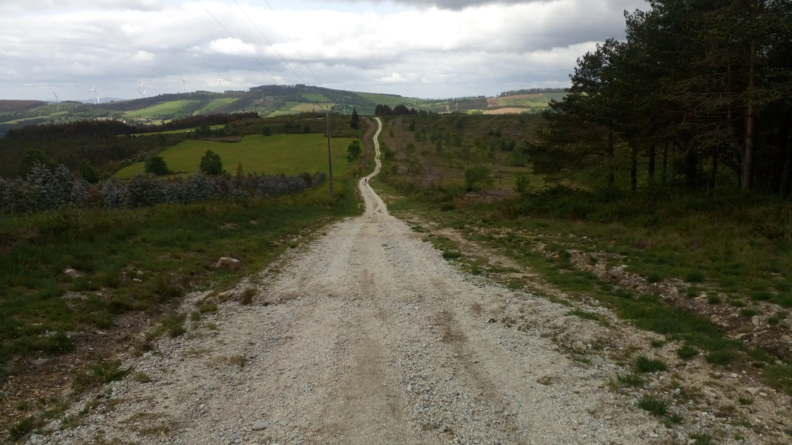
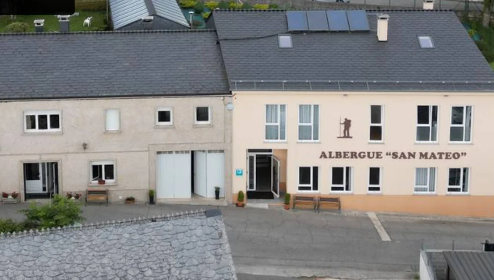

## Camino Primitivo 2023 

### Etappe-08: Complejo "O Piñeiral" - Cádavo (20,5 Km)
11 Mai 2023

🇵🇹 O dia anterior já tinha sido cansativo e, quando se vê o peregrino a perder-se na distância, este percurso parece-nos uma eternidade para os nossos pés, que ainda não estavam totalmente recuperados. Mesmo sendo a descer, cada passo sobre uma pedra fazia-nos sentir os quilómetros percorridos no dia anterior.

🇩🇪 Der Vortag war bereits anstrengend gewesen, und als wir den Pilger in der Ferne verschwinden sahen, kam uns diese Strecke wie eine Ewigkeit vor – für unsere Füße, die sich noch nicht ganz erholt hatten. Obwohl es abwärts ging, spürten wir bei jedem Tritt auf einem Stein die Kilometer, die wir am vorherigen Tag zurückgelegt hatten.
 

🇪🇸 El día anterior ya había sido agotador y, cuando ves al peregrino perderse en la lejanía, ese tramo se hace tremendamente largo para nuestros pies, que aún no se han recuperado del todo. Aunque fuera cuesta abajo, cada paso sobre una piedra nos hacía sentir el esfuerzo de los kilómetros recorridos ayer.

🇬🇧 The previous day had already been exhausting, and as we watched the pilgrim disappear into the distance, this stretch of the journey seemed to last an eternity for our feet, which hadn’t yet fully recovered. Even though it was downhill, every step on a stone made us feel the kilometres we’d covered the day before.

Googlemaps-Foto

---

 🔁 [El-Camino-Primitivo_Etappen](El-Camino-Primitivo_Etappen.md)
 
↪ [Etapa-09_Cadavo_Lugo](Etapa-09_Cadavo_Lugo.md)

 ...→

