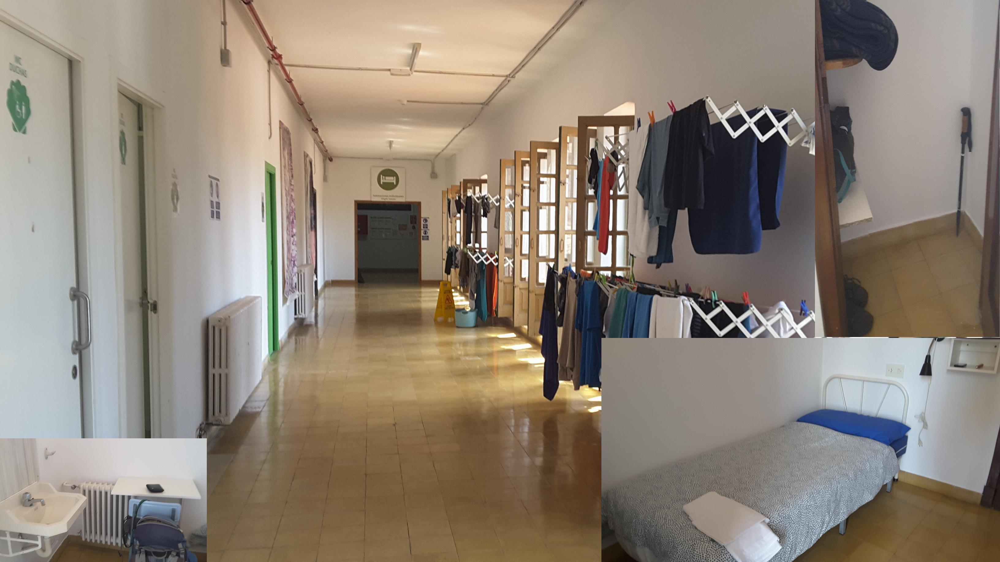
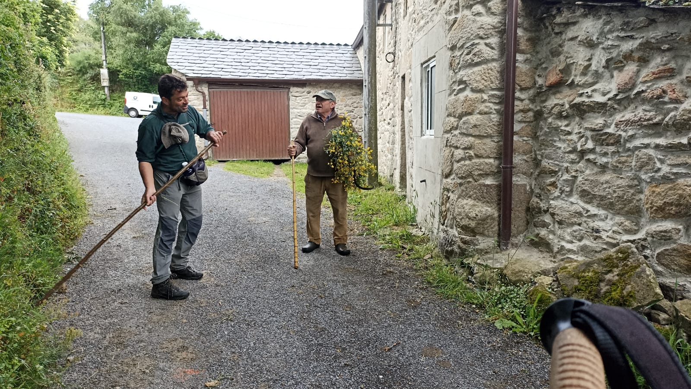
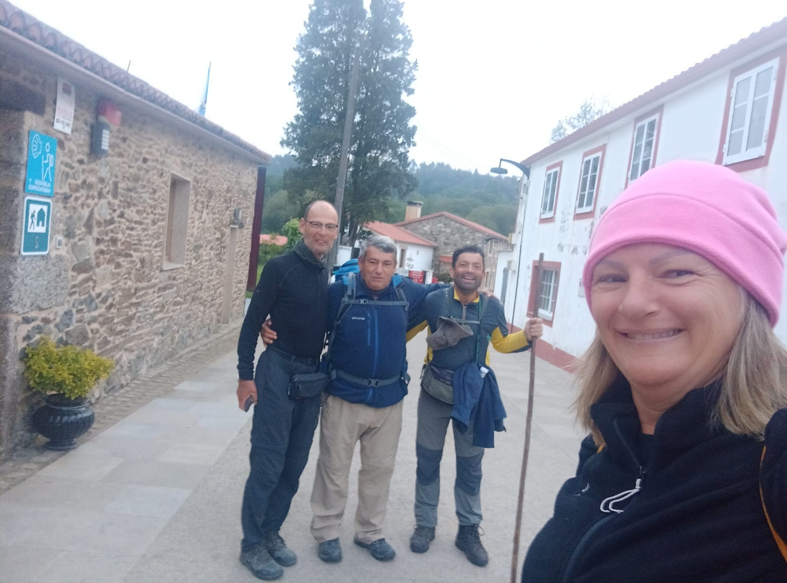
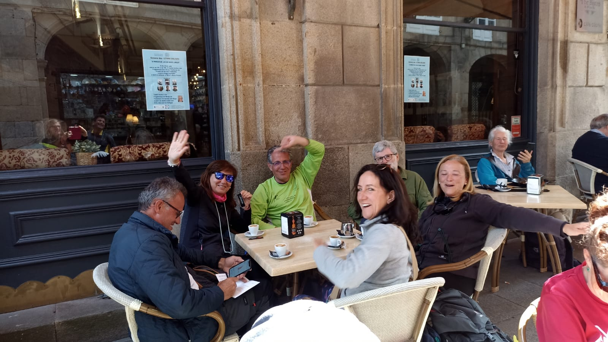
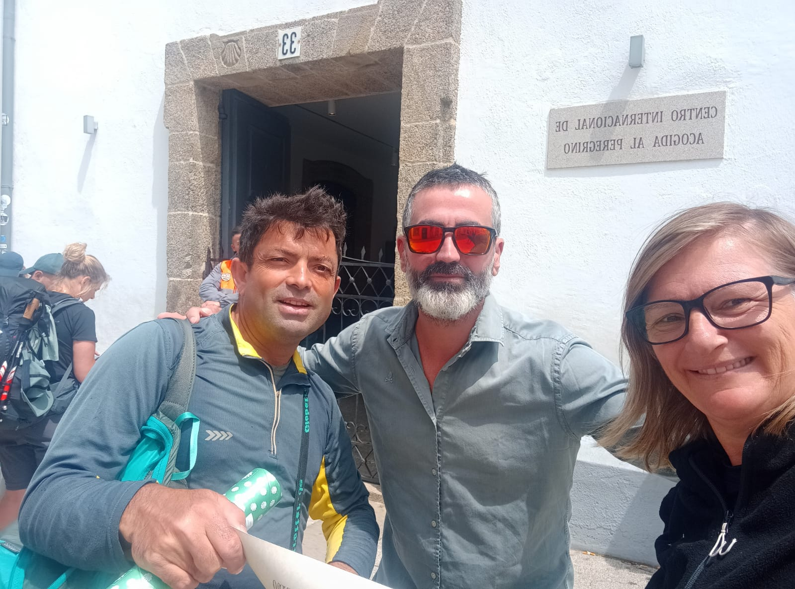
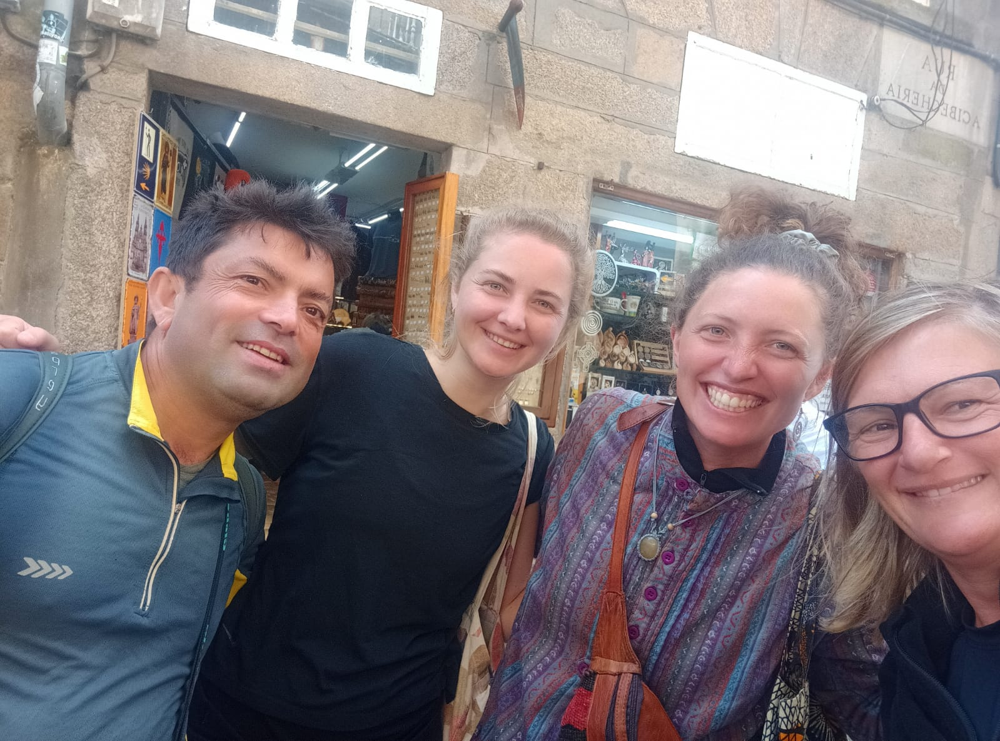
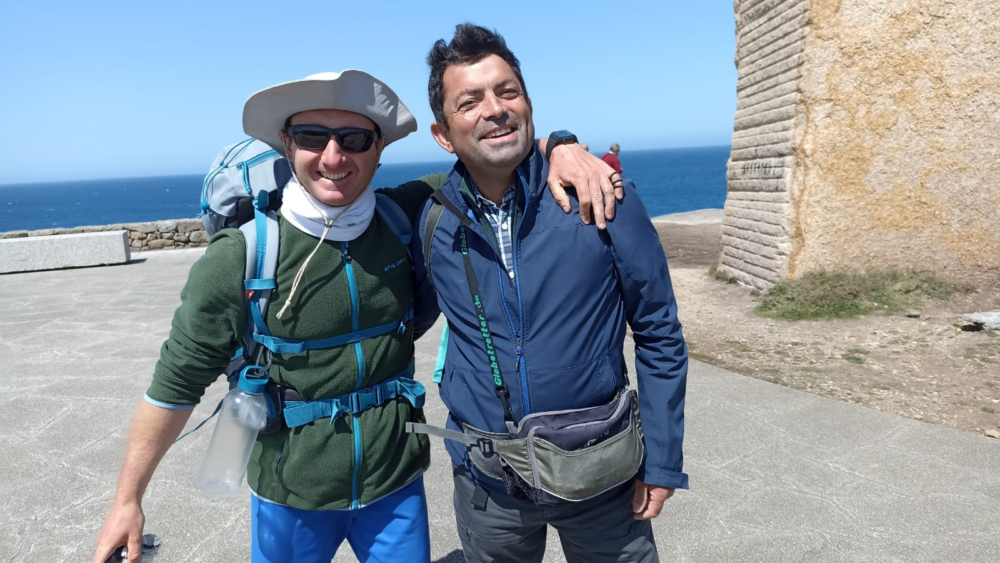
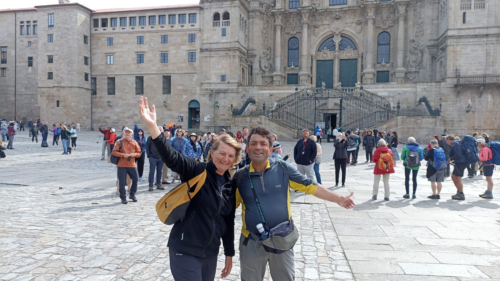
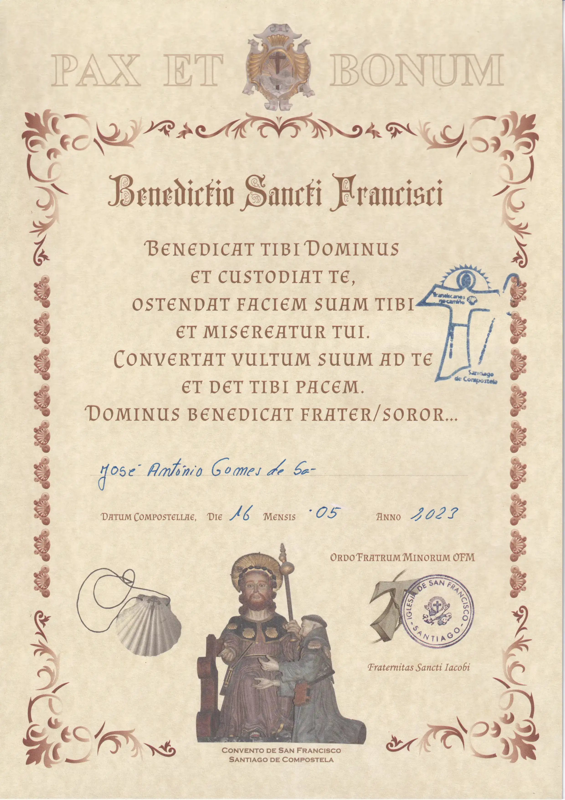
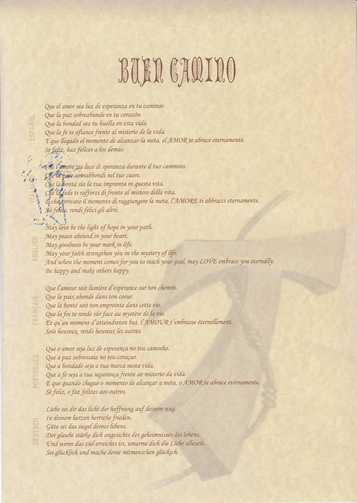

## Camino Primitivo 2023 

### Etappe-13: Lavacolla - Santiago de Compostela (9,9 Km)

16 Mai 2023

Seminário Menor

---

**Ultreia et Suseia!**

- Hasta el próximo encuentro
- Bis zum nächsten Wiedersehen
- Até à próxima vez
- Until we meet again

- 

- 

- 

- 

- 

- 

---

 🔁 [El-Camino-Primitivo_Etappen](El-Camino-Primitivo_Etappen.md)
 
↪ [Etapa-01_Oviedo_Escamplero](Etapa-01_Oviedo_Escamplero.md)

 ...→

---

**Buen Camino!**

 Benedictio-Sancti-Francisci 

#### 🇩🇪 Manchmal

gehen wir in eine Kirche, um zu beten oder zu meditieren und eine Kerze anzuzünden, um inneren Frieden zu finden. Wir erhalten eine Urkunde – ein weiteres Andenken, das belegt, dass wir dort waren. Wir kehren nach Hause zurück, öffnen die Schublade und legen sie sorgfältig hinein, ohne darüber nachzudenken, welche Persönlichkeit hinter der Person steckt, die sie uns überreicht hat. 

#####  Leben und Wirken des Heiligen Franziskus von Assisi (1181/1182 – 1226) 

- Leben: Geboren als reicher Tuchhändlersohn, wählte er nach einer inneren Krise und Kriegsgefangenschaft ein Leben in radikaler Armut.
- Wirken: Er gründete den Franziskanerorden, predigte Liebe, Frieden und Buße und lebte in tiefer Verbundenheit mit der Natur und den Armen.
- Bedeutung: Er gilt als einer der populärsten Heiligen, bekannt für den Sonnengesang und die Einführung der Weihnachtskrippe.

---
#### 🇬🇧 Sometimes 

we go to a church to pray or meditate and light a candle in order to find inner peace. We are given a certificate – another memento proving that we were there. We return home, open the drawer and place it carefully inside, without giving a thought to the personality behind the person who presented it to us.  

#####  The Life and Work of Saint Francis of Assisi (1181/1182 – 1226)

- Life: Born into a wealthy merchant family, he abandoned his riches after a spiritual awakening to embrace absolute poverty.
- Ministry: He founded the Franciscan Order, preached peace, and championed care for the poor and marginalized.
- Legacy: Patron saint of animals and the environment, famously known for his "Canticle of the Sun" and receiving the stigmata.

---
#### 🇪🇸  A veces 

vamos a una iglesia a rezar o a meditar y a encender una vela para encontrar la paz interior. Nos dan un certificado, otro recuerdo que demuestra que estuvimos allí. Volvemos a casa, abrimos el cajón y lo guardamos con cuidado, sin pensar en qué tipo de personalidad se encuentra detrás de la persona que nos lo entregó.  

#####  A vida e a obra de São Francisco de Assis (1181/1182 – 1226)

- Vida: Nacido en una rica familia de comerciantes, renunció a sus bienes materiales tras una conversión espiritual para vivir en la pobreza.
- Obra: Fundó la Orden de los Franciscanos, promovió la paz, la humildad y el amor incondicional hacia los marginados.
- Legado: Es el santo patrón de los animales y la ecología, célebre por su poema "Cántico de las Criaturas".
---
#### 🇵🇹 Às vezes, 

 vamos a uma igreja para rezar ou meditar e acender uma vela, na procura da paz interior. Dão-nos um certificado, mais uma lembrança que comprova que lá estivemos. Voltamos para casa, abrimos a gaveta e guardamo-lo com cuidado, sem pensar que personalidade está por trás da pessoa que nos o entregou.  

#####  Vida y obra de San Francisco de Asís (1181/1182 – 1226)

- Vida: Nascido numa família rica, renunciou a todos os seus bens materiais após uma profunda conversão espiritual para viver na pobreza.
- Obra: Fundou a Ordem dos Franciscanos, pregou a paz e dedicou a sua vida ao cuidado dos pobres e dos doentes.
- Legado: É o santo padroeiro dos animais e do meio ambiente, conhecido pelo seu poema "Cântico das Criaturas".

---

🇩🇪  Das verborgene Geheimnis von Santiago "PAX et Bonum ✨"

#### Die „Cotolaya“

Der historische Fakt  
Manchmal offenbaren sich die tiefsten Geheimnisse eines Ortes erst beim zweiten oder dritten Blick. Die Kirche und das Kloster San Francisco liegen nur wenige Gehminuten von der Kathedrale von Santiago de Compostela entfernt. Sie stehen genau an dem Ort, an dem Franz von Assisi im Jahr 1214 selbst als Pilger übernachtete und die Gründung des Klosters in Auftrag gab.

Wenn du heute dort eine Urkunde mit dem Titel _„PAX et Bonum – Benedictio Sancti Francisci“_ erhältst, hältst du kein anonymes Souvenir in den Händen. Es ist eine direkte Brücke zu dem Heiligen, der vor über 800 Jahren genau dieselben Pflastersteine berührte wie du heute. Dieses Dokument trägt den stolzen Namen „Cotolaya“ – und dahinter verbirgt sich eine berührende Geschichte.

Die Legende von Cotolay  
Als Franz von Assisi in Santiago ankam, erhielt er eine göttliche Vision, ein Kloster zu gründen. Er bat den armen Köhler namens Cotolay, der ihm eine Unterkunft auf dem Berg Pedroso gewährt hatte, dieses Kloster zu bauen. Cotolay entgegnete verzweifelt, dass er keinerlei Geld oder Mittel dafür besitze.

Franziskus sagte ihm daraufhin, er solle an einer nahegelegenen Quelle graben. Dort fand der gläubige Köhler tatsächlich einen vergrabenen Schatz, mit dem er den Bau des heutigen Franziskanerklosters finanzieren konnte. Bis heute erinnert die Urkunde an diese wunderbare Hilfe und lädt uns ein, den „Frieden und das Gute“ mit nach Hause zu nehmen.

---

🇪🇸  El secreto oculto de Santiago "PAX et Bonum ✨" 

#### La "Cotolaya"

El hecho histórico  
A veces, los secretos más profundos de un lugar solo se revelan a la segunda o tercera vista. La Iglesia y el Convento de San Francisco se encuentran a pocos minutos a pie de la Catedral de Santiago de Compostela. Están situados exactamente en el lugar donde Francisco de Asís pasó la noche como peregrino en el año 1214 y ordenó la fundación del monasterio.

Si hoy recibes allí un documento titulado _“PAX et Bonum – Benedictio Sancti Francisci”_, no tienes en tus manos un simple recuerdo anónimo. Es un puente directo hacia el propio Santo, quien pisó las mismas piedras que tú hace más de 800 años. Este documento lleva el orgulloso nombre de "Cotolaya", detrás del cual se esconde una conmovedora historia.

La leyenda de Cotolay  
Cuando Francisco de Asís llegó a Santiago, recibió una revelación divina para fundar un monasterio. Le pidió a un pobre carbonero llamado Cotolay, que le había dado cobijo en las faldas del monte Pedroso, que construyera dicho convento. Cotolay respondió desesperado que no tenía recursos ni dinero para ello.

San Francisco le dijo que cavara cerca de un manantial próximo a su choza. Allí, el humilde carbonero encontró un tesoro escondido con el que financió la construcción del actual convento de San Francisco. Hoy en día, el certificado rinde homenaje a esta hermosa historia de fe, invitándonos a llevar la "paz y el bien" de regreso a casa.

---

🇵🇹  O segredo oculto de Santiago "PAX et Bonum ✨"  

####  A "Cotolaya"

O facto histórico  
Às vezes, os segredos mais profundos de um lugar só se revelam ao segundo ou terceiro olhar. A Igreja e o Convento de São Francisco estão localizados a poucos minutos a pé da Catedral de Santiago de Compostela. Situam-se exatamente no local onde Francisco de Assis pernoitou como peregrino no ano de 1214 e ordenou a fundação do mosteiro.

Se hoje recebes ali um documento intitulado _“PAX et Bonum – Benedictio Sancti Francisci”_, não tens nas mãos uma simples lembrança anónima. É uma ponte direta para o próprio Santo, que pisou as mesmas pedras que tu há mais de 800 anos. Este documento traz o orgulhoso nome de "Cotolaya", e por trás dele esconde-se uma história emocionante.

A lenda de Cotolay  
Quando Francisco de Assis chegou a Santiago, recebeu uma revelação divina para fundar um mosteiro. Pediu a um pobre carvoeiro chamado Cotolay, que lhe tinha dado abrigo no monte Pedroso, que construísse o convento. Cotolay respondeu desesperado que não tinha recursos nem dinheiro para tal.

São Francisco disse-lhe para cavar perto de uma fonte próxima da sua cabana. Ali, o humilde carvoeiro encontrou um tesouro escondido com o qual financiou a construção do atual convento de São Francisco. Hoje em dia, o certificado presta homenagem a esta bela história de fé e cooperação, convidando-nos a levar a "paz e o bem" para casa.

---

 🇬🇧 The Hidden Secret of Santiago "PAX et Bonum ✨" 

#### The "Cotolaya"

The Historical Fact  
Sometimes, the deepest secrets of a place are only revealed upon a second or third look. The Church and Convent of San Francisco are located just a few minutes' walk from the Cathedral of Santiago de Compostela. They stand on the exact spot where Francis of Assisi stayed overnight as a pilgrim in 1214 and commissioned the founding of the monastery.

If you receive a document there today titled _“PAX et Bonum – Benedictio Sancti Francisci”_, you are not holding a mere anonymous souvenir. It is a direct bridge to the Saint himself, who walked the very same stones as you more than 800 years ago. This document bears the proud name of "Cotolaya"—and behind it lies a touching story.

The Legend of Cotolay  
When Francis of Assisi arrived in Santiago, he received a divine vision to found a monastery. He asked a poor charcoal burner named Cotolay, who had sheltered him on the slopes of Mount Pedroso, to build it. Cotolay replied in despair that he had no resources or money for such a task.

Saint Francis told him to dig near a spring close to his hut. There, the humble charcoal burner discovered a buried treasure, which he used to finance the construction of the Franciscan convent we see today. To this day, the certificate directly honors this legendary helper, reminding us to carry "peace and goodness" back home.

---

