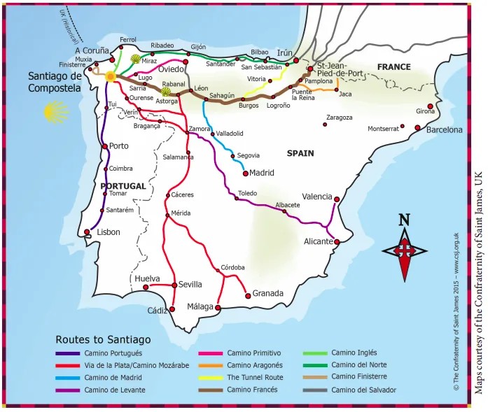

## Camino del Norte (2015 – 2024)

### 🇩🇪 Meine Erfahrungen und Eindrücke

#### 🌟 Einleitung

Willkommen in meinem digitalen Rückblick auf meine Pilgerreise!

In diesem Repository teile ich meine Fotos, Erfahrungen, Erinnerungen und Eindrücke vom zeitlich längsten Jakobsweg meines Lebens. 

Was im Jahr 2015 als logistisches Experiment begann, fand im Jahr 2024 nach vielen unvorhersehbaren Wendungen, Wetterkapriolen und wunderbaren Begegnungen 
 im Jahr 2024 ein erfolgreiches  Ende.
 
#### 💡 Die Inspiration (2012 and 2014)

💡

- **4. Mai 2012 (St. Jean Pied de Port):** Am Abend vor meinem allerersten Schritt über die Pyrenäen hörte ich das erste Mal vom Camino del Norte. Bei einem Abendspaziergang lernte ich eine Pilgerin aus der Schweiz kennen. Sie hatte ihren Weg in der Schweiz begonnen und erklärte mir, dass sie in Irun auf den Camino del Norte ausweichen würde, statt den Camino Francés zu gehen. Damals speicherte ich diese Information ab, legte sie aber gedanklich beiseite.

- **Jahr 2014:** Während ich den Camino Mozárabe (Almería → Mérida → Astorga → Santiago de Compostela) ging, hörte ich erneut von der Schönheit des Camino del Norte. Die Idee, diesen Weg selbst zu gehen, begann sich zu materialisieren.

### 🗺️ Chronologie der Etappen und Das Konzept

#### 🥾 2015: Das Pilotprojekt (Irun bis Deba)

- **Die Etappen:** Irun → San Sebastián → Zarautz → Deba (erste 3 Etappen).

- **Das Konzept:** Inspiriert von einem spanischen Pilger (den ich 2012 in den Pyrenäen traf und der seinen Weg in Etappen an Wochenenden parallel zur Arbeit ging), wollte ich den Camino del Norte in mehreren zeitlichen Abschnitten wandern. Dank guter und günstiger Flugverbindungen von Düsseldorf, Köln-Bonn und Düsseldorf-Weeze nach Santander und Bilbao wollte ich verlängerte Wochenenden mit Feiertage und Überstunden nutzen.

- **Erkenntnis:** Das Vorhaben erwies sich trotz günstiger Flüge als stressiger und teurer als gedacht.

#### 🥾 2018: Der größere Block (Deba bis Colunga)

- **Der Plan:** Von Deba bis Villaviciosa.

- **Das Ergebnis:** Aufgrund der Wetterbedingungen schaffte ich es in diesem Jahr nur bis Colunga.

#### 🥾 2023: Planänderung (Camino de San Salvador und Primitivo)

- Eigentlich wollte ich die zweite Hälfte des Camino del Norte beenden. Aufgrund eines laufenden Gerichtsverfahrens in Portugal war ich jedoch planungstechnisch gelähmt, da Termine unvorhersehbar waren.

- Wegen der günstigen Zeitspanne und Lage entschied ich mich spontan für den Camino de San Salvador (León → Oviedo) und hängte direkt den Camino Primitivo an.

- Auf dem Camino Primitivo lernte ich Roze kennen, die ebenfalls den Camino del Norte gehen wollte.

**#### 🥾 2024:** Der Weg (Bayonne bis Santiago)

- Gemeinsam mit Roze startete ich erneut, diesmal bereits im französischen Bayonne.

- Ich holte mir eine neue _Credencial del Peregrino_ (Pilgerausweis) und wir liefen den Weg bis nach Santiago de Compostela.

##### 🧭 Aktueller Status

Ich besitze nun immer noch eine unvollständige _Credencial del Peregrino_ aus dem Jahr 2018. Die vielen weißen, unausgefüllten Felder lassen mir keine Ruhe, bis sie eines Tages vollständig ausgefüllt sind.

---

### 🇪🇸 Camino del Norte: Mis Experiencias e Impresiones

#### 🌟 Introducción

¡Bienvenidos a mi diario digital de peregrinación! En este espacio comparto mis fotografías, experiencias, recuerdos e impresiones del Camino de Santiago más largo de mi vida, en cuanto a duración.

Lo que comenzó en 2015 como una experiencia logística llegó, en 2024, tras muchos giros impredecibles, caprichos del tiempo y encuentros maravillosos,
a un final con éxito.

#### 💡 La Inspiración (2012 y 2014)

 💡

- **4 de mayo de 2012 (St. Jean Pied de Port):** Escuché hablar del Camino del Norte por primera vez la noche "am Abend" antes de dar mi primer paso para cruzar los Pirineos. Durante un paseo nocturno, conocí a una peregrina suiza que había comenzado su camino en Suiza y me explicó que continuaría desde Irún por el Camino del Norte en lugar del Camino Francés. En aquel momento guardé esa información abstracta en mi memoria, pero la dejé de lado.

- **Año 2014:** Mientras realizaba el Camino Mozárabe (Almería → Mérida → Astorga → Santiago de Compostela), volví a escuchar hablar de la belleza del Camino del Norte. La idea de recorrerlo comenzó a materializarse en mi mente.

### 🗺️ Cronología de las Etapas y el Concepto

#### 🥾 2015: El proyecto piloto (Irún a Deba)

- **Las etapas:** Irún → San Sebastián → Zarautz → Deba (las 3 primeras etapas).

- **El concepto:** Inspirado por un peregrino español (a quien conocí en 2012 en los Pirineos y que hacía el camino por etapas los fines de semana mientras trabajaba), planeé dividir el Camino del Norte en varios bloques temporales. Quería aprovechar los fines de semana largos y los días festivos gracias a los vuelos directos y económicos desde Düsseldorf, Colonia-Bonn y Düsseldorf-Weeze hacia Santander y Bilbao.

- **Conclusión:** A pesar de los vuelos baratos, este enfoque resultó ser más estresante y costoso de lo planeado.

#### 🥾 2018: El bloque mayor (Deba a Colunga)

- **El plan:** De Deba a Villaviciosa.

- El resultado: Debido a las condiciones climáticas, ese año solo logré llegar hasta Colunga.

#### 🥾 2023: Cambio de planes (Camino de San Salvador y Primitivo)

- Mi intención era terminar la otra mitad del Camino del Norte. Sin embargo, debido a un proceso judicial pendiente en Portugal, estaba bloqueado a nivel de planificación por la incertidumbre de las fechas.

- Por logística y tiempo, decidí hacer el Camino de San Salvador (León → Oviedo) y finalmente también el Camino Primitivo.

- En el Camino Primitivo conocí a Roze, quien también quería hacer el Camino del Norte.

#### 🥾 2024: El Camino completo (Bayona a Santiago)

- Junto con Roze, comencé un nuevo Camino del Norte, empezando esta vez desde Bayona (Francia).

- Estrené una nueva _Credencial del Peregrino_ y caminamos  hasta Santiago de Compostela.

#### 🧭 Estado Actual

Todavía tengo guardada la _Credencial del Peregrino_ incompleta del año 2018. Esas casillas en blanco no me dejarán tranquilo hasta que logre llenarlas por completo.

---
### 🇬🇧 Camino del Norte: My Experiences and Impressions

#### 🌟 Introduction

Welcome to my digital retrospective pilgrimage diary! In this repository, I’m sharing my photos, experiences, memories and impressions from the longest Camino de Santiago of my life.

What began in 2015 as a logistical experiment came to a successful conclusion in 2024, after many unforeseen twists and turns, capricious weather and wonderful encounters
 in 2024.

#### 💡 The Inspiration (2012 & 2014)

💡

- **May 4, 2012 (St. Jean Pied de Port):** I first heard about the Camino del Norte the evening before taking my very first steps across the Pyrenees. During a night walk, I met a Swiss pilgrim who had started her journey in Switzerland and mentioned she would deviate from the Camino Francés at Irun to walk the Camino del Norte instead. At the time, I stored this information away but didn't pay much closer attention to it.

- **Year 2014:** While walking the Camino Mozárabe (Almería → Mérida → Astorga → Santiago de Compostela), I heard about the beauty of the Camino del Norte once again, and the idea of doing it myself slowly began to take shape.

### 🗺️ Chronology of Stages and The Concept

#### 🥾 2015: The Pilot Project (Irun to Deba)

- **The Stages:** Irun → San Sebastián → Zarautz → Deba (firs Armed with a new Credencial del Peregrino (Pilgrim's Passport), we walked the  route in one single continuous trip to Santiago de Compostelat 3 stages).

- **The Concept:** Inspired by a Spanish pilgrim I met in the Pyrenees in 2012 (who walked the Camino Francés in stages on weekends around his work schedule), I planned to complete the Camino del Norte in several short intervals. I aimed to utilize long weekends and holidays, using cheap and convenient flights from Düsseldorf, Cologne-Bonn, and Düsseldorf-Weeze to Santander and Bilbao.

- **The Outcome:** Despite the cheap flights, this approach turned out to be much more stressful and expensive than anticipated.

#### 🥾 2018: The Larger Section (Deba to Colunga)

- **The Plan:** From Deba to Villaviciosa.

- **The Outcome:** Due to bad weather conditions, I only managed to reach Colunga that year.

#### 🥾 2023: Change of Plans (Camino de San Salvador and Primitivo)

- I originally wanted to finish the second half of the Camino del Norte. However, due to a pending legal proceeding in Portugal, I was unable to plan properly because of unpredictable dates.

- Given the available timeframe and convenient location, I spontaneously chose to walk the Camino de San Salvador (León → Oviedo) and ended up continuing onto the Camino Primitivo.

- On the Camino Primitivo, I met Roze, who also wanted to do the Camino del Norte.

#### 🥾 2024: Walking the Full Route (Bayonne to Santiago)

- Together with Roze, I started the Camino del Norte once again, this time beginning in Bayonne (France).

- I got myself a new _Credencial del Peregrino_ (pilgrim’s passport) and we walked the route to Santiago de Compostela.

#### 🧭 Current Status

I still have that unfinished _Credencial del Peregrino_ from 2018. Those many blank white boxes will not give me any peace of mind until they are finally filled.

---
### 🇵🇹 Camino del Norte: Minhas Experiências e Impressões

#### 🌟 Introdução
Bem-vindos ao meu diário digital retrospectivo de peregrinação! Neste repositório, partilho as minhas fotografias, experiências, memórias e impressões do Caminho de Santiago mais longo da minha vida, em termos de duração.

O que começou em 2015 como uma experiência logística chegou, em 2024, após muitas reviravoltas imprevisíveis, caprichos do tempo e encontros surpreendentes,
a um final bem-sucedido.

#### 💡 A Inspiração (2012 & 2014)
 
 

 
💡

 
- **4 de maio de 2012 (St. Jean Pied de Port):** Ouvi falar do Camino del Norte pela primeira vez na noite "am Abend" anterior a dar o meu primeiro passo para cruzar os Pirenéus. Durante um passeio noturno, conheci uma peregrina suíça que tinha começado o seu caminho na Suíça e explicou-me que iria continuar a partir de Irún pelo Camino del Norte, em vez do Caminho Francês. Na altura, guardei essa informação na memória, mas não lhe dei muita atenção.

- **Ano 2014:** Enquanto fazia o Caminho Moçárabe (Almería → Mérida → Astorga → Santiago de Compostela), ouvi novamente falar da beleza do Camino del Norte, e a ideia de o percorrer começou a materializar-se na minha mente.

### 🗺️ Cronologia das Etapas e o Conceito

#### 🥾 2015: O Projeto Piloto (Irún a Deba)

- **As etapas:** Irún → San Sebastián → Zarautz → Deba (as 3 primeiras etapas).

- **O conceito:** Inspirado por um peregrino espanhol (que conheci em 2012 nos Pirenéus e que fazia o caminho por etapas nos fins de semana enquanto trabalhava), planeei dividir o Camino del Norte em vários blocos temporais. Graças às boas e económicas ligações aéreas de Düsseldorf, Colónia-Bona e Düsseldorf-Weeze para Santander e Bilbau, queria aproveitar os fins de semana prolongados com feriados e horas extraordinárias.

- **Conclusão:** Apesar dos voos baratos, esta abordagem revelou-se mais stressante e dispendiosa do que o planeado.

#### 🥾 2018: O Bloco Maior (Deba a Colunga)

- **O plano:** De Deba a Villaviciosa.

- **O resultado:** Devido às condições climatéricas, nesse ano só consegui chegar até Colunga.

#### 🥾 2023: Mudança de Planos (Caminho de São Salvador e Primitivo)

- A minha intenção era terminar a outra metade do Camino del Norte. No entanto, devido a um processo judicial pendente em Portugal, estava bloqueado a nível de planeamento por causa da incerteza das datas.

- Pela logística e tempo favorável, decidi fazer o Caminho de São Salvador (León → Oviedo) e acabei por fazer também o Caminho Primitivo.

- No Caminho Primitivo conheci a Roze, que também queria fazer o Camino del Norte.

#### 🥾 2024: O Caminho Completo (Baiona a Santiago)

- Juntamente com a Roze, comecei um novo Camino del Norte, partindo desta vez de Baiona (França).

- Utilizei uma nova _Credencial del Peregrino_ e caminhámos até Santiago de Compostela.

#### 🧭 Estado Atual

Ainda tenho guardada a _Credencial del Peregrino_ incompleta do ano 2018. Aqueles vários campos brancos e vazios não me vão deixar descansar enquanto não estiverem totalmente preenchidos.

---

 

---

🇵🇹  O Camino del Norte (Texto não estruturado)

Aqui, no meu repositório Obsidian no GitHub, pretendo partilhar publicamente com outros peregrinos fotografias, experiências, memórias e impressões do meu Caminho de Santiago, o mais longo em termos de duração.
Comecei-o em 2015 e terminei-o em 2024.

A primeira vez que ouvi falar do Caminho do Norte foi na tarde de 4 de maio de 2012, em Saint-Jean-de-Port, ainda antes de dar o meu primeiro passo para atravessar os Pirenéus. 

Depois de o posto de informação turística de Saint-Jean-Pied-de-Port nos ter arranjado um alojamento, dei uma volta pela pequena cidade. Durante este passeio ao final da tarde, conheci uma peregrina da Suíça e fiquei a saber que ela tinha começado a sua viagem na Suíça. Quando iniciei o meu primeiro Caminho de Santiago, estava tão concentrado em mim próprio que nem sequer me apercebi do grande feito que isso representava.

Ela estava um pouco abalada e acho que era devido a uma constipação que ainda não tinha curado completamente. Durante a conversa sobre a etapa que nos esperava, descobri que ela iria continuar o seu caminho em Irun e que não iria fazer o Caminho Francês, mas sim desviar-se para o Caminho do Norte. 

Este momento e a estadia em Saint-Jean-Pied-de-Port ficaram bem gravados na minha memória; na altura, guardei essas informações, que para mim ainda eram abstratas, e coloquei-as de lado na minha consciência.

Em 2014, fiz o Caminho Mozárabe (Almería → Mérida → Astorga → Santiago de Compostela) e, mais uma vez, ouvi falar do maravilhoso Caminho do Norte, e foi aí que a ideia de percorrer também esse caminho começou lentamente a concretizar-se na minha imaginação.

Em julho de 2015, percorri as primeiras três etapas (Irun → San Sebastián → Zaurautz → Deba) do Caminho do Norte. Estas três etapas destinavam-se a ser um projeto-piloto para percorrer o Caminho do Norte de uma forma totalmente diferente. O meu plano inicial era aproveitar os fins de semana prolongados, com horas extras e feriados, para percorrer o Caminho do Norte em vários blocos temporais, uma vez que havia ligações aéreas boas e económicas de Düsseldorf, Colónia-Bona e Düsseldorf-Weeze para Santander e Bilbau.

A ideia era fazê-lo exatamente como um peregrino espanhol pretendia percorrer o Caminho Francês em 2012. Esse peregrino, que conheci em 2012 na primeira etapa do Caminho Francês, durante a subida aos Pirenéus, pretendia percorrer as etapas do Caminho Francês perto da sua casa, sempre aos fins de semana. Segundo ele, pretendia, na sexta-feira, depois do trabalho, apanhar o carro e os transportes públicos até à etapa seguinte e regressar no domingo. Queria percorrer o Caminho durante 2 dias e trabalhar 5 dias, mantendo este ritmo enquanto os tempos de viagem fossem razoáveis, e tirar férias para a segunda metade do Caminho Francês.

Como há boas ligações de transportes públicos ao longo do Caminho do Norte, planeei no meu esboço de itinerário utilizar os transportes públicos para chegar a cada troço específico, de modo a recomeçar ali onde tinha terminado as últimas etapas. De acordo com o meu plano da altura, isso seria possível até (Villaviciosa), Oviedo ou Gijón, e depois caminhar de uma só vez até Santiago de Compostela. 

No primeiro projeto-piloto, constatei que, apesar das ligações boas e económicas da Alemanha para Espanha, este plano é um pouco mais stressante e dispendioso do que eu imaginava. Por isso, em 2018, planeei um troço mais longo – de Deba a Villaviciosa –, mas, devido às condições meteorológicas, só consegui chegar até Colunga.

Em 2023, pretendia concluir a outra metade do Caminho do Norte, mas como, na altura, estava a preparar um processo judicial em Portugal e não sabia como se iriam desenrolar as datas, fiquei um pouco paralisado em termos de planeamento, por isso, devido ao período e à localização que me eram favoráveis (Leão – Oviedo), decidi fazer o Caminho de São Salvador e, por fim, acabei por fazer também o Caminho Primitivo. 

No Caminho Primitivo, conheci a Roze e ela também queria fazer o Caminho do Norte; foi assim que, em 2024, decidi obter uma nova Credencial do Peregrino, fiz o Caminho do Norte com ela, mas comecei (começámos) em Bayonne e caminhei (caminhámos) até Santiago.

Agora tenho ainda uma credencial de peregrino de 2018, com muitos campos em branco que não me dão paz até estarem preenchidos.

---

 🇩🇪 Camino del Norte (Unstrukturierter Text)

Hier, in meinem Obsidian-Repository auf GitHub, möchte ich Fotos, Erlebnisse, Erinnerungen und Eindrücke von meinem zeitmässig längsten Jakobsweg öffentlich mit anderen Pilgern teilen.
Ich habe ihn 2015 begonnen und 2024 beendet.
Das erste Mal hörte ich vom Nordweg am Abend des 4. Mai 2012 in Saint-Jean-de-Port, noch bevor ich meinen ersten Schritt zur Überquerung der Pyrenäen machte. Nachdem uns die Touristeninformation in Saint-Jean-Pied-de-Port eine Unterkunft vermittelt hatte, machte ich einen Spaziergang durch die kleine Stadt. 
Während dieses Spaziergangs am späten Nachmittag lernte ich eine Pilgerin aus der Schweiz kennen und erfuhr, dass sie ihre Reise in der Schweiz begonnen hatte. Als ich meinen ersten Jakobsweg antrat, war ich so sehr auf mich selbst konzentriert und aufgeregt, dass mir gar nicht bewusst war, was für eine grosse Leistung das darstellte.

Sie fühlte sich etwas angeschlagen, und ich glaube, das lag an einer Erkältung, die sie noch nicht ganz auskuriert hatte. Während des Gesprächs über die Etappe, die uns erwartete, erfuhr ich, dass sie ihren Weg in Irun fortsetzen würde und nicht den französischen Jakobsweg nehmen, sondern auf den Nordweg abweichen würde. 

Dieser Moment und der Aufenthalt in Saint-Jean-Pied-de-Port haben sich tief in mein Gedächtnis eingegraben; damals habe ich diese Informationen, die für mich noch abstrakt waren, zwar im Gedächtnis behalten, aber in meinem Bewusstsein beiseite geschoben.

Im Jahr 2014 wanderte ich auf dem Mozarabischen Weg (Almería → Mérida → Astorga → Santiago de Compostela) und hörte erneut vom wunderbaren Nordweg – und da begann sich die Idee, auch diesen Weg zu gehen, langsam in meiner Vorstellung zu konkretisieren.

Im Juli 2015 legte ich die ersten drei Etappen (Irun → San Sebastián → Zaurautz → Deba) des Nordwegs zurück. Diese drei Etappen sollten als Pilotprojekt dienen, um den Nordweg auf eine ganz andere Art und Weise zu beschreiten. Mein ursprünglicher Plan war es, die verlängerten Wochenenden mit Überstunden und Feiertagen zu nutzen, um den Nordweg in mehreren Zeitblöcken zu bewältigen, da es gute und günstige Flugverbindungen von Düsseldorf, Köln-Bonn und Düsseldorf-Weeze nach Santander und Bilbao gab.

Die Idee war, es genau so zu machen, wie ein spanischer Pilger den „Caminho Francês“ im Jahr 2012 zurücklegen wollte. Dieser Pilger, den ich 2012 auf der ersten Etappe des „Caminho Francês“ während des Aufstiegs in die Pyrenäen kennengelernt hatte, wollte die Etappen des „Caminho Francês“ in der Nähe seines Wohnortes zurücklegen, immer an den Wochenenden. Seinen Angaben zufolge wollte er freitags nach der Arbeit mit dem Auto und öffentlichen Verkehrsmitteln zur nächsten Etappe fahren und am Sonntag zurückkehren. Er wollte zwei Tage lang den Jakobsweg gehen und fünf Tage arbeiten, diesen Rhythmus beibehalten, solange die Reisezeiten zumutbar waren, und für die zweite Hälfte des Französischen Weges Urlaub nehmen.

Da es entlang des „Caminho do Norte“ gute Verbindungen mit öffentlichen Verkehrsmitteln gibt, hatte ich in meinem Entwurf für die Strecke geplant, die einzelnen Abschnitte mit öffentlichen Verkehrsmitteln zu erreichen, um dort weiterzuwandern, wo ich die letzten Etappen beendet hatte. Nach meinem damaligen Plan wäre dies bis nach (Villaviciosa), Oviedo oder Gijón möglich gewesen, um dann in einem Zug bis nach Santiago de Compostela zu wandern. 

Beim ersten Pilotprojekt stellte ich fest, dass dieser Plan trotz der guten und günstigen Verbindungen von Deutschland nach Spanien etwas stressiger und kostspieliger ist, als ich mir vorgestellt hatte. Deshalb plante ich 2018 eine längere Etappe – von Deba nach Villaviciosa –, kam aber aufgrund der Wetterbedingungen nur bis nach Colunga.

Im Jahr 2023 wollte ich die andere Hälfte des Nordwegs beenden, doch da ich zu dieser Zeit ein Gerichtsverfahren in Portugal vorbereitete und nicht wusste, wie sich die Termine entwickeln würden, war ich bei der Planung etwas gelähmt; daher entschied ich mich aufgrund des für mich günstigen Zeitraums und des günstigen Standorts (León – Oviedo), den Weg des Camino de San Salvador zu gehen, und schließlich lief ich auch den Camino Primitivo. 

Auf dem „Caminho Primitivo“ lernte ich Roze kennen, und auch sie wollte den „Caminho do Norte“ gehen; so kam es, dass ich mir 2024 einen neuen Pilgerausweis holt, den „Caminho do Norte“ mit ihr ging, allerdings in Bayonne startete und bis nach Santiago wanderte.

Jetzt habe ich noch einen Pilgerausweis aus dem Jahr 2018, mit vielen leeren Feldern, die mir keine Ruhe lassen, bis sie ausgefüllt sind.

---
↪ 

🔁 

---
**←** 🔁 [Os Caminhos](https://github.com/GomesDeSa-JA/Camino-del-Salvador_2023-2025/blob/main/Os_Caminhos.md)

 ...→
