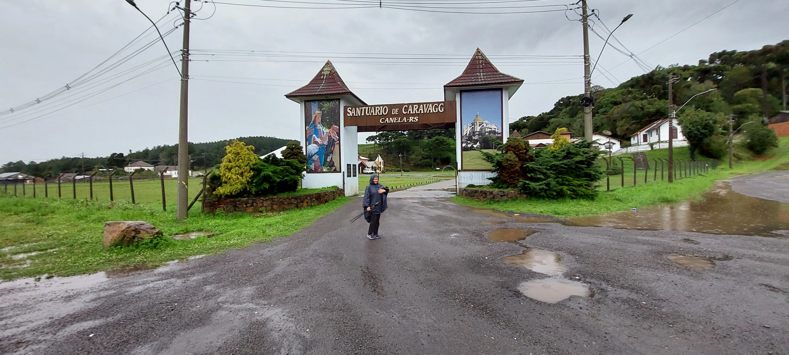
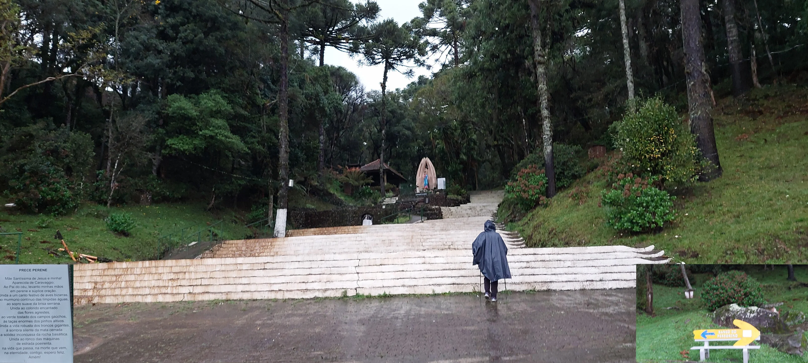
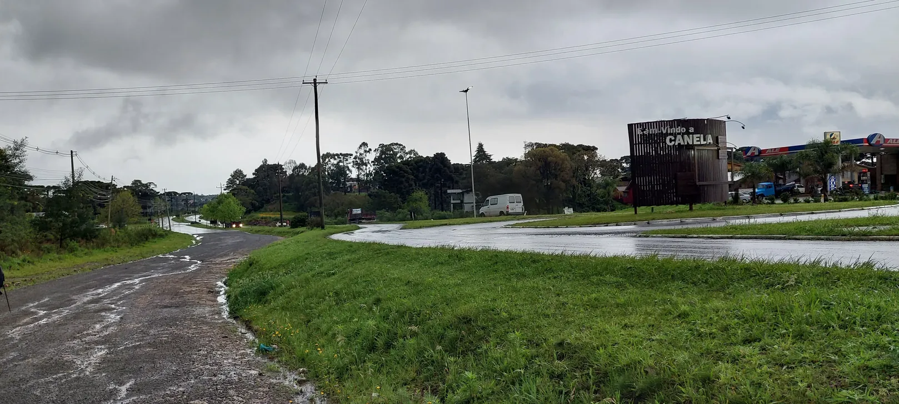
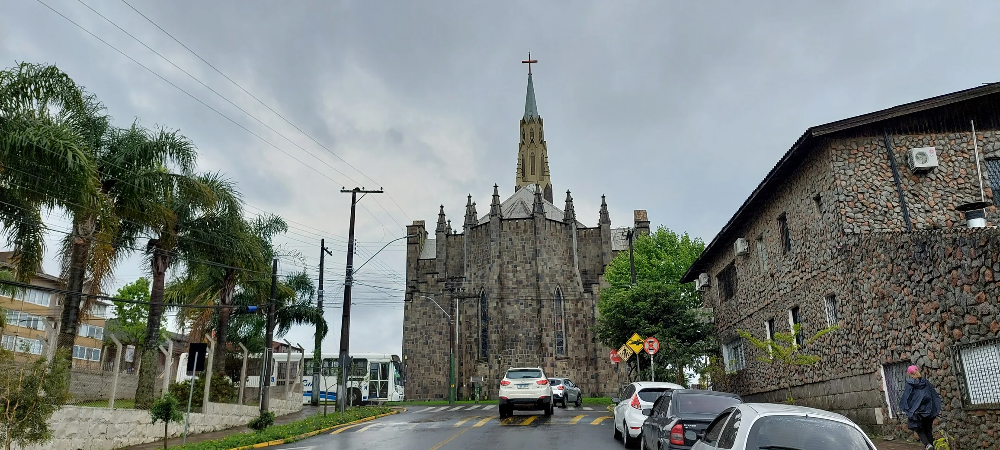
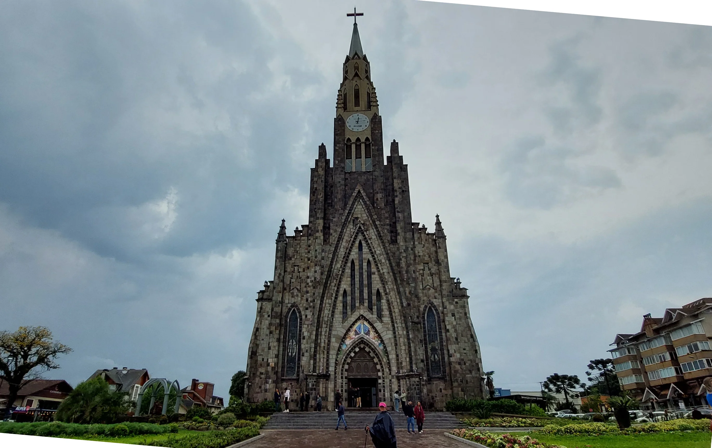
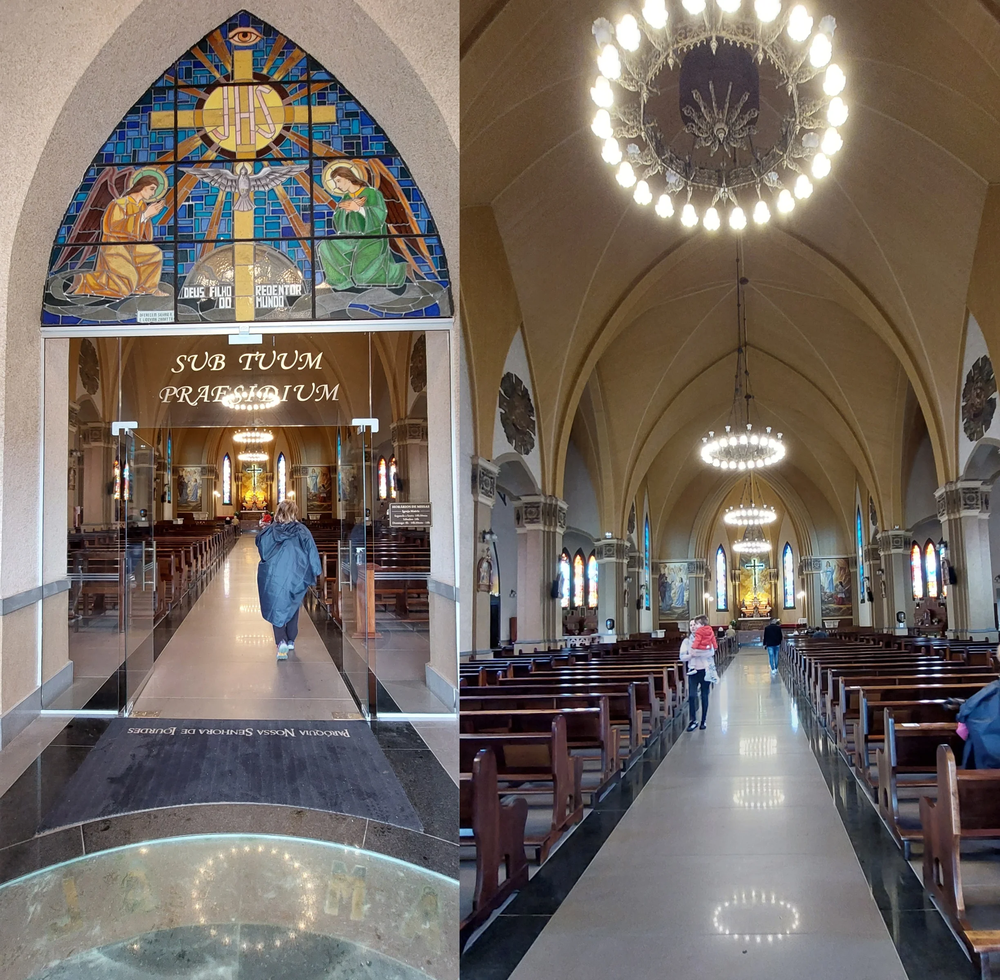
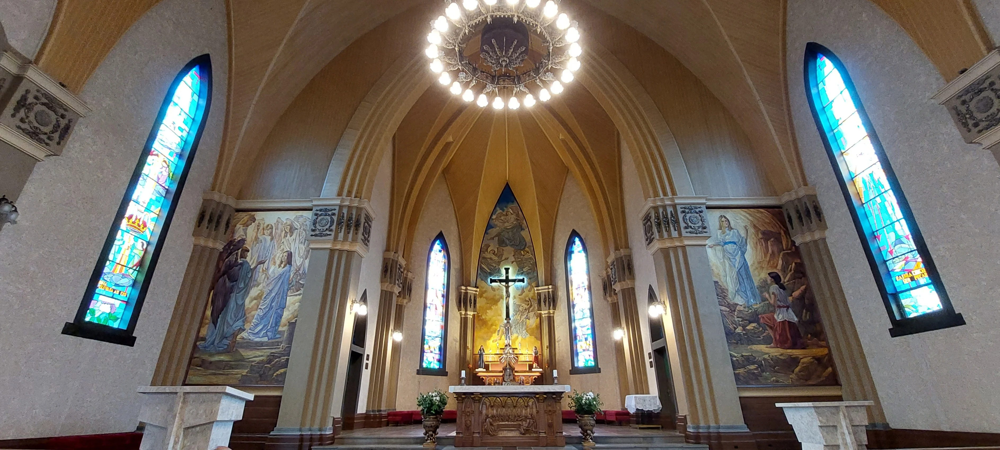
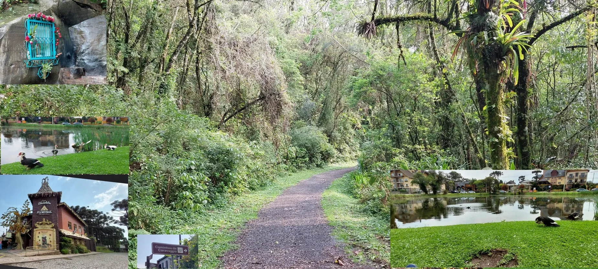
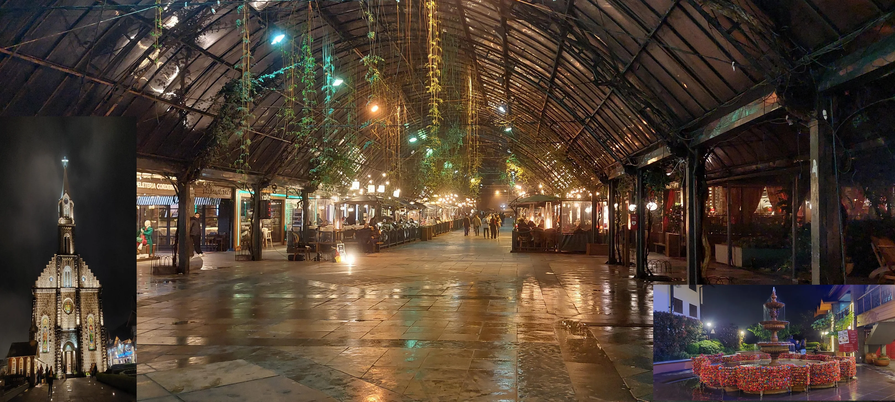

## Caminhos de Caravaggio  2023 

### Etappe-01: Canela  →  Gramado (14,3 Km)
26 de Setembro 2023

"Santuário de Caravaggio" →  Casa Girassol 

[Nossa Senhora de Caravaggio Canela RS](Nossa-Senhora-de-Caravaggio_Canela-RS.md)

#### 🇩🇪 Nossa Senhora de Caravaggio, Canela in Rio Grande do Sul (RS).  

- Nur etwa zwei Stunden später verwandelten sich diese Stufen an jenem Tag in einen wunderschönen Wasserfall.  
- Leider haben wir dieses Naturspektakel verpasst, weil wir so früh aufgebrochen sind. Andererseits war es ein Glück, denn sonst hätten meine Füße – trotz wasserdichter Wanderstiefel – im sintflutartigen Regen gebadet.  
- In diesen Tagen regnete es so stark, dass die Iguaçu-Wasserfälle rund zwei Wochen später den zweithöchsten Wasserstand seit Beginn der Aufzeichnungen erreichten.
(Ich glaube ? Es waren ca. 20.000.000 bis 25.000.000  Liter Wasser/ pro Sekunde)

---

 Die Geschichte von Canela in Rio Grande do Sul 

Canela in der Serra Gaúcha entstand im 19. Jahrhundert als Raststätte für Tropeiros und entwickelte sich zu einem der beliebtesten Reiseziele in Rio Grande do Sul.

##### Herkunft des Namens

- **Zimtbaum**: Der Name stammt von einem großen schwarzen Zimtbaum, der in der Nähe des heutigen Hauptplatzes stand.

- **Rastplatz der Tropeiros**: Die Tropeiros ruhten sich im Schatten dieses Baumes aus und nutzten den Ort, um ihre Tiere zu tränken.

- **Campestre Canella**: Dies war der offizielle Titel, der dem ersten Bewohner und Landbesitzer, Joaquim da Silva Esteves, im Jahr 1821 verliehen wurde.

##### **Gründung und Besiedlung**

- **Frühe Siedlungen**: Die Region wurde vor der Ankunft der Viehtreiber und Siedler von den Caigangues-Indianern bewohnt.

- **Oberst João Corrêa**: Im Jahr 1903 ließ sich Oberst João Ferreira Corrêa da Silva hier nieder und gründete den ersten Stadtkern.

- **Eisenbahn**: Die Eisenbahnlinie, die Taquara mit Canela verband, wurde in den 1920er Jahren fertiggestellt und gab dem Handel sowie der lokalen, auf der Holzgewinnung basierenden Wirtschaft neue Impulse.

##### **Emanzipation**

- **Bezirk Taquara**: Canela gehörte viele Jahre lang zu Taquara.

- **Autonomie**: Das schnelle Wachstum zog Einwohner, Hotels und Sägewerke an.

- **Eigenständige Stadt**: Am 28. Dezember 1944 wurde die Gemeinde durch ein Landesgesetz gegründet und im Januar 1945 offiziell eingerichtet.

---

#### 🇵🇹 Nossa Senhora de Caravaggio, Canela no Rio Grande do Sul (RS).  
- Apenas duas horas mais tarde, naquele dia, estes degraus transformaram-se numa bela cascata.  
- Infelizmente, perdemos esse espetáculo da natureza por termos saído tão cedo. Por outro lado, ainda bem que partimos antes, caso contrário os meus pés – mesmo protegidos por botas de caminhada impermeáveis – teriam tomado um banho sob a chuva torrencial.  
- Choveu tanto naqueles dias que as Cataratas do Iguaçu atingiram, cerca de duas semanas depois, o segundo maior volume de água desde o início dos registos.

---

 História de Canela em Rio Grande do Sul  

Canela, na Serra Gaúcha, surgiu como um pouso de tropeiros no século XIX e se transformou em um dos destinos turísticos mais amados do Rio Grande do Sul.

##### Origem do Nome

- **Árvore de canela**: O nome veio de uma grande canela-preta que ficava perto da atual praça central.

- **Parada de tropeiros**: Os tropeiros descansavam sob a sombra dessa árvore e usavam o local para hidratar os animais.

- **Campestre Canella**: Esse foi o título oficial dado ao primeiro morador e proprietário de terras, Joaquim da Silva Esteves, em 1821. [

##### Fundação e Colonização

- **Povoados iniciais**: A região era habitada por indígenas caigangues antes da chegada dos tropeiros e colonizadores.

- **Coronel João Corrêa**: Em 1903, o Coronel João Ferreira Corrêa da Silva fixou residência e organizou o primeiro núcleo urbano da cidade.

- **Estrada de ferro**: A linha de trem que ligava Taquara a Canela chegou na década de 1920, impulsionando o comércio e a economia local baseada na extração de madeira. 

##### Emancipação

- **Distrito de Taquara**: Canela pertenceu por muitos anos a Taquara.

- **Autonomia**: O crescimento rápido atraiu moradores, hotéis e serrarias.

- **Cidade independente**: Em 28 de dezembro de 1944, a lei estadual criou o município, instalado oficialmente em janeiro de 1945. 

---
#### 🇬🇧 Nossa Senhora de Caravaggio, Canela in Rio Grande do Sul (RS).  
 - Just about two hours later that day, these steps transformed into a beautiful waterfall. 
 
 - Unfortunately, we missed this natural spectacle because we set off so early. On the other hand, it was a good thing we did, otherwise my feet—despite being tucked into waterproof hiking boots—would have bathed in the torrential downpour.  
 
 - It rained so heavily during those days that about two weeks later, the Iguaçu Falls reached their second-highest water level since records began.

---

 History of Canela in Rio Grande do Sul 

Canela, in the Serra Gaúcha, began as a resting place for tropeiros in the 19th century and has become one of the most beloved tourist destinations in Rio Grande do Sul.

##### Origin of the Name

- **Cinnamon tree**: The name comes from a large black cinnamon tree that stood near the current central square.

- **Muleteers’ rest stop**: The muleteers would rest in the shade of this tree and use the spot to water their animals.

- **Campestre Canella**: This was the official title given to the first resident and landowner, Joaquim da Silva Esteves, in 1821. [
  
##### Founding and Colonization

- **Early Settlements**: The region was inhabited by Caigangue indigenous people before the arrival of the tropeiros and colonists.

- **Colonel João Corrêa**: In 1903, Colonel João Ferreira Corrêa da Silva settled in the area and established the town’s first urban center.

- **Railroad**: The railroad line connecting Taquara to Canela arrived in the 1920s, boosting commerce and the local economy based on timber extraction.

##### Emancipation

- **Taquara District**: Canela belonged to Taquara for many years.

- **Autonomy**: Rapid growth attracted residents, hotels, and sawmills.

- **Independent City**: On December 28, 1944, a state law established the municipality, which was officially inaugurated in January 1945.

---
#### 🇪🇸 Nossa Senhora Aparecida de Caravaggio, Canela en Rio Grande do Sul (RS).  
- Solo unas dos horas más tarde, aquel día, estos escalones se transformaron en una hermosa cascada.  
-  Lamentablemente, nos perdimos ese espectáculo de la naturaleza por haber salido tan temprano. Por otra parte, menos mal que nos marchamos antes, de lo contrario mis pies —a pesar de ir resguardados en botas de montaña impermeables— habrían acabado bañándose bajo la lluvia torrencial.  
-  Llovió tanto en esos días que, unas dos semanas después, las Cataratas del Iguazú alcanzaron el segundo mayor nivel de agua desde que se tienen registros.

---

 Historia de Canela en Rio Grande do Sul 

Canela, en la Serra Gaúcha, surgió como un lugar de descanso para los tropeiros en el siglo XIX y se ha convertido en uno de los destinos turísticos más queridos de Rio Grande do Sul.

##### Origen del nombre

- **Árbol de canela**: El nombre proviene de un gran árbol de canela negra que se encontraba cerca de la actual plaza central.
- 
- **Parada de tropeiros**: Los tropeiros descansaban a la sombra de ese árbol y utilizaban el lugar para dar de beber a los animales.

- **Campestre Canella**: Este fue el título oficial otorgado al primer habitante y propietario de tierras, Joaquim da Silva Esteves, en 1821. [

##### Fundación y clonización

- **Asentamientos iniciales**: La región estaba habitada por indígenas caigangues antes de la llegada de los tropeiros y los colonizadores.

- **Coronel João Corrêa**: En 1903, el coronel João Ferreira Corrêa da Silva se estableció en la zona y organizó el primer núcleo urbano de la ciudad.

- **Ferrocarril**: La línea de tren que unía Taquara con Canela llegó en la década de 1920, lo que impulsó el comercio y la economía local basada en la extracción de madera.

##### Emancipación

  - **Distrito de Taquara**: Canela perteneció durante muchos años a Taquara.

- **Autonomía**: El rápido crecimiento atrajo a nuevos residentes, hoteles y aserraderos.

- **Ciudad independiente**: El 28 de diciembre de 1944, una ley estatal creó el municipio, que se constituyó oficialmente en enero de 1945.

### Bem Vindo a Canela

**Catedral de Pedra**

Paroquia Nossa Senhora de Lourdes

### Gramado

---

 🔁 [Caminhos de Caravaggio Etapas](Caminhos-de-Caravaggio_Etapas.md)
 
↪ [Etappe-02_Gramado_Linha-Furna](Etappe-02_Gramado_Linha-Furna.md)

 ...→
 