## Caminhos de Caravaggio  2023 

### Etappe-03:  Linha Furna  →  Vila Oliva ( 20,8 Km)
28 de Setembro 2023

Pousada Colina de Pedra →  Pousada Dona Solange

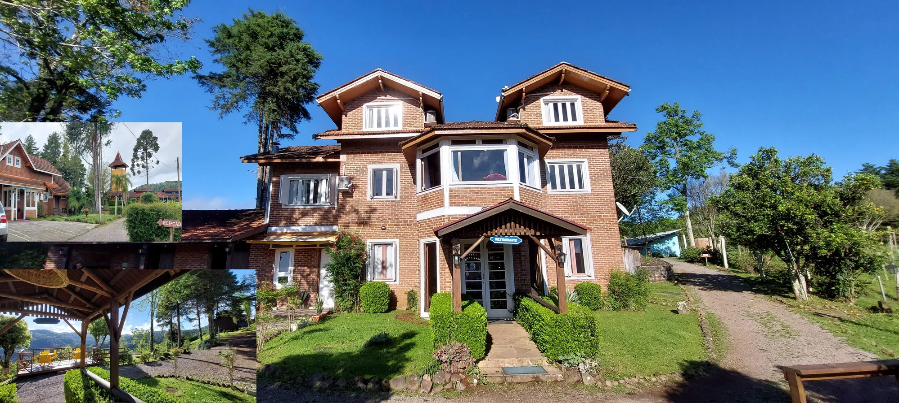

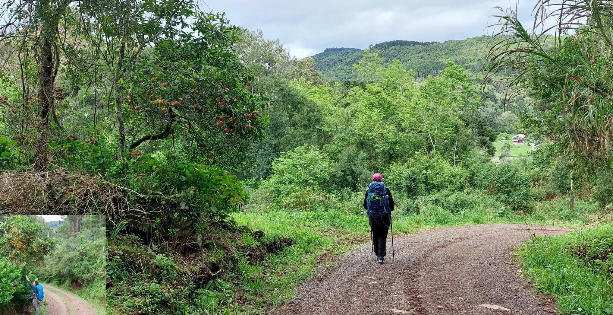

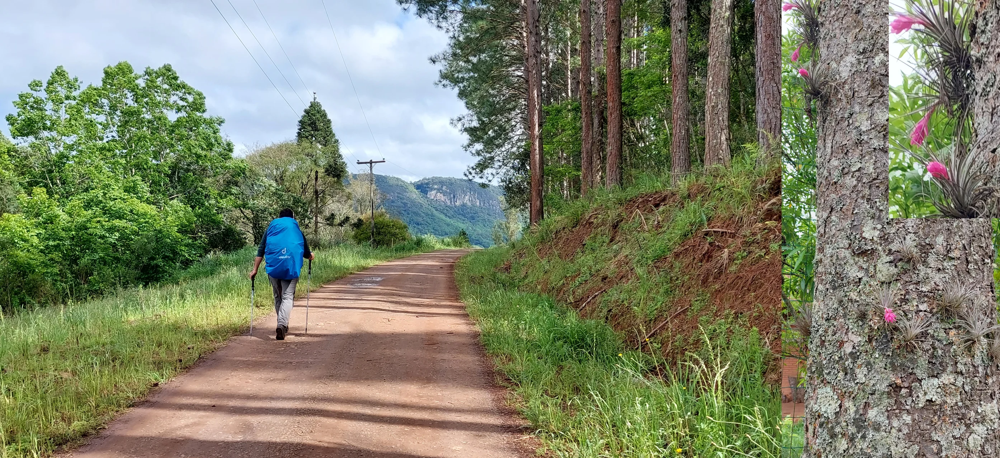

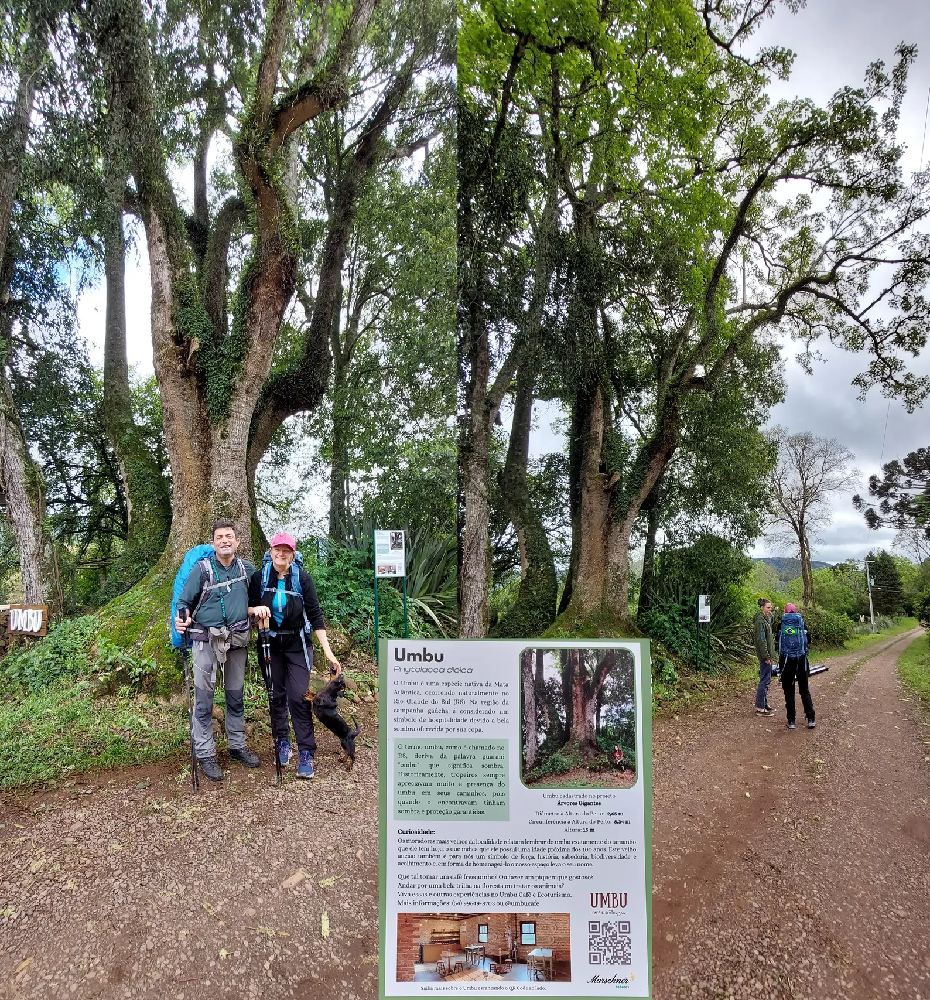

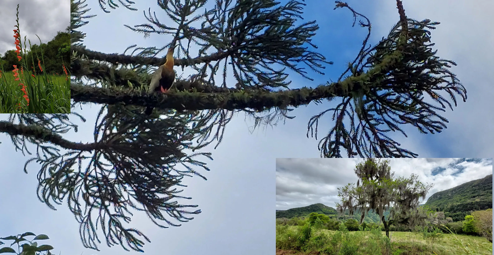

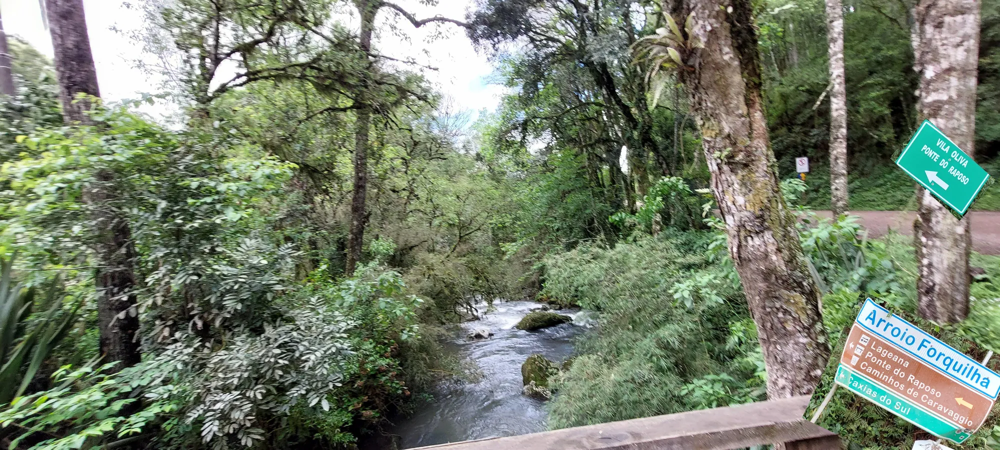

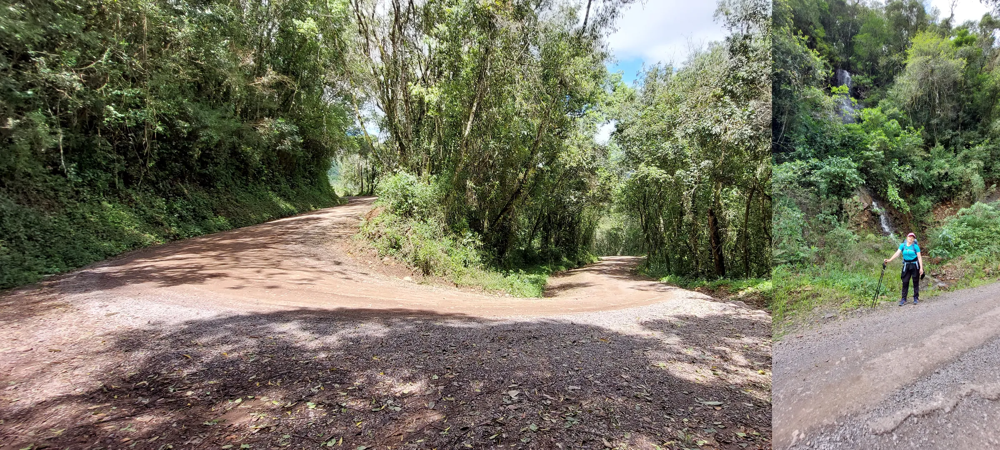

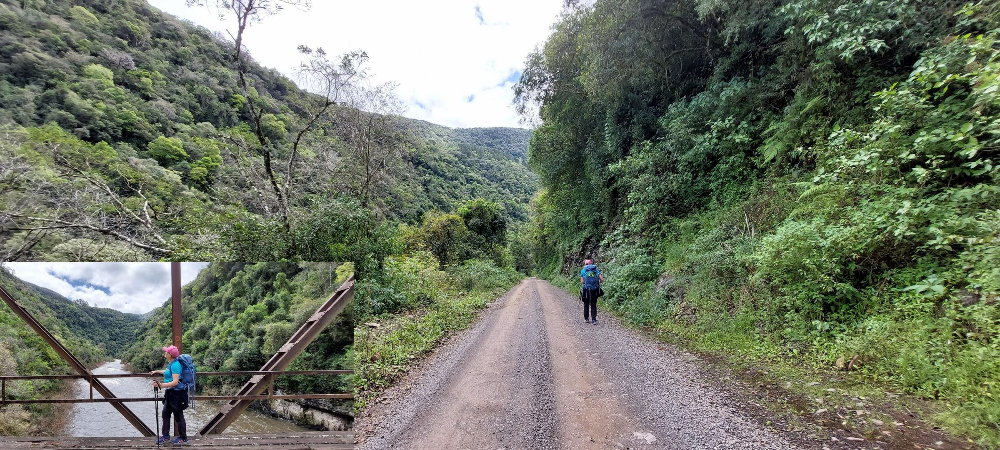

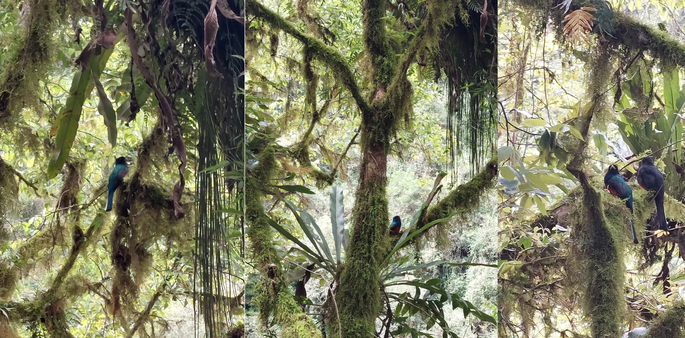

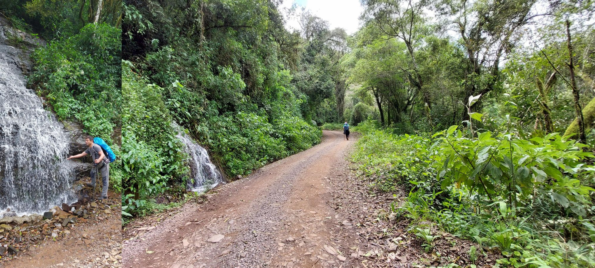

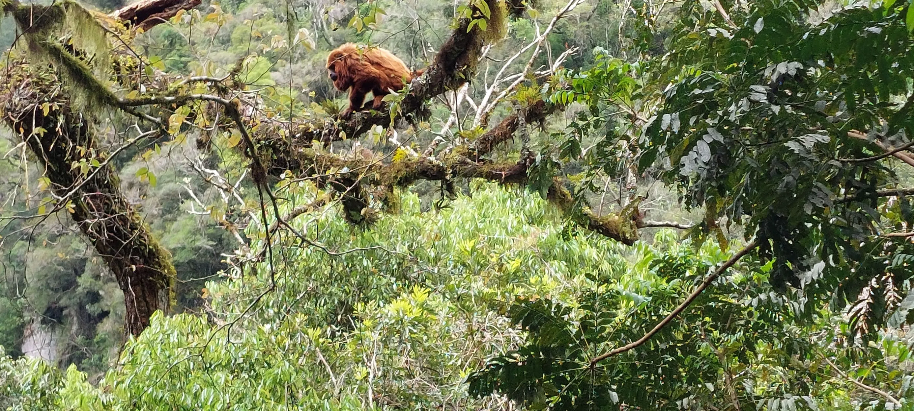

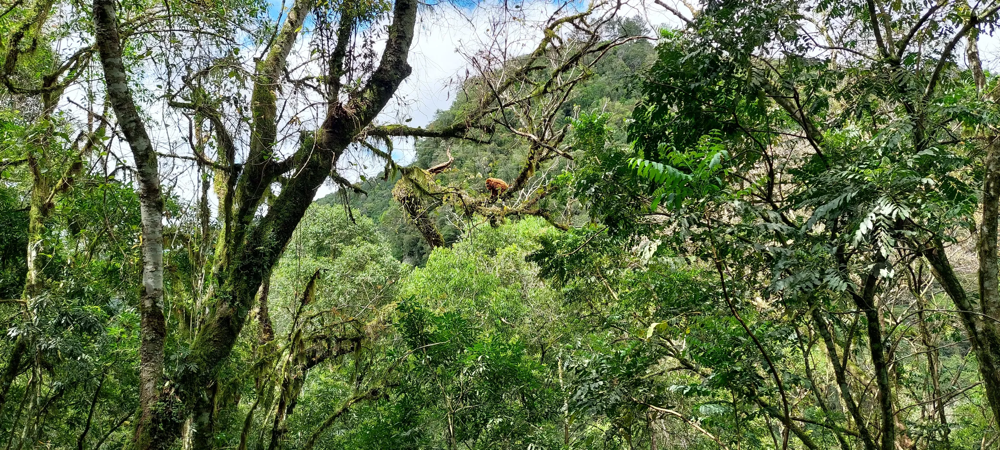

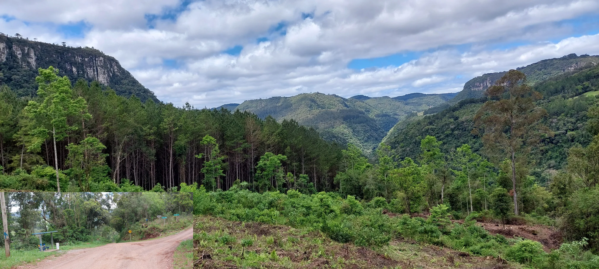

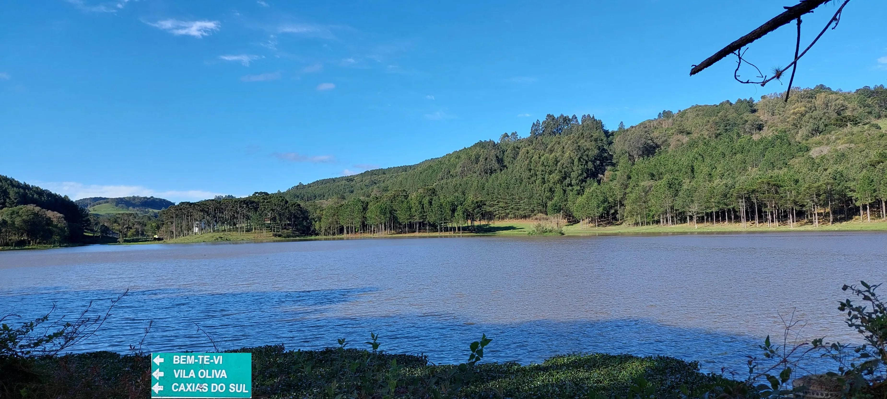

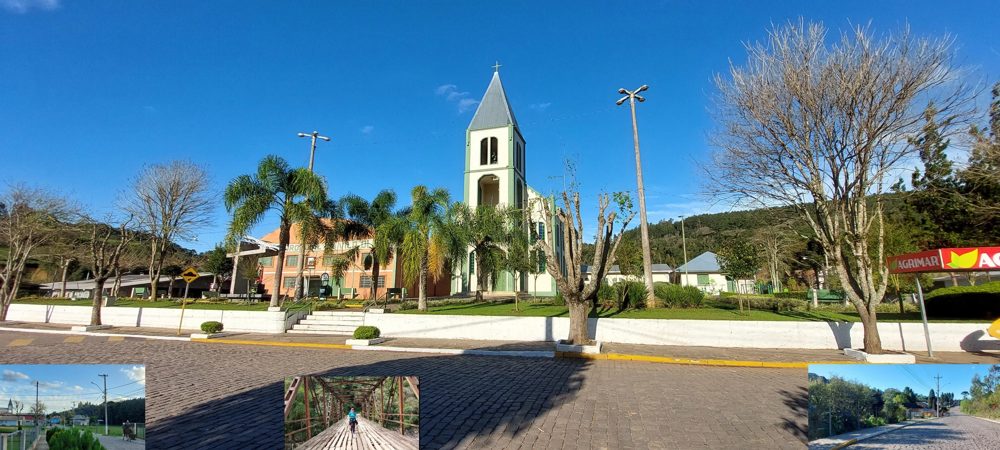

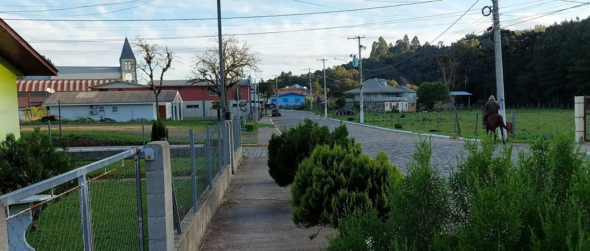

  

🇬🇧
🇪🇸
🇵🇹
🇩🇪

---

 🔁 [Caminhos-de-Caravaggio_Etapas](Caminhos-de-Caravaggio_Etapas.md)
 
↪ [Etappe-04_Vila Oliva_Santa-Lucia-do-Piai](Etappe-04_Vila%20Oliva_Santa-Lucia-do-Piai.md)

 ...→