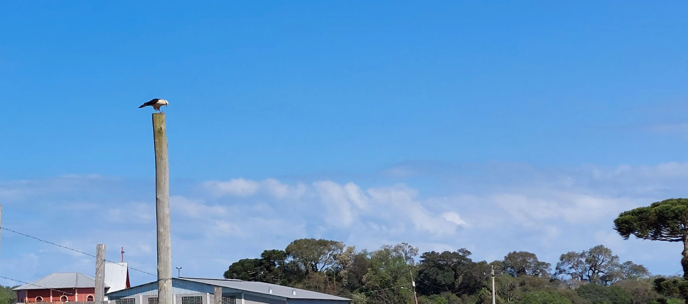
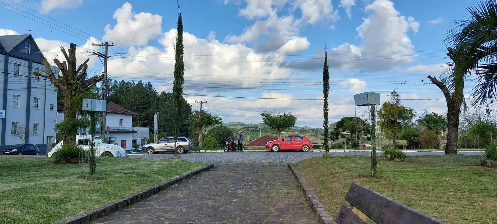
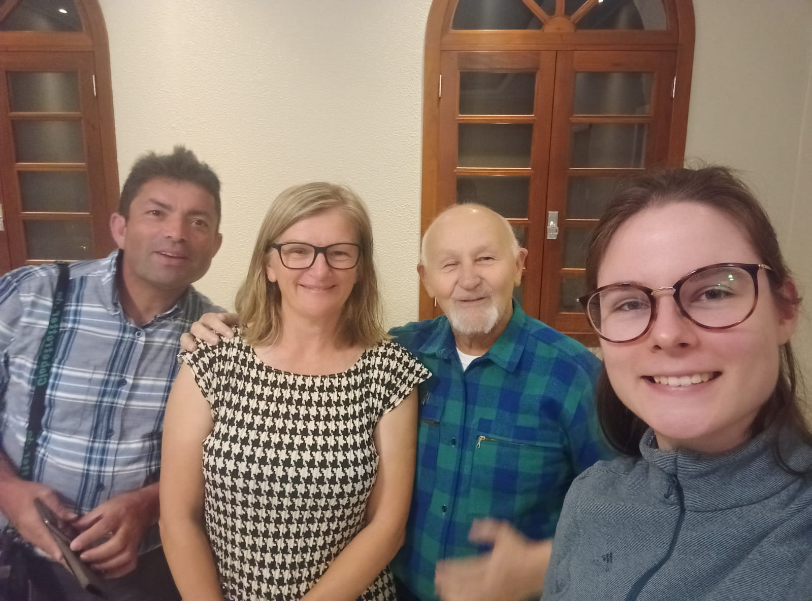

## Caminhos de Caravaggio  2023 

### Etappe-04: Vila Oliva →  Santa Lúcia do Piaí (15,6 Km)
29 de Setembro 2023

Pousada Dona Solange → Seminário dos Cônegos Regulares

---

🇩🇪 Unglaubliche Ereignisse 

### 🇩🇪 **Unglaubliche Ereignisse, die die Welt kaum glauben wird, aber kennen sollte.**

Am 29. September 2023 um 16:47 Uhr ereigneten sich in der kleinen Stadt Santa Lúcia do Piaí Dinge, von denen die Welt erfahren sollte. Und wenn man die Geschichte hört, die sich genau ein Jahr zuvor auf der anderen Seite des Atlantiks in Âncora Praia zugetragen hat, wird man sie ebenso wenig glauben.

Der Anlass, warum ich diese Geschichte erzähle, ist eine andere unglaubliche Anekdote, die mir ein Herr beiläufig berichtete. Alles begann mit einer ganz alltäglichen Situation am 10. April 2026 in Lissabon. Ich ging in eine Bank, um Geld abzuheben. Nach dem Klingeln trat ich ein und sah zwei Kunden, die an den einzigen beiden Schaltern bedient wurden. Da es keine Sitzgelegenheiten gab, wartete ich ein oder zwei Minuten im Stehen.

Einer der Kunden zählte gerade einen Stapel Geldscheine, während der Bankangestellte Daten überprüfte. Nach der Größe und dem etwas zerknitterten Zustand der Scheine zu urteilen, betrieb der Herr wohl einen kleinen Tante-Emma-Laden um die Ecke, in dem er Kartoffeln und Zwiebeln verkauft. Als der andere Kunde aufstand und den Mann neben sich das Geld zählen sah, raunte er ihm zu, er solle das nicht so offen tun. Er könne von Glück reden, dass wir hier in Portugal seien – einem Land, in dem man sicher ist.

Dann erzählte er mir von einem Mitarbeiter eines Werttransportunternehmens. Dieser habe beim Leeren der Geldautomaten-Kassetten einfach auf die Toilette gehen wollen und die Kassetten sperrangelweit offen auf dem Fußgängerüberweg stehen lassen. Viele Passanten seien vorbeigelaufen, doch niemand habe das Geld angerührt. Portugal sei eben sicher; in Brasilien wäre das Geld längst weg gewesen.

Da erwiderte ich in nüchternem Ton: „Auch in Portugal wird gestohlen. Mir selbst wurde in Âncora Praia auf dem Bahnsteig das Handy entwendet. In Brasilien dagegen habe ich mein Smartphone einmal aus Versehen auf einer Parkbank liegen gelassen – und als ich eine Stunde später zurückkehrte, lag es immer noch da.“

Der Mann verabschiedete sich. Ich drehte mich zur Bankangestellten um und sagte: „Selbst dem unvorsichtigsten Mitarbeiter einer Sicherheitsfirma würde so ein Leichtsinn im Traum nicht einfallen.“ Ich vermute, der Herr hat irgendetwas im Fernsehen gesehen – eine Sendung wie „Versteckte Kamera“, bei der die Passanten vielleicht durch ein Schild gewarnt wurden, das Geld nicht anzufassen, weil es sich nur um ein Experiment handelte, das zeigen sollte, in was für einer wunderbaren Welt wir leben.

#### **Die Geschichte meines Handys im Park von Santa Lúcia do Piaí**

Was mir passierte, geschieht täglich millionenfach auf der Welt. Wir vergessen ständig etwas: den Regenschirm im Zug, und kaum steigt man aus, fängt es an zu regnen und der Zug ist weg; die ungelesene Zeitung im Café, und wenn man sie wiederfindet, sind die Nachrichten schon alt.

An jenem Tag hatten Roze und ich gerade eine lange Wanderung auf dem Caminho de Caravaggio hinter uns. Nachdem wir uns im Seminar von Santa Lúcia do Piaí eingerichtet hatten, wollten wir das ruhige, schöne Städtchen erkunden. Wir entdeckten einen Park, setzten uns hin, genossen die friedliche Stille, gönnten unseren müden Füßen eine Pause und planten die nächste Etappe. Wir schauten uns die Route auf Rozes Handy an, während ich mein Smartphone neben mir auf die Bank legte. Als die ersten Tropfen vom Himmel fielen, beschlossen wir aufzubrechen. Das Abendessen wartete auf uns, und wir wollten nicht durchnässt ankommen. (Über diesen wunderbaren Abend muss ich später noch schreiben.)

Zurück im Seminar bemerkte ich, dass mein Handy fehlte. Wir machten uns sofort wieder auf den Weg. Ich spüre noch heute den Schmerz in meinen müden Beinen bei diesem plötzlichen Fußmarsch. Doch als wir im Park ankamen, geschah das kleine Wunder: Das Handy lag unberührt auf der Bank. Und noch eine Überraschung: Es war völlig trocken, da dort kaum Regen gefallen war. Fast schade – sonst hätte ich meine Erleichterung mit Regen-Freudentränen zeichen können.

Wie das Foto zeigt, das ich um 16:47 Uhr aufnahm, waren  Menschen dort unterwegs. Wer es gesehen hat, muss wohl gedacht haben: „Man darf Dinge, die jemand liegengelassen hat, nicht anfassen, sonst findet der Besitzer sie nicht wieder.“

Das sind keine Ammenmärchen, sondern echte Erlebnisse. Und wo wir gerade von Geschichten sprechen: Ich muss auch noch die Geschichten über Pferde aufschreiben, über die wir beim Abendessen gesprochen haben – genauer gesagt über die Alternativroute, die der Pfarrer hoch zu Ross zurückgelegt hat.

---

🇩🇪 Die Ära der Kabel … bis zu dem Tag, an dem der Weihnachtsmann nicht kam  

**Hinweis:** *Als ich Ki bat, die Zeichensetzung meines Textes zu überprüfen und ihn zu übersetzen, waren die Satzzeichen, soweit ich das beurteilen kann, korrekt; lediglich ein Wort oder ein Teil eines Satzes wurde aufgrund einer anderen Ausdrucksweise inhaltlich etwas ungenau übersetzt – „andere Länder, andere Sitten, oder besser gesagt, andere Ausdrucksweisen“.   Ich habe die Übersetzung gelesen und beschlossen, sie so zu belassen, da dies nur 1 % bis 2 % des Textes betrifft. Wer das nicht bemerkt, wird es gar nicht wahrnehmen, und wer es bemerkt, wird es entweder lustig finden oder sich darüber ärgern.*
*Ich überlege noch, ob ich das später korrigieren soll. 

Ich kann die Verantwortung für die 1 % bis 2 % Fehler in diesem Text übernehmen, aber man sollte das nicht unterschätzen, denn selbst wenn es nur 1 % sind, kann dies dem Text eine völlig andere Bedeutung und Auslegung verleihen.* 

### Meine Handy-Chronik: Von schlaflosen Nächten zu filmreifen Abenteuern

#### Die Ära der Drähte und der Sehnsucht (1997–2007)

Meine Reise in die Welt der Telekommunikation begann nicht mit einem mobilen Gerät in der Hosentasche, sondern mit einem sturen, normalen Tastentelefon, fest verankert an einem klassischen TAE-Anschluss der Deutschen Telekom. Wenn man damals seine Ruhe wollte, gab es keinen „Flugmodus“ – man musste den Stecker physisch aus der Wand ziehen oder das Klingeln so leise drehen, dass man es überhörte.

Es war eine Zeit, in der Distanz noch teuer bezahlt wurde. Zwischen 1997 und 2007 gingen über 90 Prozent meiner Telefonate über die Grenze hinweg zur Familie nach Portugal. Die monatlichen Rechnungen waren hoch, lagen meist zwischen 40 und 60 Euro, und erreichten in den 90er-Jahren mit einer Spitze von 150 DM einen absoluten Höchststand. Doch der wahre Preis dieser Gespräche war nicht in Währung zu messen. Es waren die langen, emotionalen Gesprächsstunden am späten Abend vor dem Schlafengehen. Sie veränderten familiäre und freundschaftliche Beziehungen, wühlten die Gedanken auf und bescherten mir unzählige schlaflose Nächte. Dieser geraubte Schlaf ärgerte mich im Rückblick oft weitaus mehr als die hohen Telefonrechnungen.

#### Der radikale Schnitt und das Warten auf den Weihnachtsmann

Die Wende deutete sich an, als mein Arbeitskollege Daniel Bamberg mir voller Stolz sein neues Nokia N95 zeigte. Er zahlte nur 40 Euro im Monat – inklusive Freiminuten und Internet. Ich durfte das Gerät in den Händen halten, und in mir reifte der Entschluss: _Genau das suche ich auch._

Ich zog los durch Wuppertal-Elberfeld und betrat einen Handyladen. Doch die Realität der Mobilfunkverträge holte mich schnell ein. Als ich meine Wünsche äußerte – Internet, ein paar Freiminuten für Deutschland, aber vor allem günstige Konditionen nach Portugal –, wollte der Verkäufer sofort meinen Telekom-Anschluss kündigen. Nach meinen Vorstellungen sollte das Ganze jedoch plötzlich 80 Euro kosten. Ich lehnte dankend ab, zog aber meine eigenen Konsequenzen: Ich fuhr nach Hause, zog den Stecker aus der Wand und kündigte meinen Vertrag bei der Telekom eigenhändig.

Es folgte eine Zeit der eingeschränkten Erreichbarkeit. Die Familie akzeptierte den Schritt zähneknirschend, und ich beging den Fehler, ihnen für Notfälle meine Arbeitsnummer zu geben – was dazu führte, dass private Anrufe mich fortan mitten in der Arbeit unterbrachen. Als mein Bruder mich an Weihnachten in Portugal fragte, warum ich mir kein Handy holte, entgegnete ich, dass mich mein Wunschgerät über die Jahre ein Vermögen kosten würde. Er versprach, mir ein ausrangiertes Handy aus dem Keller seines Chefs zu besorgen, der sich ohnehin ständig das neueste Modell kaufte. Ich schrieb meine Wünsche auf einen Zettel und wartete. Doch der „Weihnachtsmann“ kam nie vorbei – vielleicht war mein alter, verschlossener Kohleofen-Anschluss in der Wohnung schuld daran, dass die Wünsche nicht zugestellt werden konnten.

In den Jahren des Wartens wurden die Internetcafés im Bahnhofstunnel von Wuppertal-Elberfeld und Barmen zu meinen digitalen Brücken zur Außenwelt. Wer dorthin wollte, musste die Treppen hoch auf die gegenüberliegende Straßenseite, drei Minuten vorbei am McDonald’s und der Schwebebahn-Station. Es war ein mühsamer Weg, um den Kontakt zur Heimat zu halten.

#### Der treue Riese: Das Samsung Galaxy Note 1 (2012–2020)

Ende 2011 traf ich eine große Lebensentscheidung: Ich wollte 2012 den Jakobsweg gehen. Für diese Reise brauchte ich ein Gerät, das alles konnte: Internet, zuverlässiges GPS und eine Kamera, die so gute Fotos machte, dass ich meine ein Jahr zuvor gekaufte Fujifilm FinePix-JZ300 nicht ständig umständlich aus der Tasche kramen musste. Wieder war es Daniel Bamberg, der den Impuls gab, als er vom neuen Samsung Galaxy S2 schwärmte.

Ich lief zum Saturn in Wuppertal-Elberfeld, um das S2 zu testen. Doch die Karten von Google Maps und die Internettexte waren mir einfach zu klein. Direkt daneben stand das allererste Samsung Galaxy Note 1. Ich nahm es in die Hand, und es passierte etwas Magisches: Es klebte förmlich an meiner Hand. Mit seinem für damalige Verhältnisse riesigen 5,3-Zoll-Bildschirm war es genau das, was ich suchte.

Dieses Telefon wurde zu einem meiner treuesten Begleiter und leistete mir bis zum Jahr 2020 wunderbare Dienste. Dass es acht Jahre überlebte, verdankte es einem unschätzbaren Vorteil der damaligen Technik: Der Akku ließ sich mit einem Handgriff wechseln. Ich hatte unterwegs immer einen geladenen Ersatzakku in der Tasche. Das Note 1 überstand im Laufe der Jahre mehrere harte Stürze auf den Boden, doch sein Ende fand es im Winter 2020 in den Bergen der Schweiz. Es holte sich im wahrsten Sinne des Wortes eine „Erkältung“. Durch die früheren Stürze war das Gehäuse nicht mehr zu hundert Prozent dicht. Beim ständigen Wechsel zwischen der wohligen Wärme drinnen und der eiskalten, feuchten Bergluft draußen bildete sich Kondenswasser im Inneren. Das Display ließ sich nicht mehr steuern. Wehmütig musste ich mich von dem Gerät verabschieden – und mit ihm von unersetzlichen Fotos, unter anderem vom Jakobsweg. Da ich die Micro-SD-Karte im System verschlüsselt hatte, war sie ohne das funktionierende Note 1 im Computer nicht mehr lesbar. Die Bilder waren verloren.

#### Der Kriminalroman von Âncora Praia (September 2022)

Nach dem schmerzhaften Verlust in den Alpen stieg ich auf das Samsung Galaxy A52s 5G um. Es sollte eine Geschichte schreiben, die an detektivischem Scharfsinn und zwischenmenschlicher Dramatik kaum zu übertreffen ist.

Es geschah im September 2022 am Bahnhaltepunkt im portugiesischen Vila Praia de Âncora. Vor der Abfahrt des Zuges saß ich auf einer Bank und holte mein Tablet aus dem Rucksack, in dem sich auch mein Handy befand. Beim Hinsetzen schloss ich den Rucksack nicht richtig. Als die Bahn einfuhr, sprang ich auf, packte das Tablet hinein, schloss den Rucksack, stieg ein und setzte mich zu meinen damaligen WG-Mitbewohnern Gabriela, Ari und Jacqueline. Während der Fahrt erzählte Jacqueline, dass sie auf dem Weg zu einem Kosmetik-Kurs sei, der rund 300 Euro für nur wenige Stunden kosten sollte. Schockiert über diesen Preis erwiderte ich, das sei ja teurer als in der Schweiz. Ich wollte mein Handy herausholen, um die Schweizer Kurspreise im Internet zu vergleichen, doch meine Hand griff ins Leere. „Ich könnte schwören, ich habe mein Andi in die Tasche gepackt!“, sagte ich fassungslos. Ari vermutete, es liege vielleicht noch zu Hause in der Küche, wo ich es zuletzt benutzt hatte. Ich stieg sofort aus und kehrte um.

Doch im Haus war kein Handy. Ich suchte die Umgebung ab, fragte herum – ohne Erfolg. Entschlossen schickte ich eine SMS an meine Nummer mit der Information, wo man das Gerät abgeben könne. Mein nächster Weg führte mich zur Post, um die Angestellten zu informieren. Der hilfsbereite Postangestellte rief sogleich von seinem eigenen Telefon mein Handy an (963982428). Keine Reaktion. Er schlug vor: „Wir gehen  auf die Praça und rufen noch mal an. Manche Menschen schmeißen die Geräte in den Müll, wenn sie sehen, dass sie keinen Zugang haben.“ Doch auch auf dem Platz blieb es still.

Ich ging weiter zur Station der _Guardia Civil_ in Âncora Praia. Noch vor der Tür fing mich ein Beamter im Vorbeigehen ab. Ich schilderte den Vorfall. Als er fragte, ob die Ortung aktiv sei, verneinte ich und erklärte, dass das Gerät im Offline-Modus sei. Beim Galaxy A52s 5G ist dieser Modus besonders gut gesichert, da man ein Passwort eingeben muss, um ihn zu ändern. Der Beamte winkte ab: „Dann haben Sie keine Chance, es wiederzufinden.“ Damit hakte er die Sache ab, und ich ging.

Wieder zu Hause angekommen, bot mir ein marokkanischer Mitbewohner sofort an, mich über seinen Laptop bei Google anzumelden, um das Handy zu lokalisieren. Ich lehnte dankend ab – ich hatte ja mein eigenes Tablet und meinen Laptop. Und hier begann mein systematischer Plan: Ich nutzte mein Tablet als Testobjekt. Ich prüfte die Google-Lokalisierungsfunktionen unter verschiedenen Bedingungen, um exakt herauszufinden, welche Daten und Werte das System in Abhängigkeit vom Online- oder Offline-Modus sendet. Durch diesen Test verstand ich die Signale. Obwohl das gestohlene Handy offline war, konnte ich den genauen Akkustatus einsehen. Als ich bemerkte, dass der Akku minimal Energie verloren hatte, wusste ich: Jemand hantiert mit dem Gerät.

Mitten in der Nacht schritt ich zur Tat. Wieder und wieder aktivierte ich per Fernzugriff den laut schrillenden Alarm. Die psychologische Kriegsführung zeigte Wirkung: Der Dieb verlor in seiner Wohnung die Nerven. In den praktischen Kartenfächern meiner Handyhülle hatte er genau das gefunden, worauf er es abgesehen hatte: etwa 150 Euro Bargeld. Zudem steckten dort zwei Visitenkarten von Remax-Immobilienmaklern sowie einige meiner persönlichen Notizen.

Nachdem er das Geld an sich genommen und die SIM- sowie die unverschlüsselte Micro-SD-Karte herausgerissen hatte, wurde ihm das laut schreiende Handy in der nächtlichen Ruhe der Nebenstraßen zu einer akuten Gefahr. Da er den schrillenden Alarm nicht ausschalten konnte und Angst vor Entdeckung hatte, flüchtete er mitten in der Nacht nach draußen und warf das unaufhörliche Smartphone in einer Seitengasse weg.

Gegen 3 Uhr morgens, als die Verbindung endgültig abriss, legte ich mich für ein paar Stunden schlafen. Am frühen Morgen fuhr ich zum Bahnhof nach Viana do Castelo. Die dortigen Bahnmitarbeiter riefen nicht das normale Fundbüro an, sondern eine übergeordnete Stelle, da die Tat noch so frisch war – dort würde ein abgegebenes Handy als Erstes landen. Die Antwort war negativ, aber sie gaben mir eine Telefonnummer für spätere Nachfragen.

Danach ging ich zur Hauptpolizeiwache in Viana do Castelo, um den Diebstahl offiziell anzuzeigen. Dort erfuhr ich, dass eigentlich die _Guardia Civil_ in Âncora Praia zuständig gewesen wäre, da ich dort wohnte und die Tat dort geschah. Da ich nun aber einmal da war, nahmen die Beamten das erste offizielle Protokoll auf.

Ich fuhr zurück nach Âncora Praia – und mein Weg führte mich wieder an der Post vorbei. Und tatsächlich: Mein Handy wartete dort auf mich! Eine ehrliche alte Dame hatte das weggeworfene Smartphone im Morgengrauen in der Nebenstraße gefunden und es bei einem ihr bekannten Möbelhändler abgegeben. Der Möbelhändler hatte das Display eingeschaltet, meine hinterlassene SMS gelesen und das Gerät pflichtbewusst zur Post gebracht.

Das Handy selbst war gerettet, doch der Verlust schmerzte tief: Das Bargeld, die Notizen und die Visitenkarten waren weg. Und am schwersten wog, dass mit der entwendeten, unverschlüsselten SD-Karte erneut unersetzliche, wichtige Fotos und wertvolle Informationen für immer verloren waren.

Sofort fuhr ich zurück zur Polizei nach Viana do Castelo, um das Wiedererlangen des Geräts zu melden, woraufhin ein zweites Protokoll aufgenommen wurde. Anschließend ging ich zum Mobilfunkanbieter _Meo_, sperrte die alte SIM-Karte und holte mir eine neue. Mein letzter Weg an diesem ereignisreichen Tag führte mich zurück zum Möbelhändler in Âncora Praia. Ich übergab ihm 50 Euro Finderlohn mit der Bitte, das Geld der alten Dame auszuhändigen. Es war exakt das Geld, das ich eigentlich für den Kauf eines neuen Handys hätte ausgeben müssen – investiert in die ehrliche Kette menschlicher Hilfsbereitschaft.

---

## 📋 Liste der beteiligten Personen und Zeugen

_(Die Liste bleibt unverändert präzise wie zuvor.)_

- Ari und Jacqueline (aus Venezuela)
- Gabriela  (aus Brasilien)
- Dona Deonilda
- Der marokkanische Mitbewohner
- Der Postmann von Âncora Praia 
- Der Guardia Civil (Âncora Praia)
- Die Bahnmitarbeiter (Viana do Castelo)
- Die zwei Polizisten (Viana do Castelo)
- Die alte Dame (Finderin)
- Der Möbelhändler von Âncora Praia
-  Und die Dame von MEO

---

---

 🇵🇹 Coisas inacreditáveis  

### 🇵🇹 **Coisas inacreditáveis que o mundo custará a acreditar, mas que deveria saber.**

No dia 29 de setembro de 2023, às 16h47, aconteceram coisas na pequena cidade de Santa Lúcia do Piaí que o mundo precisa saber. E se o mundo ouvir a história que se passou exatamente um ano antes, do outro lado do Atlântico, em Âncora Praia, também não vai acreditar.

O motivo de eu contar esta história é uma outra anedota incrível que um senhor me contou por acaso. Tudo começou com uma situação perfeitamente quotidiana no dia 10 de abril de 2026. Fui a um banco para levantar dinheiro. Depois de tocar à campainha, entrei e vi dois clientes a serem atendidos nos únicos dois balcões disponíveis. Como não havia onde sentar, esperei um ou dois minutos de pé.

Um dos clientes estava a contar um maço de notas, enquanto o funcionário do banco verificava alguns dados. A julgar pelo tamanho e pelo estado um pouco amarrotado das notas, eu diria que o senhor do maço de dinheiro geria uma pequena mercearia de bairro ao virar da esquina, onde vende batatas e algumas cebolas. Quando o outro cliente se levantou e viu o homem ao lado a contar o dinheiro, sussurrou-lhe para não o fazer de forma tão aberta. Disse-lhe que tinha sorte por estarmos em Portugal, um país onde se está seguro.

Depois, contou-me a história de um funcionário de uma empresa de transporte de valores. Ao esvaziar as cassetes das caixas dos Automáticos, o homem terá ido à casa de banho e deixado as cassetes escancaradas em plena passadeira de peões. Muitos transeuntes passaram por ali, mas ninguém tocou no dinheiro. Portugal é seguro; no Brasil, aquele dinheiro já teria desaparecido há muito.

Foi então que lhe respondi, num tom sóbrio: "Em Portugal também há roubos. A mim, roubaram-me o telemóvel na plataforma da estação em Âncora Praia. No Brasil, por outro lado, esqueci-me uma vez do telemóvel num banco de jardim e, quando voltei uma hora mais tarde, ainda lá estava."

O homem foi-se embora. Voltei-me para a funcionária do banco e disse: "Nem ao funcionário mais insensato de uma empresa de segurança passaria pela cabeça uma imprudência dessas." Calculo que o senhor tenha visto algo na televisão, do género "Câmara Oculta", onde os transeuntes talvez tenham sido avisados por um sinal para não tocar no dinheiro, porque era apenas uma experiência para mostrar o mundo maravilhoso em que vivemos.

#### **A história do meu telemóvel no parque de Santa Lúcia do Piaí**

O que me aconteceu acontece milhões de vezes todos os dias pelo mundo fora. Esquecemo-nos constantemente de algo: o guarda-chuva no comboio e, mal saímos, começa a chover e o comboio já partiu; o jornal não lido no café e, quando o reencontramos, as notícias já estão desatualizadas.

Naquele dia, a Roze e eu tínhamos acabado de fazer uma longa caminhada pelo Caminho de Caravaggio. Depois de nos instalarmos no Seminário de Santa Lúcia do Piaí, decidimos visitar a bonita e tranquila cidadezinha. Avistámos um parque, sentámo-nos, respirámos a paz do lugar, demos um descanso merecido aos nossos pés cansados e planeámos a etapa seguinte. Vimos a rota no telemóvel da Roze, enquanto eu pousei o meu no banco, ao meu lado. Quando caíram as primeiras gotas de chuva, decidimos ir embora. O jantar já nos esperava e não queríamos chegar encharcados. (Ainda tenho de escrever sobre essa noite maravilhosa mais tarde.)

Quando chegámos ao Seminário, percebi que o meu telemóvel tinha desaparecido. Voltámos imediatamente para trás. Ainda hoje sinto o esforço que exigi às minhas pernas cansadas naquela caminhada repentina. Mas quando chegámos ao parque, aconteceu o pequeno milagre: o telemóvel estava lá, intocado no banco. E com outra surpresa: estava completamente seco, pois quase não tinha chovido ali. Quase tive pena de não ter chovido mais, pois assim teria disfarçado o meu alívio com lágrimas de alegria misturadas com a chuva.

Como mostra a fotografia que tirei às 16h47, passaram pessoas por ali. Quem quer que o tenha visto deve ter pensado: "Não se deve tocar nas coisas que alguém deixou esquecidas, senão o dono não as encontra."

Isto não são histórias da carochinha, são coisas que aconteceram mesmo. E por falar nisso, também tenho de escrever as histórias sobre cavalos de que falámos ao jantar — especificamente sobre a rota alternativa que o padre fez a cavalo.

---

🇵🇹 A era dos fios… até ao dia em que o Pai Natal não apareceu.

**Comentário:** *Quando pedi ao Ki para verificar a pontuação do meu texto e traduzi-lo, os sinais de pontuação, tanto quanto posso avaliar, estavam corretos; apenas uma palavra ou parte de uma frase foi traduzida de forma um pouco imprecisa em termos de conteúdo, devido a uma forma de expressão diferente – «outros países, outros costumes, ou melhor dizendo, outras formas de expressão».   Li a tradução e decidi deixá-la assim, uma vez que isto afeta apenas 1 % a 2 % do texto. Quem não reparar nisso nem vai dar por isso, e quem reparar vai ou achar engraçado ou ficar irritado.*
*Ainda estou a ponderar se devo corrigir isto mais tarde.* 

*Posso assumir a responsabilidade pelos erros de 1% a 2% neste texto, mas não se deve subestimar isto, pois mesmo que seja apenas 1%, pode conferir ao texto um sentido e um significado completamente diferentes.*

---

### A História dos Meus Telemóveis: De Noites sem Dormir a Aventuras de Cinema

#### A era dos fios e da saudade (1997–2007)

A minha jornada no mundo das telecomunicações não começou com um dispositivo móvel no bolso, mas sim com um telefone fixo de teclas, firmemente ligado à clássica tomada TAE da Deutsche Telekom. Naquela altura, quando queríamos sossego, não existia o "modo de voo" – tínhamos de puxar fisicamente a ficha da parede ou baixar o volume da campainha até já não se ouvir nada.

Era um tempo em que a distância se pagava caro. Entre 1997 e 2007, mais de 90 por cento das minhas chamadas cruzavam a fronteira em direção à família em Portugal. As faturas mensais eram altas, oscilando geralmente entre os 40 e os 60 euros, e atingiram um recorde absoluto nos anos 90 com uma conta de 150 marcos alemães (DM). No entanto, o verdadeiro preço dessas conversas não se media em dinheiro. Eram as longas e emotivas horas de conversa ao final da noite, antes de deitar. Elas transformavam as relações familiares e de amizade, agitavam os pensamentos e traziam-me noites intermináveis de insónias. Olhando para trás, essa perda de sono revoltava-me muitas vezes muito mais do que o valor elevado das faturas.

#### O corte radical e a espera pelo Pai Natal

A mudança começou a desenhar-se quando o meu colega de trabalho, Daniel Bamberg, me mostrou cheio de orgulho o seu novo Nokia N95. Ele pagava apenas 40 euros por mês – com minutos livres e internet incluídos. Tive a oportunidade de segurar o aparelho nas mãos e, nesse momento, tomou forma em mim uma decisão: _É exatamente isto que eu também procuro._

Fui dar uma volta por Wuppertal-Elberfeld e entrei numa loja de telemóveis. Mas a realidade dos contratos de comunicações móveis rapidamente me trouxe de volta à terra. Quando expressei os meus desejos – internet, alguns minutos livres para a Alemanha, mas sobretudo tarifas económicas para Portugal –, o vendedor quis cancelar imediatamente o meu contrato de rede fixa da Telekom. Contudo, de acordo com os meus planos, o conjunto acabou por ir parar aos 80 euros. Recusei cordialmente, mas tirei as minhas próprias conclusões: cheguei a casa, puxei a ficha da parede e cancelei eu mesmo o meu contrato com a Telekom.

Seguiu-se um período de acessibilidade limitada. A família aceitou a decisão a contragosto e cometi o erro de lhes dar o meu número de trabalho para emergências – o que fez com que as chamadas privadas passassem a interromper-me a meio do horário laboral. Quando o meu irmão me perguntou, pelo Natal em Portugal, porque é que eu não comprava um telemóvel, respondi-lhe que o aparelho que eu queria me custaria uma fortuna ao longo dos anos. Ele prometeu arranjar-me um telemóvel usado da cave do chefe dele, que de qualquer forma estava sempre a comprar o modelo mais recente. Escrevi os meus desejos num pedaço de papel e fiquei à espera. Mas o "Pai Natal" nunca apareceu – talvez a culpa tenha sido da conduta fechada da minha velha salamandra a carvão no apartamento, que impediu a entrega dos desejos.

Nos anos de espera, os cibercafés no túnel da estação de Wuppertal-Elberfeld e Barmen tornaram-se as minhas pontes digitais para o mundo exterior. Quem quisesse ir lá tinha de subir as escadas para o lado oposto da rua, caminhar três minutos passando pelo McDonald’s e pela estação do comboio suspenso (Schwebebahn). Era um caminho penoso para manter o contacto com a pátria.

#### O gigante fiel: O Samsung Galaxy Note 1 (2012–2020)

No final de 2011, tomei uma grande decisão de vida: queria fazer o Caminho de Santiago em 2012. Para esta viagem, precisava de um dispositivo que fizesse tudo: internet, GPS fiável e uma câmara que tirasse fotografias tão boas que me poupasse o trabalho de andar constantemente a tirar a minha Fujifilm FinePix-JZ300 do bolso (comprada um ano antes). Mais uma vez, foi Daniel Bamberg quem deu o impulso, ao falar com entusiasmo do novo Samsung Galaxy S2.

Fui à Saturn em Wuppertal-Elberfeld para testar o S2. Mas os mapas do Google Maps e os textos da internet pareciam-me simplesmente demasiado pequenos. Mesmo ao lado estava o primeiríssimo Samsung Galaxy Note 1. Peguei nele e aconteceu algo mágico: parecia que estava colgado à minha mão. Com o seu ecrã de 5,3 polegadas, gigante para a época, era exatamente o que eu procurava.

Este telemóvel tornou-se um dos meus companheiros mais fiéis e prestou-me serviços maravilhosos até ao ano de 2020. O facto de ter sobrevivido oito anos deveu-se a uma vantagem inestimável da tecnologia daquela altura: a bateria podia ser trocada com um único movimento. Eu tinha sempre uma bateria sobressalente carregada no bolso durante as viagens. O Note 1 resistiu a várias quedas duras no chão ao longo dos anos, mas o seu fim chegou no inverno de 2020, nas montanhas da Suíça. Apanhou um "resfriado" no sentido literal da palavra. Devido às quedas anteriores, a carcaça já não estava cem por cento estanque. Com a mudança constante entre o calor acolhedor do interior e o ar gelado e húmido do exterior, formou-se condensação  lá  dentro. O ecrã deixou de responder. Tive de me despedir do aparelho com nostalgia – e com ele foram-se fotografias insubstituíveis, incluindo as do Caminho de Santiago. Como eu tinha encriptado o cartão Micro-SD no sistema, ele ficou ilegível no computador sem o Note 1 a funcionar. As imagens perderam-se.

#### O romance de mistério em Vila Praia de Âncora (Setembro de 2022)

Após a dolorosa perda nos Alpes, mudei para o Samsung Galaxy A52s 5G. Ele viria a escrever uma história que dificilmente será superada em termos de perspicácia detetivesca e drama humano.

Aconteceu em setembro de 2022, no apeadeiro de comboios em Vila Praia de Âncora, Portugal. Antes da partida do comboio, estava sentado num banco e tirei o meu tablet da mochila, onde também se encontrava o meu telemóvel. Ao sentar-me, não fechei a mochila corretamente. Quando o comboio chegou, levantei-me depressa, guardei o tablet, fechei a mochila, entrei e sentei-me ao lado dos meus colegas de casa da altura: a Gabriela, o Ari e a Jacqueline. Durante a viagem, a Jacqueline contou que ia a caminho de um curso de estética, que custava cerca de 300 euros por apenas algumas horas. Chocado com o preço, respondi que aquilo era mais caro do que na Suíça. Quis tirar o telemóvel para comparar os preços dos cursos na Suíça na internet, mas a minha mão tateou no vazio. "Podia jurar que guardei o meu Andi na mala!", disse eu, incrédulo. O Ari sugeriu que talvez estivesse em casa na cozinha, onde eu o tinha usado pela última vez. Saí imediatamente no apeadeiro seguinte e voltei para trás.

Mas na casa não havia telemóvel. Procurei nas redondezas, perguntei por aí – sem sucesso. Determinado, enviei um SMS para o meu número (963983428) com a informação de onde o aparelho poderia ser entregue. O meu passo seguinte levou-me aos correios, para informar os funcionários. O prestável funcionário dos correios ligou imediatamente do seu próprio telefone para o meu telemóvel. Nenhuma reação. Ele sugeriu: "Vamos até à Praça e ligamos outra vez. Algumas pessoas atiram os aparelhos para o lixo quando veem que não têm acesso." Mas também na praça tudo permaneceu em silêncio.

Continuei até ao posto da _Guarda Nacional Republicana_ (GNR) em Âncora Praia. Ainda antes da porta, um guarda abordou-me de passagem. Relatei o sucedido. Quando ele perguntou se a localização estava ativa, respondi que não e expliquei que o aparelho estava em modo offline. No Galaxy A52s 5G, este modo é especialmente seguro, pois é necessário introduzir uma palavra-passe para o ligar ou desligar. O guarda desvalorizou: "Então não tem qualquer hipótese de o encontrar." Com isto, ele deu o caso por encerrado e eu fui-me embora.

Ao chegar novamente a casa, um colega de quarto marroquino ofereceu-se imediatamente para eu fazer login no Google através do portátil dele, para localizar o telemóvel. Recusei o favor – afinal, eu tinha o meu próprio tablet e o meu portátil. E aqui começou o meu plano sistemático: usei o meu tablet como objeto de teste. Testei as funções de localização do Google sob várias condições, para descobrir com exatidão que dados e valores o sistema enviava em função do modo online ou offline. Através deste teste, decifrei os sinais. Embora o telemóvel roubado estivesse offline, consegui ver o estado exato da bateria. Quando notei que a bateria tinha perdido uma quantidade mínima de energia, soube: alguém estava a mexer no aparelho.

A meio da noite, passei à ação. Ativei repetidamente o alarme estridente através do acesso remoto. A guerra psicológica surtiu efeito: o ladrão perdeu os nervos dentro de casa. Nos práticos compartimentos para cartões da capa do meu telemóvel, ele tinha encontrado exatamente o que procurava: cerca de 150 euros em dinheiro. Além disso, estavam lá dois cartões de visita de consultores imobiliários da Remax e algumas das minhas notas pessoais.

Depois de ter ficado com o dinheiro e de ter arrancado o cartão SIM e o cartão Micro-SD (que não estava encriptado), o telemóvel, que tocava sem parar no silêncio noturno das ruas secundárias, tornou-se um perigo agudo para ele. Como não conseguia desligar o alarme estridente e tinha medo de ser descoberto, fugiu a meio da noite para a rua e atirou o telemóvel implacável para um beco.

Por volta das 3 horas da manhã, quando a ligação caiu definitivamente, deitei-me por algumas horas. De manhã cedo, fui até à estação de comboios de Viana do Castelo. Os funcionários da CP ali não ligaram para a secção de perdidos e achados normal, mas sim para uma estância superior, dado que a ocorrência era muito recente – se alguém tivesse entregado o telemóvel, iria parar lá primeiro. A resposta foi negativa, mas deram-me um número de telefone para ligar mais tarde.

Depois fui à esquadra principal da polícia em Viana do Castelo para registar oficialmente o roubo. Lá soube que, na verdade, a _GNR_ em Âncora Praia é que seria a responsável, visto que eu morava lá e o roubo tinha acontecido lá. No entanto, como eu já ali estava, os agentes registaram o primeiro auto oficial.

Regressei a Âncora Praia – e o meu caminho levou-me novamente a passar pelos correios. E não é que era verdade? O meu telemóvel estava lá à minha espera! Uma senhora idosa e honesta tinha encontrado o telemóvel abandonado ao romper do dia numa rua secundária e entregou-o a um comerciante de móveis que conhecia. O comerciante de móveis tinha ligado o ecrã, lido a mensagem que eu tinha deixado e levado o aparelho zelosamente para os correios.

O telemóvel em si estava salvo, mas a perda doeu profundamente: o dinheiro, as notas e os cartões de visita tinham desaparecido. E o que custou mais foi o facto de que, com o roubo do cartão SD que não estava encriptado, fotos importantes e informações valiosas perderam-se novamente para sempre.

Fui imediatamente de volta à polícia em Viana do Castelo para comunicar a recuperação do dispositivo, tendo sido registado um segundo auto. Em seguida, dirigi-me à operadora móvel _Meo_, cancelei o cartão SIM antigo e levantei um novo. O meu último caminho neste dia cheio de acontecimentos levou-me de volta ao comerciante de móveis em Âncora Praia. Entreguei-lhe 50 euros de recompensa com o pedido de fazer chegar o dinheiro à senhora idosa. Foi exatamente o dinheiro que eu teria de gastar na compra de um telemóvel novo – investido na corrente honesta da entreajuda humana.

---

#### 📋 Lista de pessoas envolvidas e testemunhas

Para manter viva a memória destes dias cheios de peripécias, aqui ficam registados todos os intervenientes por ordem cronológica:

- Ari e Jacqueline (da Venezuela): Colegas de casa e testemunhas diretas no comboio. O curso de estética dispendioso da Jacqueline (300 €) foi o motivo pelo qual eu quis tirar o telemóvel do bolso e notei a falta dele. O Ari deu a ideia de procurar primeiro na cozinha de casa.
- Gabriela e o marido (do Brasil): Colegas de casa que presenciaram todo o desenrolar, o choque e a agitação desde o primeiro minuto.
- Dona Deonilda: A senhoria da casa partilhada, que também foi testemunha de todo o alvoroço em casa.
- O colega marroquino: Demonstrou uma solidariedade imediata e ofereceu-me o seu próprio portátil a meio da crise para eu tentar localizar o telemóvel através do Google (o nome e o e-mail dele estão guardados nos meus documentos privados).
- O carteiro de Âncora Praia e a esposa: Demonstraram uma grande iniciativa própria. Ele ligou imediatamente para o número a partir do seu telemóvel e acompanhou-me até à Praça para tentar ouvir se o telemóvel tinha sido deitado no lixo. Mais tarde, guardaram o aparelho em segurança na estação de correios.
- O Guarda da GNR (Âncora Praia): O agente que me abordou de passagem em frente ao posto e deu o caso por perdido devido ao modo offline.
- Os funcionários dos comboios (Viana do Castelo): Os senhores na estação que ligaram imediatamente para a central interna para perguntar por objetos perdidos recentes e me deixaram um número de contacto.
- Os dois polícias (Viana do Castelo): Os agentes da esquadra principal que, apesar da dúvida sobre a competência territorial, lavraram o primeiro auto (denúncia de roubo) e, mais tarde, o segundo auto (recuperação do telemóvel).
- A senhora idosa (quem encontrou): A cidadã honesta que avistou o telemóvel ao amanhecer na rua secundária e deu início à corrente de salvamento.
- O comerciante de móveis de Âncora Praia: O intermediário decisivo que leu o SMS no ecrã, levou o telemóvel para os correios e, mais tarde, aceitou os 50 euros de recompensa para entregar à senhora idosa.
- E a Jovem do MEO

---

---

 🇺🇸 Incredible events  

### 🇺🇸 **Incredible events that the world will hardly believe, but should know about.**

On September 29, 2023, at 4:47 PM, things happened in the small town of Santa Lúcia do Piaí that the world needs to hear about. And if people hear the story that took place exactly one year earlier on the other side of the Atlantic in Âncora Praia, they will be just as disbelieving.

The reason I am sharing this story is another incredible anecdote that a gentleman mentioned to me in passing. It all started with a perfectly ordinary situation on April 10, 2026. I went into a bank to withdraw money. After ringing the bell, I walked in and saw two customers being served at the only two counters available. Since there were no seats, I waited on my feet for a minute or two.

One of the customers was counting a stack of banknotes while the bank teller verified some data. Judging by the size and the somewhat crumpled state of the bills, I would guess the gentleman with the cash ran a small corner grocery store nearby, selling potatoes and a few onions. When the other customer stood up and saw the man next to him counting the money, he whispered to him not to do it so openly. He told him he was lucky we were in Portugal—a country where you are safe.

Then he told me about an employee of an armored car company. While emptying the ATM cassettes, the man supposedly decided to go to the restroom, leaving the cassettes wide open right on the pedestrian crossing. Many passersby walked past, but no one touched the money. Portugal is safe, he said; in Brazil, that money would have been gone long ago.

To that, I replied in a matter-of-fact tone: "There is theft in Portugal too. I had my phone stolen right off the platform in Âncora Praia. In Brazil, on the other hand, I once accidentally left my phone on a park bench—and when I returned an hour later, it was still there."

The man left. I turned to the bank teller and said, "Not even the most careless security company employee would dream of such recklessness." I suspect the gentleman saw something on TV, like a "Candid Camera" show, where passersby might have been warned by a sign not to touch the money because it was just an experiment to show what a wonderful world we live in.

#### **The Story of My Phone in the Park of Santa Lúcia do Piaí**

What happened to me happens millions of times every day all over the world. We constantly forget things: an umbrella on the train, and the moment you step off, it starts to rain and the train is gone; the unread newspaper at the café, and by the time you find it again, the news is already old.

That day, Roze and I had just finished a long hike on the Caminho de Caravaggio. After settling into the Seminary of Santa Lúcia do Piaí, we decided to visit the beautiful, quiet little town. We spotted a park, sat down, breathed in the peaceful atmosphere, gave our tired feet a well-deserved break, and planned the next stage. We looked at the route on Roze's phone, while I placed my smartphone on the bench next to me. When the first drops of rain fell, we decided it was time to leave. Dinner was waiting for us, and we didn't want to arrive soaked. (I still need to write about that wonderful evening later.)

Back at the Seminary, I realized my phone was missing. We immediately retraced our steps. I can still feel the ache in my tired legs from that sudden rush. But when we reached the park, a small miracle awaited us: the phone was lying untouched on the bench. And there was another surprise: it was completely dry, as hardly any rain had fallen there. It was almost a pity it hadn't rained more, because then I could have masked my relief with tears of joy mixed with the rain.

As the photo I took at 4:47 PM shows, people were walking past. Anyone who saw it must have thought, "You shouldn't touch things that someone left behind, otherwise the owner won't find them again."

These are not tall tales; these are things that actually happened. And speaking of stories, I also need to write down the stories about horses we talked about at dinner—specifically about the alternative route the priest took on horseback.

---

  

🇬🇧
🇪🇸
🇵🇹
🇩🇪

---

↪ [Etappe-05_Santa-Lucia-de-Piai_Linha-Brasil](Etappe-05_Santa-Lucia-de-Piai_Linha-Brasil.md)

 🔁 [Caminhos-de-Caravaggio_Etapas](Caminhos-de-Caravaggio_Etapas.md)
 
 ...→