## Caminhos de Caravaggio  2023 

### Etappe-05:  Santa Lúcia de Piaí → Linha Brasil (23,1 Km)
30 de Setembro 2023

Seminário dos Cônegos Regulars → Hospedaria Bom Pastor (Linha Temerária)

---

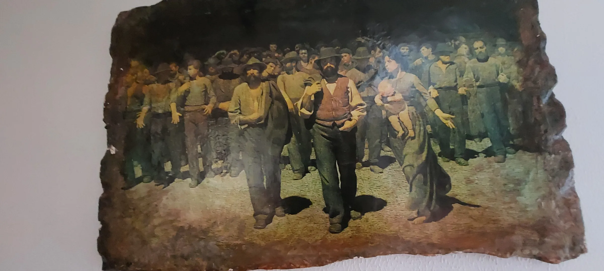

---

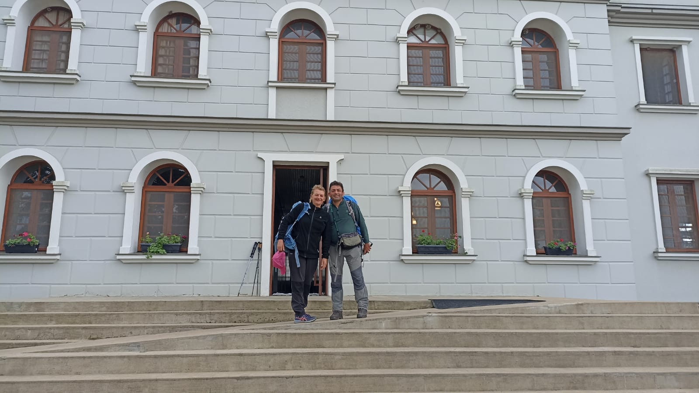

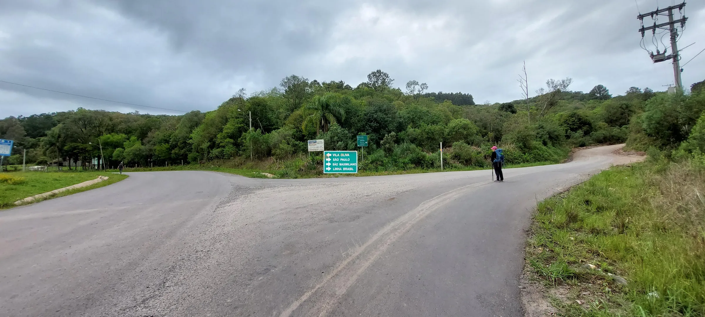

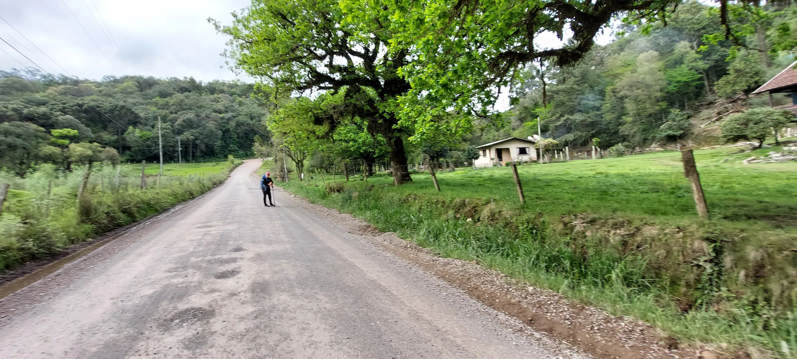

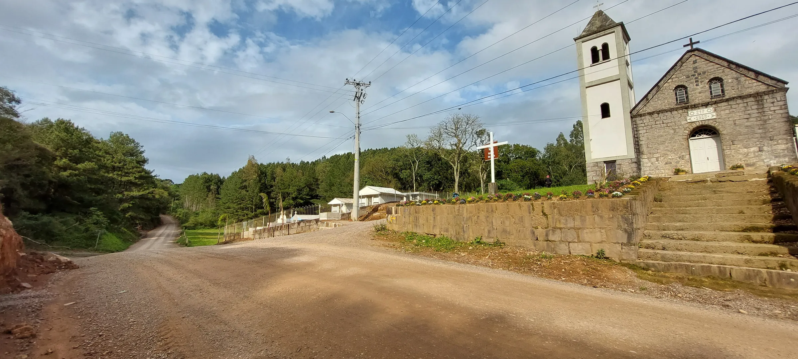

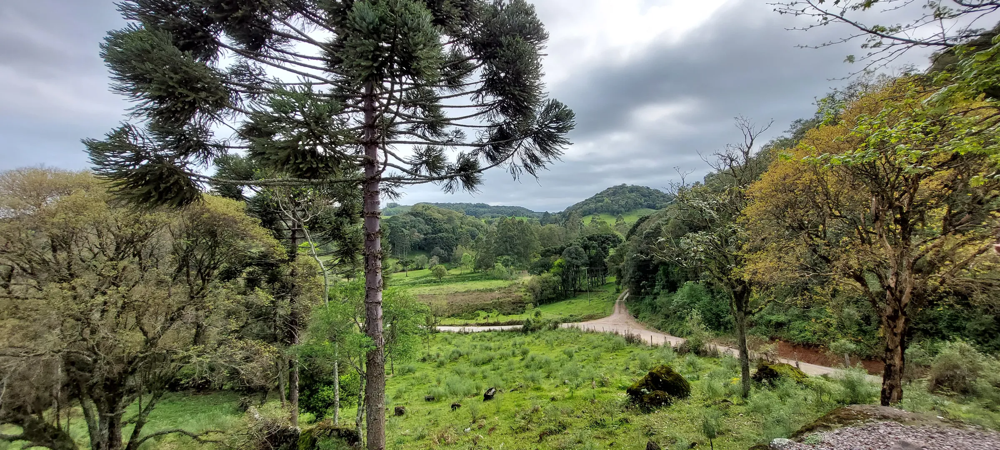

---

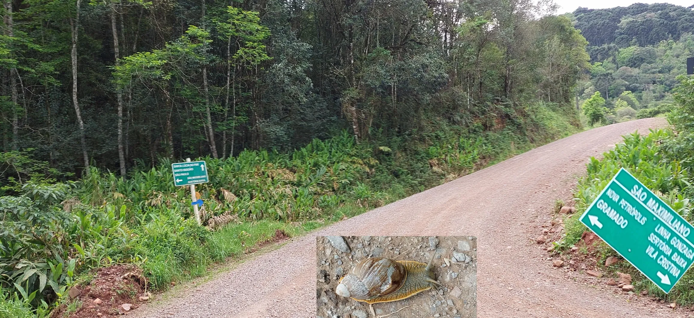

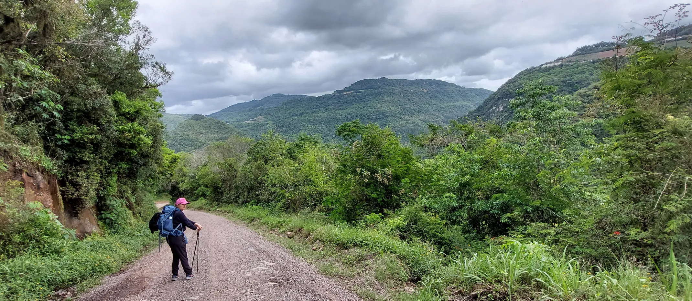

---

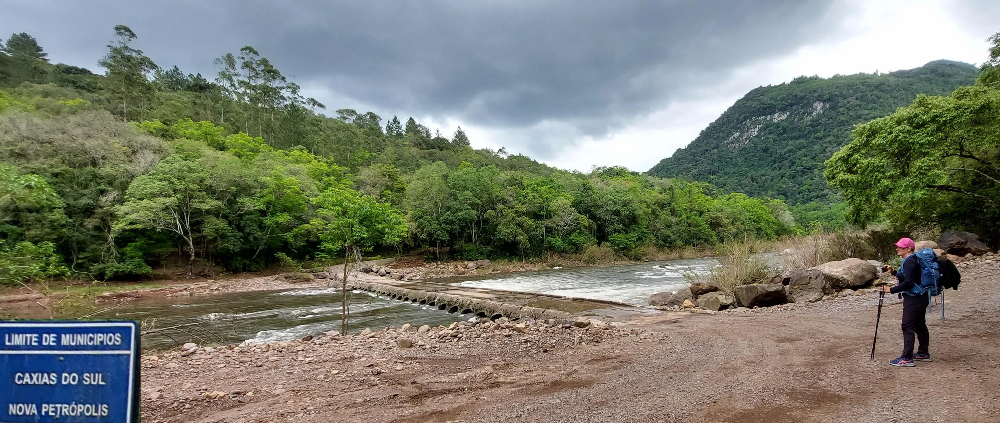

A travessia do rio pela passagem plana de betão pode tornar-se perigosa em caso de chuva forte.

Die Überquerung des Flusses über den flachen Betonübergang kann bei starkem Regen gefährlich werden.

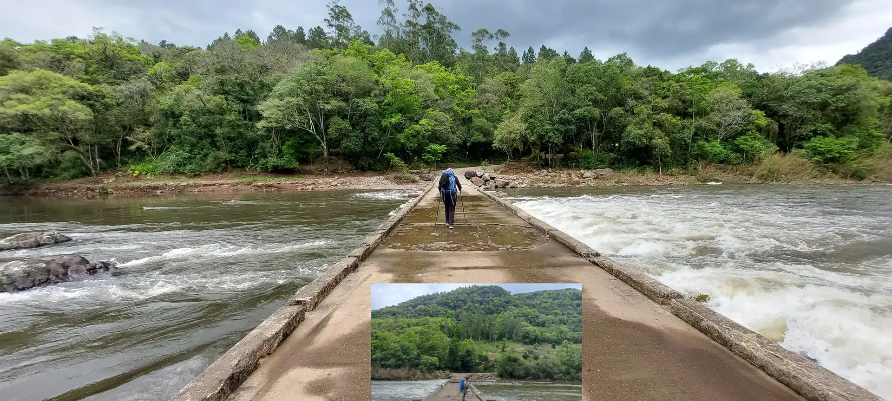

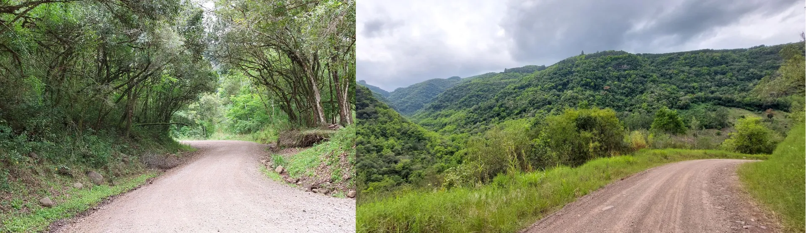

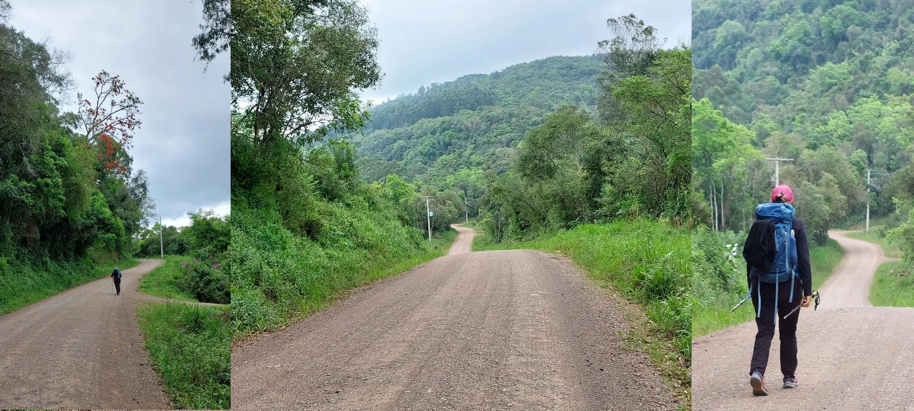

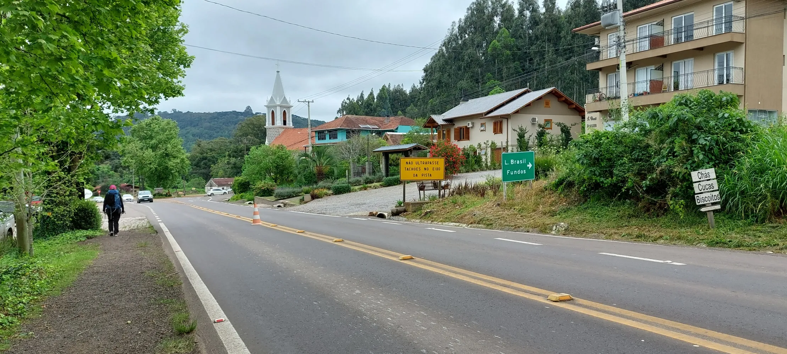

  

🇬🇧
🇪🇸
🇵🇹
🇩🇪

---

 🔁 [Caminhos-de-Caravaggio_Etapas](Caminhos-de-Caravaggio_Etapas.md)
 
↪ [Etappe-06_Linha-Brasil_Nova-Petropolis](Etappe-06_Linha-Brasil_Nova-Petropolis.md)

 ...→