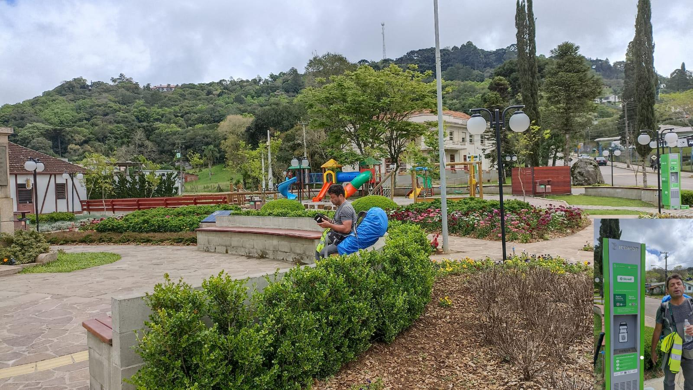

## Caminhos de Caravaggio  2023 

### Etappe-06: Linha do Brasil _(Linha Temerária)_ → Nova Petrópolis 

Hospedaria Bom Pasto  →  Pousada da Chácara (19,3 Km)
01 de Outubro de 2023

Linha Imperial

 Praça Theodor Amstad  

🇪🇸 Dos descubrimientos especiales durante mis caminos de peregrinación  

### 🇪🇸 Dos descubrimientos especiales durante mis caminos de peregrinación

Durante mis caminos de peregrinación descubrí dos instalaciones muy especiales que se han quedado en mi memoria.

La primera (2) se encuentra en la **Praça Theodor Amstad, en Linha Imperial, cerca de Nova Petrópolis, en el sur de Brasil**. Allí hay una moderna estación de hidratación que ofrece agua fría y caliente. 

En el sur de Brasil, esta es una idea especialmente acertada, ya que el **chimarrão**, el tradicional mate, forma parte de la cultura y de la vida cotidiana de la gente de Rio Grande do Sul. En esta estación se puede simplemente disfrutar de un vaso de agua fría para refrescarse o utilizar el agua caliente para preparar un chimarrão. El sistema de agua caliente está diseñado precisamente para este propósito.

Para mí, como peregrino, fue algo muy especial. Después de una caminata larga, un vaso de agua fría puede ser una auténtica bendición y, al mismo tiempo, permite acercarse un poco a la cultura local.

Mi segundo (1) descubrimiento fue en **España**. Todavía tengo que averiguar exactamente dónde se encontraba, revisando de nuevo mis fotografías y mis notas. Allí encontré una **máquina expendedora de leche fresca**, donde los habitantes de la "Ciudad" zona y las personas que pasaban podían abastecerse de leche fresca. La leche procedía de ganaderos locales.

Descubrí esta máquina casi por casualidad después de una **caminata de peregrinación de unos 10 a 15 kilómetros**. En aquel momento, aquella leche fresca y refrigerada me vino de maravilla y, por supuesto, la disfruté muchísimo.

Dos sistemas muy diferentes, pero con una idea en común: **poner productos locales y servicios útiles a disposición de una manera que beneficie tanto a los habitantes como a los visitantes y peregrinos.**

A menudo son estas pequeñas iniciativas, pensadas con atención, las que pueden marcar una diferencia sorprendentemente grande durante una peregrinación. Son prácticas y sostenibles y, al mismo tiempo, permiten conocer un poco mejor la cultura y la vida cotidiana de cada región.

#####  Linha Imperial – un lugar especial para los peregrinos

Linha Imperial sería un lugar maravilloso para un punto de descanso para peregrinos y, en mi opinión, también un lugar ideal para crear un albergue de peregrinos.

Lo que más me impresionó fue la casa histórica situada en la Praça Theodor Amstad. Según mis investigaciones, esta era la casa de José Neumann Sênior, donde la antigua Caixa Rural – surgida de la cooperativa impulsada por el padre Theodor Amstad – tuvo su primera sede entre 1902 y 1933. Por ello, este lugar forma parte de las raíces históricas del movimiento cooperativo en América Latina. 

Cuando hice allí una pausa, la casa estaba cerrada. Aun así, pensé inmediatamente: ¡qué lugar tan maravilloso sería para un albergue de peregrinos!

Naturalmente, no sé si los peregrinos sabrían valorar una casa con una historia tan importante y utilizarla con el respeto y la responsabilidad que un lugar así merece. Pero precisamente por representar una historia de comunidad, ayuda mutua y solidaridad, creo que encajaría perfectamente con la idea de un albergue para peregrinos.

Una casa histórica en una plaza histórica, donde los peregrinos pudieran descansar, beber agua y quizás conversar con otros caminantes. Para mí, eso convertiría a Linha Imperial en un lugar casi perfecto como punto de descanso en un camino de peregrinación.

Quizás sea simplemente una bonita idea. Pero, a veces, así es precisamente como comienzan las mejores ideas para un camino de peregrinación.

---

🇵🇹 Duas descobertas especiais nos meus caminhos de peregrinação 

### 🇵🇹 Duas descobertas especiais nos meus caminhos de peregrinação

Durante os meus caminhos de peregrinação, descobri duas instalações muito especiais que ficaram na minha memória.

A primeira (2) encontra-se na **Praça Theodor Amstad, em Linha Imperial, perto de Nova Petrópolis, no sul do Brasil**. Ali existe uma moderna estação de hidratação com água fria e quente. 

No sul do Brasil, esta é uma ideia particularmente interessante, pois o **chimarrão**, o tradicional mate, faz parte da cultura e do dia a dia das pessoas do Rio Grande do Sul. Nesta estação, é possível simplesmente beber um copo de água fria para se refrescar ou utilizar a água quente para preparar um chimarrão. O sistema de água quente foi inclusive concebido especialmente para essa finalidade. 

Para mim, como peregrino, esta possibilidade foi algo muito especial. Depois de uma caminhada mais longa, um copo de água fria pode ser uma verdadeira bênção – e, ao mesmo tempo, permite conhecer um pouco da cultura local.

A segunda (1) descoberta aconteceu em **Espanha**. Ainda preciso descobrir exatamente onde foi, consultando novamente as minhas fotografias e anotações. Ali encontrei uma **máquina de venda de leite fresco**, onde os moradores e as pessoas que passavam pelo local podiam comprar leite fresco. O leite vinha de produtores locais.

Descobri essa máquina quase por acaso, depois de uma caminhada de peregrinação de aproximadamente **10 a 15 quilómetros**. Naquele momento, o leite fresco e refrigerado soube-me especialmente bem – e, naturalmente, aproveitei para o saborear.

Dois sistemas muito diferentes, mas com uma ideia em comum: **oferecer produtos locais e instalações públicas de uma forma que beneficie tanto os moradores como os visitantes e peregrinos.**

São estas pequenas e bem pensadas iniciativas que podem fazer uma diferença surpreendentemente grande durante uma peregrinação. São práticas, sustentáveis e, ao mesmo tempo, permitem conhecer um pouco da cultura e da vida quotidiana de cada região.

##### Linha Imperial – um lugar maravilhoso para os peregrinos

Linha Imperial seria um lugar maravilhoso para um ponto de parada de peregrinos e, certamente, também um local ideal para instalar um albergue de peregrinos.

A casa histórica situada na Praça Theodor Amstad seria simplesmente um lugar de sonho para isso. Naturalmente, não sei se os peregrinos saberiam valorizar um edifício histórico como este e utilizá-lo com o devido respeito e dignidade. Mas, na minha opinião, este lugar e esta casa seriam simplesmente perfeitos para uma hospedagem de peregrinos.

Um lugar com história, ambiente e personalidade – exatamente aquilo que torna uma peregrinação tão especial.

Linha Imperial – um lugar especial para os peregrinos

Linha Imperial seria um lugar maravilhoso para um ponto de parada de peregrinos e, na minha opinião, também um local ideal para criar um albergue de peregrinos.

O que mais me impressionou foi a casa histórica situada na Praça Theodor Amstad. Segundo as minhas pesquisas, esta era a casa de José Neumann Sênior, onde a antiga Caixa Rural – que surgiu a partir da cooperativa fundada por iniciativa do Padre Theodor Amstad – teve a sua primeira sede entre 1902 e 1933. Por isso, este lugar faz parte das raízes históricas do cooperativismo na América Latina. 

Quando fiz uma pausa ali, a casa estava fechada. Mesmo assim, pensei imediatamente: que lugar maravilhoso seria este para um albergue de peregrinos!

Naturalmente, não sei se os peregrinos saberiam valorizar uma casa com uma história tão importante e utilizá-la com o respeito e a responsabilidade que um lugar assim merece. Mas, justamente por representar uma história de comunidade, ajuda mútua e solidariedade, penso que este lugar combinaria perfeitamente com a ideia de um albergue de peregrinos.

Uma casa histórica numa praça histórica, onde os peregrinos pudessem descansar, beber água e talvez conversar com outros caminhantes – para mim, Linha Imperial seria quase o ponto de parada perfeito para uma peregrinação.

Talvez seja apenas uma ideia bonita. Mas, às vezes, é exatamente assim que começam as melhores ideias para um caminho de peregrinação.

---

🇩🇪 Zwei besondere Entdeckungen auf meinen Pilgerwegen  

#### 🇩🇪 Zwei besondere Entdeckungen auf meinen Pilgerwegen

Auf meinen Pilgerwegen habe ich zwei ganz besondere Einrichtungen entdeckt, die mir nachhaltig in Erinnerung geblieben sind.

Die erste (2) befindet sich auf dem **Theodor-Amstad-Platz (Praça Theodor Amstad) in Linha Imperial bei Nova Petrópolis im Süden Brasiliens**. Dort gibt es eine moderne Trinkwasserstation mit kaltem und heißem Wasser. 

Gerade in Südbrasilien ist das eine wunderbare Idee, denn **Chimarrão**, der traditionelle Mate-Tee, gehört fest zur Kultur und zum Alltag der Menschen in Rio Grande do Sul. An dieser Station kann man sich entweder einfach mit einem Glas kaltem Wasser erfrischen oder heißes Wasser für einen Chimarrão zapfen. Die heiße Wasserstation ist sogar speziell für die Zubereitung des Chimarrão ausgelegt.

Für mich als Pilger war diese Möglichkeit etwas ganz Besonderes. Nach einer längeren Wanderung kann ein Glas kaltes Wasser eine wahre Wohltat sein – und gleichzeitig bekommt man einen kleinen Einblick in die lokale Kultur.

Die zweite (1)  Entdeckung machte ich in **Spanien**. Wo genau das war, muss ich noch einmal anhand meiner Fotos und Aufzeichnungen herausfinden. Dort gab es einen **Frischmilchautomaten**, an dem sich Einheimische und Vorbeikommende mit frischer Milch versorgen konnten. Die Milch stammte von örtlichen Bauern.

Ich entdeckte diesen Automaten eher zufällig nach einer etwa **10 bis 15 Kilometer langen Pilgerwanderung**. Die frische, gekühlte Milch kam mir in diesem Moment gerade recht – und ich habe sie natürlich genossen.

Zwei ganz unterschiedliche Systeme, aber eine gemeinsame Idee: **lokale Produkte und öffentliche Einrichtungen so anzubieten, dass sie sowohl den Menschen vor Ort als auch Besuchern und Pilgern zugutekommen.**

Solche kleinen, durchdachten Angebote können auf einer Pilgerreise einen überraschend großen Unterschied machen. Sie sind praktisch, nachhaltig und vermitteln gleichzeitig ein Stück der Kultur  und des Alltags der einzelnen Regionen ein wenig besser kennenzulernen.

#### Linha Imperial – ein besonderer Ort für Pilger

Linha Imperial wäre ein wunderschöner Ort für einen Pilger-Haltepunkt und meiner Meinung nach auch ein idealer Standort für eine Pilgerherberge.

Besonders beeindruckend finde ich das historische Haus an der Praça Theodor Amstad. Nach meinen Recherchen befand sich hier das Haus von José Neumann Sênior, in dem die frühe Caixa Rural – die aus der von Padre Theodor Amstad initiierten Genossenschaft hervorging – von 1902 bis 1933 ihren ersten Sitz hatte. Damit gehört dieser Ort zu den historischen Wurzeln des Genossenschaftswesens in Lateinamerika. 

Als ich dort eine Pause eingelegt habe, war das Haus geschlossen. Trotzdem habe ich sofort gedacht: Was für ein wunderbarer Ort wäre das für eine Pilgerunterkunft!

Natürlich weiß ich nicht, ob Pilgerinnen und Pilger ein solch geschichtsträchtiges Haus zu schätzen wissen und mit der Achtung und Verantwortung nutzen würden, die ein solcher Ort verdient. Aber gerade die Geschichte dieses Hauses – Gemeinschaft, gegenseitige Hilfe und Solidarität – würde meiner Meinung nach hervorragend zur Idee einer Pilgerherberge passen.

Ein historisches Haus an einem historischen Platz, dazu die Möglichkeit, sich dort auszuruhen, Wasser zu trinken und vielleicht mit anderen Pilgern ins Gespräch zu kommen – für mich wäre Linha Imperial damit ein nahezu perfekter Pilger-Haltepunkt.

Vielleicht ist es nur eine schöne Idee. Aber manchmal beginnen genau so die besten Ideen für einen Pilgerweg.

---

🇬🇧 Two special discoveries on my pilgrim journeys 

#### 🇬🇧 Two special discoveries on my pilgrim journeys

During my pilgrim journeys, I came across two very special facilities that have stayed in my memory.

The first (2) one is located at **Theodor Amstad Square (Praça Theodor Amstad) in Linha Imperial, near Nova Petrópolis, in southern Brazil**. There is a modern hydration station providing both cold and hot water.

This is a particularly wonderful idea in southern Brazil, where **chimarrão**, the traditional mate tea, is an important part of everyday life and local culture in Rio Grande do Sul. At this station, people can either simply enjoy a glass of cold water or use the hot water to prepare their chimarrão. The hot-water system was specifically designed for this purpose.

For me, as a pilgrim, this was something quite special. After a long walk, a glass of cold water can be a real blessing – while at the same time offering a small glimpse into the local culture.

My second (1) discovery was in **Spain**. I still need to find out exactly where it was by going through my photographs and notes again. There, I came across a **fresh-milk vending machine**, where local residents and people passing by could obtain fresh milk. The milk came from local farmers.

I discovered the machine almost by chance after a **10- to 15-kilometre pilgrimage walk**. At that moment, the fresh, chilled milk was especially welcome – and, of course, I thoroughly enjoyed it.

Two very different systems, but with one idea in common: **making local products and useful public facilities available in a way that benefits both local residents and visitors and pilgrims.**

It is often these small, thoughtful initiatives that can make a surprisingly big difference during a pilgrimage. They are practical and sustainable, while also offering a glimpse into the culture and everyday life of the region.

#### Linha Imperial – a wonderful place for pilgrims

Linha Imperial would be a wonderful place for a pilgrim stopping point and, in my opinion, an ideal location for a pilgrim hostel.

What particularly impressed me was the historic house on Praça Theodor Amstad. According to my research, this was the house of José Neumann Sênior, where the early Caixa Rural – which grew out of the cooperative initiated by Father Theodor Amstad – had its first headquarters from 1902 to 1933. This makes the site part of the historic roots of the cooperative movement in Latin America. 

When I stopped there for a break, the house was closed. Even so, I immediately thought: What a wonderful place this could be for a pilgrim hostel!

Of course, I do not know whether pilgrims would truly appreciate such a historic house and use it with the respect and responsibility that a place like this deserves. But precisely because the history of this house represents community, mutual assistance and solidarity, I believe it would fit beautifully with the idea of a pilgrim hostel.

A historic house on a historic square, where pilgrims could rest, have some water and perhaps meet and talk with other walkers – for me, that would make Linha Imperial an almost perfect stopping point on a pilgrimage route.

Perhaps it is simply a nice idea. But sometimes, that is exactly how the best ideas for a pilgrimage route begin.

---

**Pinheiro Multissecular:** Uma árvore gigante e atração turística local que atrai visitantes para trilhas na natureza.

  

🇬🇧
🇪🇸
🇵🇹
🇩🇪

---

 🔁 [Caminhos-de-Caravaggio_Etapas](Caminhos-de-Caravaggio_Etapas.md)
 
↪ [Etappe-07_Nova-Metropolis_Nova-Palmira](Etappe-07_Nova-Metropolis_Nova-Palmira.md)

 ...→