## Caminhos de Caravaggio  2023 

### Etappe-06: Linha do Brasil _(Linha Temerária)_ → Nova Petrópolis 

Hospedaria Bom Pasto  →  Pousada da Chácara (19,3 Km)
01 de Outubro de 2023

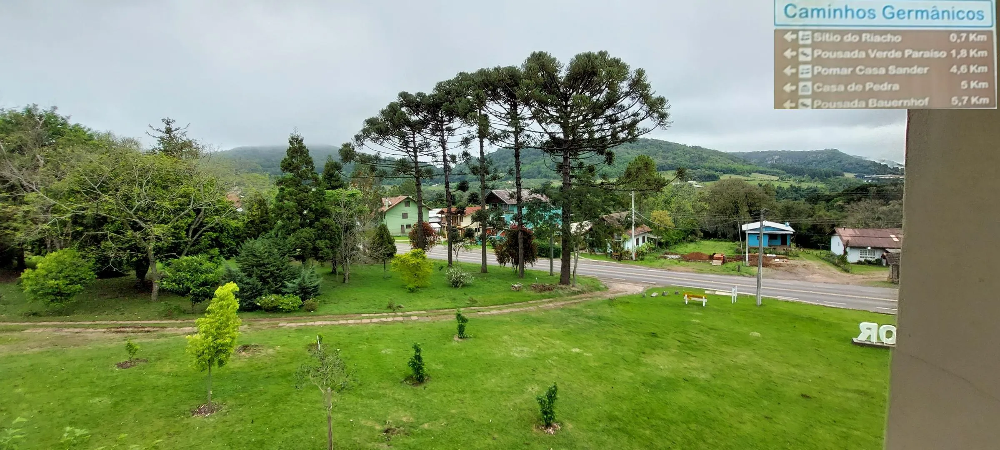

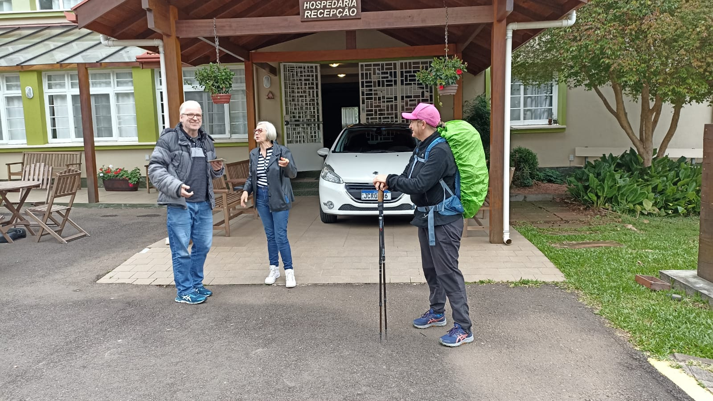

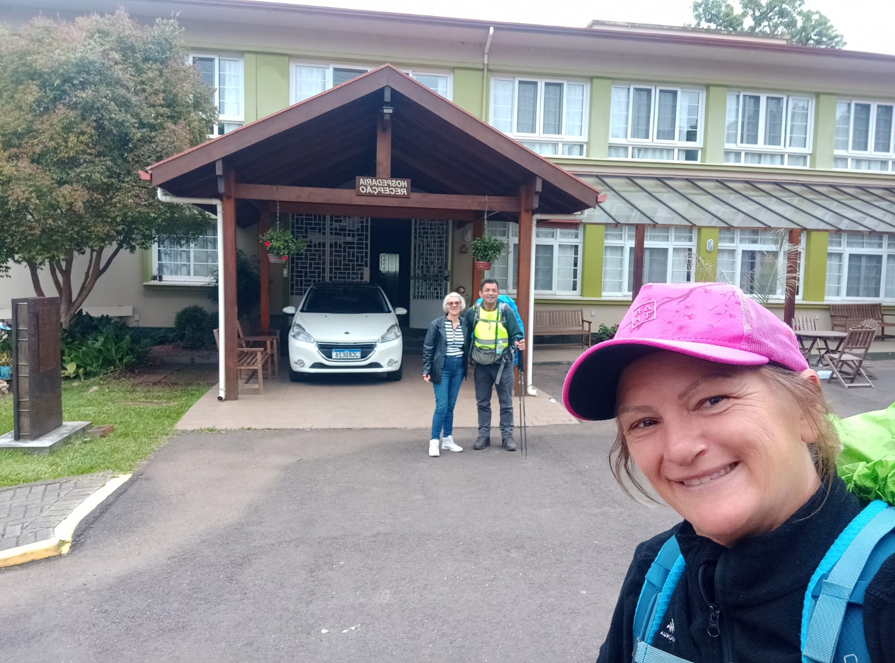

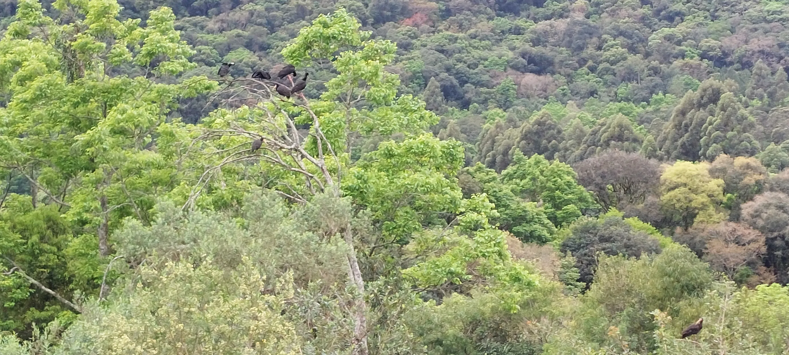

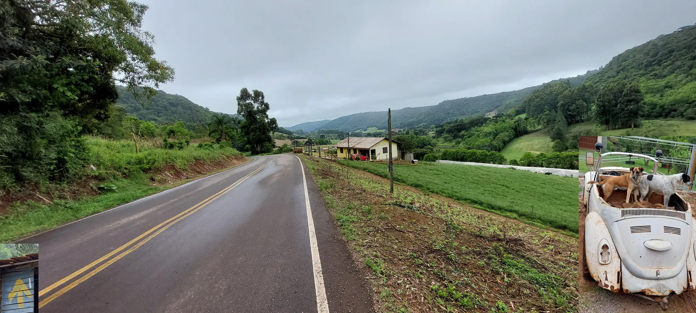

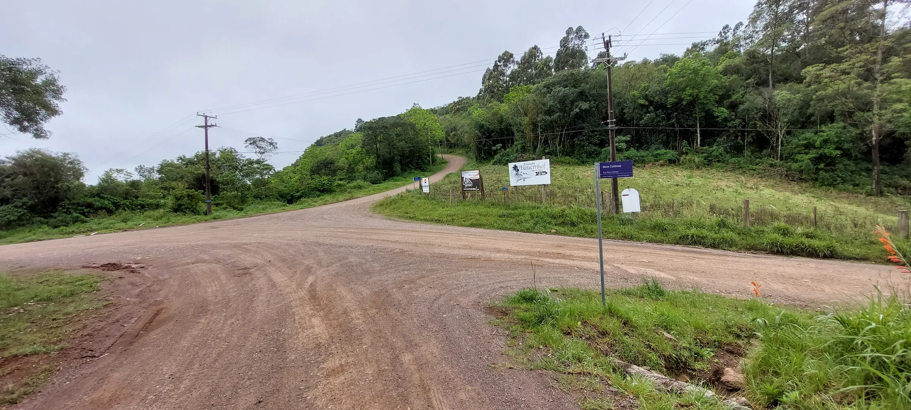

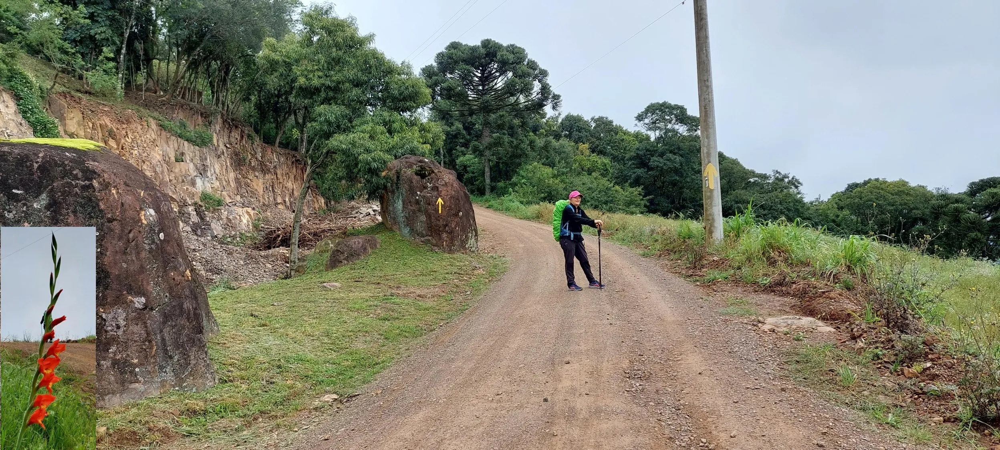

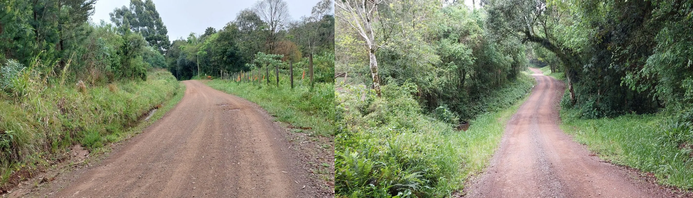

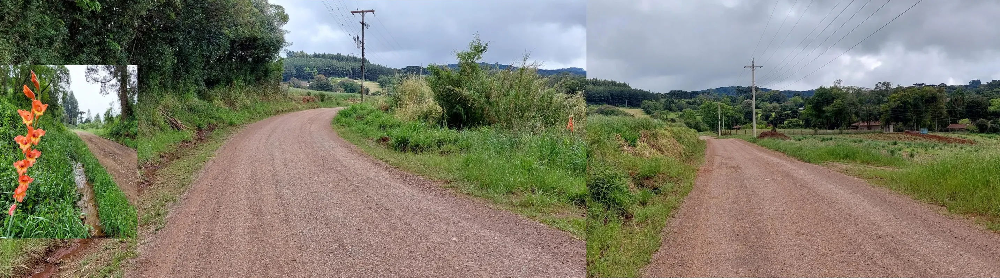

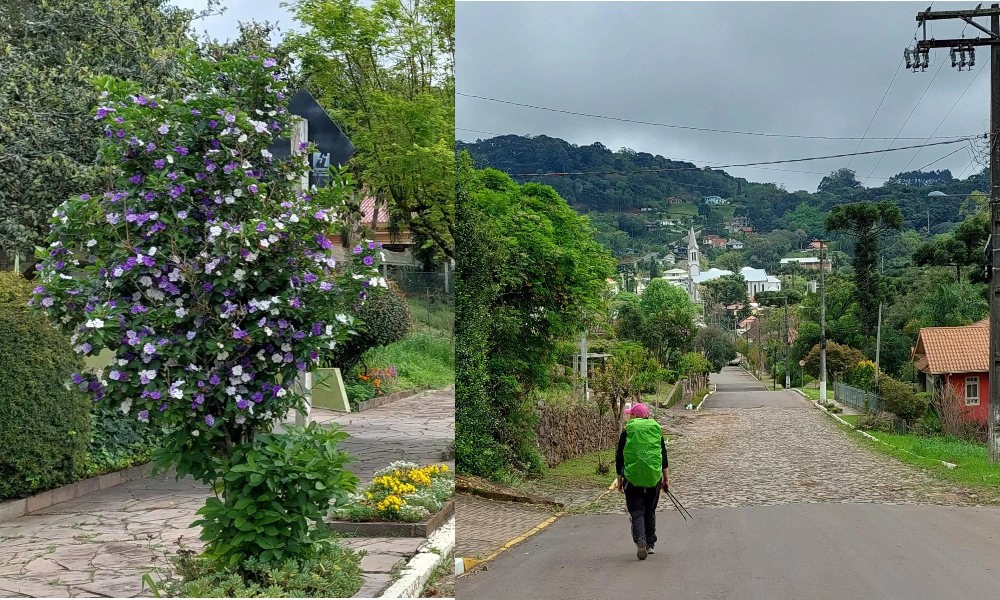

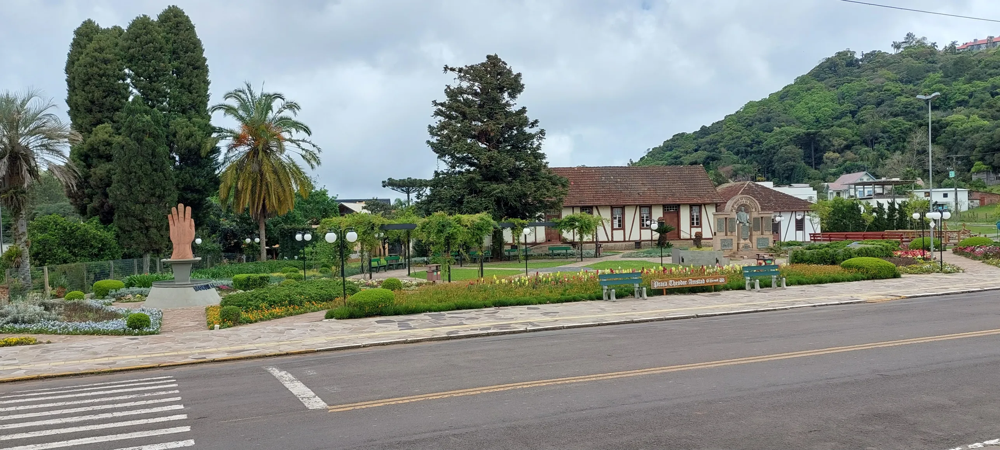

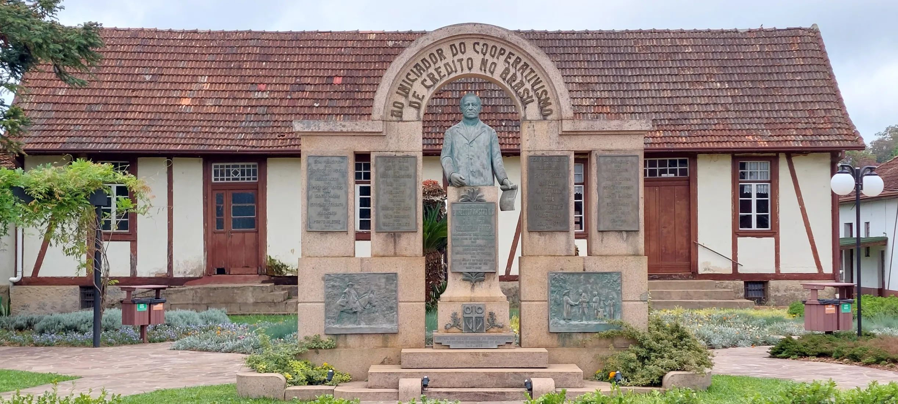

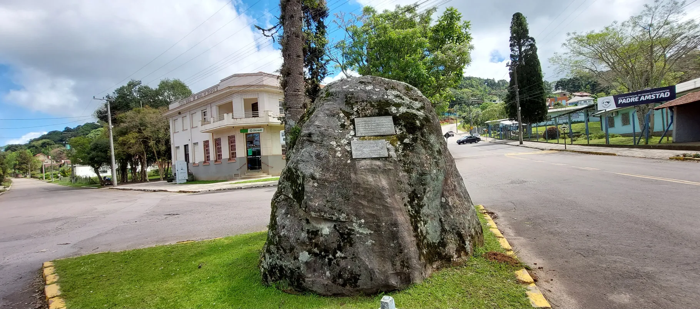

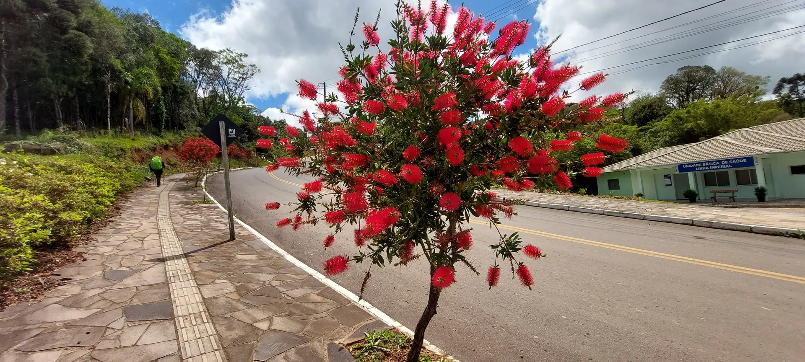

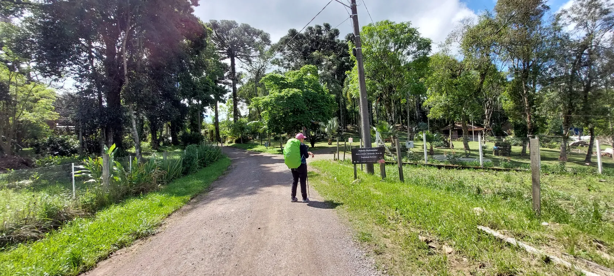

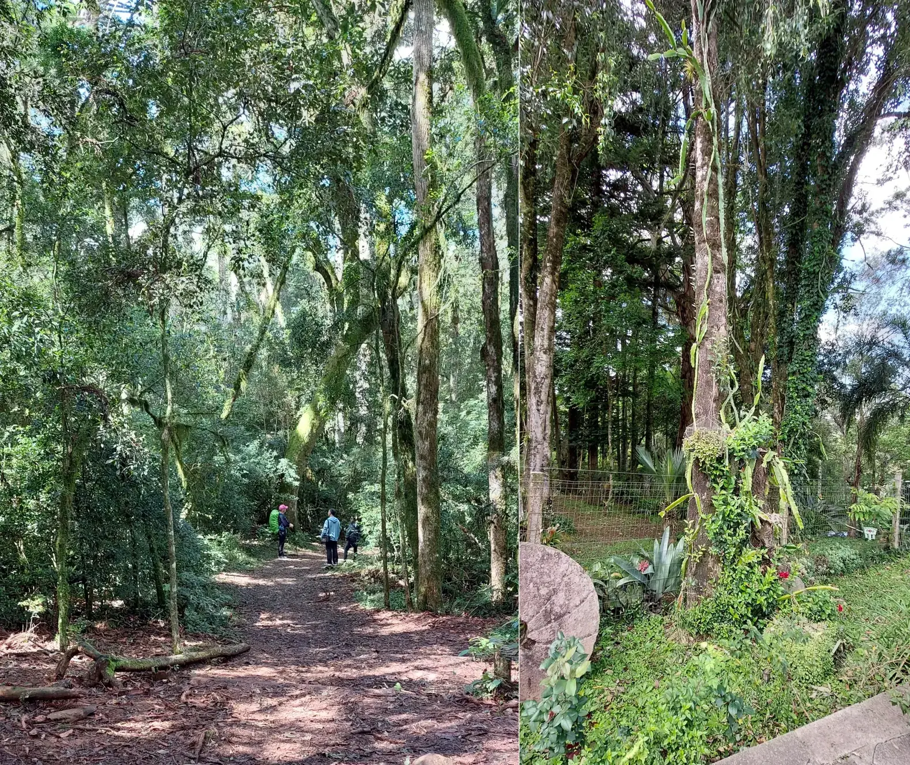

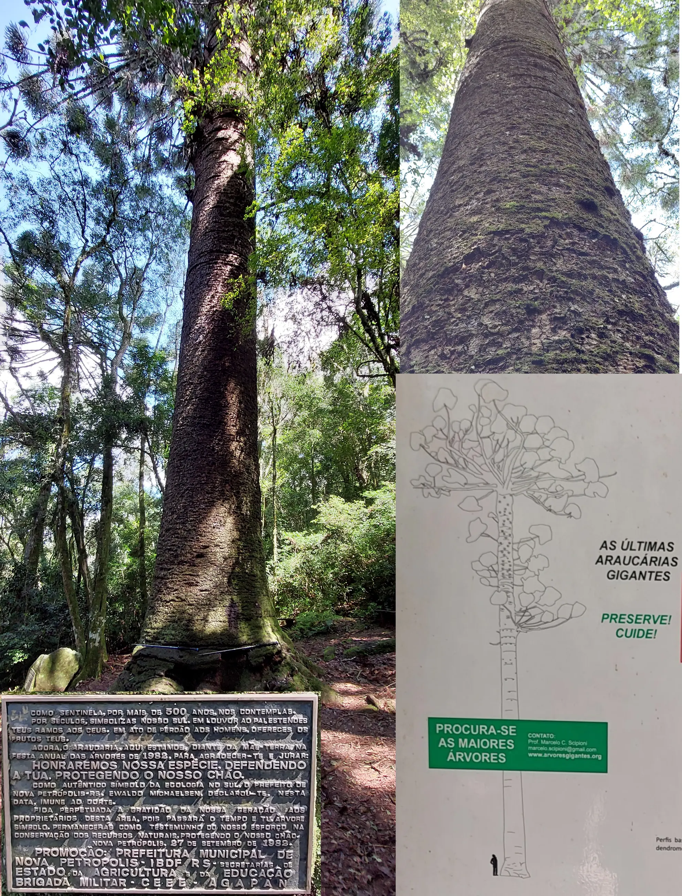

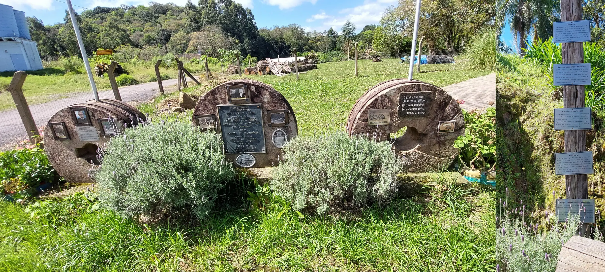

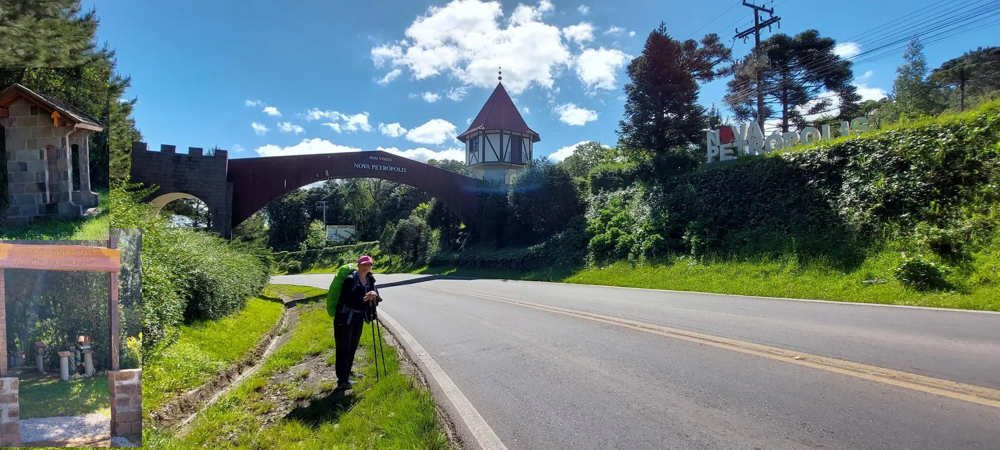

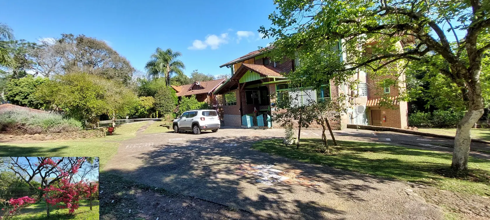

  

🇬🇧
🇪🇸
🇵🇹
🇩🇪

---

 🔁 [Caminhos-de-Caravaggio_Etapas](Caminhos-de-Caravaggio_Etapas.md)
 
↪ [Etappe-07_Nova-Metropolis_Nova-Palmira](Etappe-07_Nova-Metropolis_Nova-Palmira.md)

 ...→